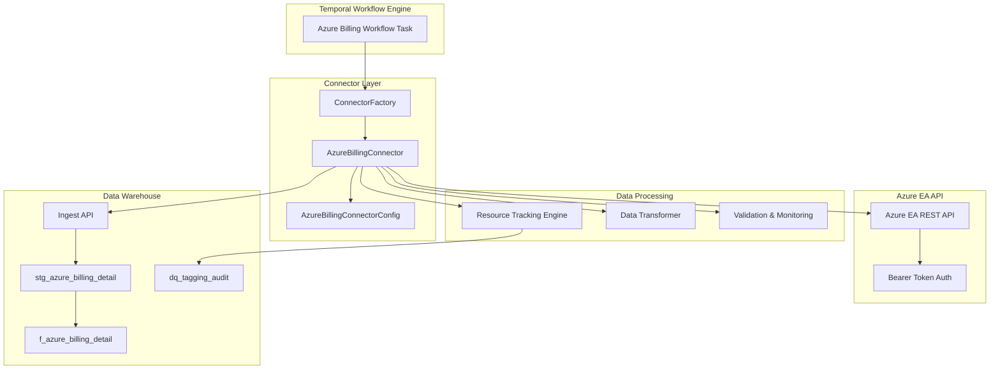

# Design Document

## Overview

The Azure Billing API Connector is designed to integrate Azure Enterprise Agreement (EA) billing data into the existing ODW ETL architecture. The connector follows the established pattern of existing connectors (Blob, Logs, Events) while incorporating specialized logic for Azure billing data extraction, transformation, and resource tracking. The design leverages the existing Temporal workflow orchestration, ClickHouse data warehouse, and ingest API infrastructure.

## Architecture

### High-Level Architecture



### Component Integration

The Azure Billing Connector integrates with existing ODW components:

1. **Temporal Workflows**: Uses the same `moose_lib.Task` pattern as existing extract workflows
2. **ConnectorFactory**: Extended to support `ConnectorType.AzureBilling`
3. **Ingest API**: Leverages existing `/ingest/AzureBillingDetail` endpoint
4. **ClickHouse**: Uses existing table schemas and transformation patterns
5. **Resource Tracking**: Integrates with existing `d_application_tag` table

## Components and Interfaces

### AzureBillingConnector

```python
class AzureBillingConnectorConfig:
    def __init__(
        self,
        batch_size: Optional[int] = None,
        start_date: Optional[date] = None,
        end_date: Optional[date] = None,
        azure_enrollment_number: Optional[str] = None,
        azure_api_key: Optional[str] = None,
        api_base_url: Optional[str] = None
    ):
        self.batch_size = batch_size or 1000
        self.start_date = start_date
        self.end_date = end_date
        self.azure_enrollment_number = azure_enrollment_number
        self.azure_api_key = azure_api_key
        self.api_base_url = api_base_url or "https://ea.azure.cn/rest"

class AzureBillingConnector(Generic[T]):
    def __init__(self, config: AzureBillingConnectorConfig):
        self._config = config
        self._resource_tracking_patterns = []
        
    def extract(self) -> List[AzureBillingDetail]:
        # Main extraction method following connector pattern
        pass
```

### Azure API Client

```python
class AzureEAApiClient:
    def __init__(self, enrollment_number: str, api_key: str, base_url: str):
        self.enrollment_number = enrollment_number
        self.api_key = api_key
        self.base_url = base_url
        
    def fetch_billing_data(self, month: str, page_url: Optional[str] = None) -> Tuple[List[Dict], Optional[str]]:
        # Handles API requests, pagination, and retry logic
        pass
        
    def _build_headers(self) -> Dict[str, str]:
        return {'Authorization': f'bearer {self.api_key}'}
```

### Resource Tracking Engine

```python
class ResourceTrackingEngine:
    def __init__(self, clickhouse_client: Client):
        self.client = clickhouse_client
        self.patterns = []
        
    def load_patterns(self) -> List[Tuple[str, str, int]]:
        # Load patterns from d_application_tag table
        pass
        
    def apply_tracking(self, df: pl.DataFrame) -> Tuple[pl.Series, pl.DataFrame]:
        # Apply vectorized resource tracking with audit logging
        pass
```

### Data Transformer

```python
class AzureBillingTransformer:
    @staticmethod
    def transform_raw_data(raw_data: pl.DataFrame, tracking_patterns: List[Tuple]) -> Tuple[pl.DataFrame, pl.DataFrame]:
        # Transform raw API data to warehouse schema
        pass
        
    @staticmethod
    def clean_json_fields(df: pl.DataFrame) -> pl.DataFrame:
        # Clean and parse JSON fields (tags, additional_info)
        pass
        
    @staticmethod
    def derive_computed_fields(df: pl.DataFrame) -> pl.DataFrame:
        # Derive SKU, VM names, resource names, etc.
        pass
```

## Data Models

### AzureBillingDetail (Pydantic Model)

```python
class AzureBillingDetail(BaseModel):
    id: Optional[str] = None
    account_owner_id: Optional[str] = None
    account_name: Optional[str] = None
    service_administrator_id: Optional[str] = None
    subscription_id: Optional[int] = None
    subscription_guid: Optional[str] = None
    subscription_name: Optional[str] = None
    date: Optional[date] = None
    month: Optional[int] = None
    day: Optional[int] = None
    year: Optional[int] = None
    product: Optional[str] = None
    meter_id: Optional[str] = None
    meter_category: Optional[str] = None
    meter_sub_category: Optional[str] = None
    meter_region: Optional[str] = None
    meter_name: Optional[str] = None
    consumed_quantity: Optional[float] = None
    resource_rate: Optional[float] = None
    extended_cost: Optional[float] = None
    resource_location: Optional[str] = None
    consumed_service: Optional[str] = None
    instance_id: str  # Required field
    service_info1: Optional[str] = None
    service_info2: Optional[str] = None
    additional_info: Optional[Dict[str, Any]] = None
    tags: Optional[Dict[str, Any]] = None
    store_service_identifier: Optional[str] = None
    department_name: Optional[str] = None
    cost_center: Optional[str] = None
    unit_of_measure: Optional[str] = None
    resource_group: Optional[str] = None
    extended_cost_tax: Optional[float] = None
    resource_tracking: Optional[str] = None
    resource_name: Optional[str] = None
    vm_name: Optional[str] = None
    latest_resource_type: Optional[str] = None
    newmonth: Optional[str] = None
    month_date: date
    sku: Optional[str] = None
    cmdb_mapped_application_service: Optional[str] = None
    ppm_billing_item: Optional[str] = None
    ppm_id_owner: Optional[str] = None
    ppm_io_cc: Optional[str] = None
```

### Configuration Models

```python
class AzureApiConfig(BaseModel):
    enrollment_number: str
    api_key: str
    base_url: str = "https://ea.azure.cn/rest"
    timeout: int = 800
    max_retries: int = 3
    retry_delay: int = 5

class ProcessingConfig(BaseModel):
    batch_size: int = 1000
    chunk_size: int = 10000
    memory_threshold_mb: int = 500
    enable_audit_logging: bool = True
```

## Error Handling

### API Error Handling

1. **HTTP Errors**: Implement retry logic for 503 Service Unavailable and other transient errors
2. **Authentication Errors**: Log and fail fast for 401/403 errors
3. **Rate Limiting**: Implement exponential backoff for rate limit responses
4. **Timeout Handling**: Configure appropriate timeouts and retry failed requests

### Data Processing Errors

1. **JSON Parsing Errors**: Log malformed JSON and continue with null values
2. **Data Validation Errors**: Skip invalid records and log validation failures
3. **Memory Errors**: Implement chunked processing and garbage collection
4. **Resource Tracking Conflicts**: Generate audit logs for manual review

### Error Recovery Strategies

```python
class ErrorHandler:
    @staticmethod
    def handle_api_error(response: requests.Response, attempt: int) -> bool:
        # Return True if should retry, False otherwise
        pass
        
    @staticmethod
    def handle_data_error(error: Exception, record: Dict) -> Optional[Dict]:
        # Return cleaned record or None if unrecoverable
        pass
        
    @staticmethod
    def log_processing_error(error: Exception, context: Dict) -> None:
        # Structured error logging
        pass
```

## Testing Strategy

### Unit Testing

1. **Connector Interface Tests**: Verify extract() method returns correct data types
2. **API Client Tests**: Mock Azure API responses and test pagination/retry logic
3. **Data Transformation Tests**: Test field mapping, JSON parsing, and computed fields
4. **Resource Tracking Tests**: Test pattern matching and audit log generation
5. **Error Handling Tests**: Test various error scenarios and recovery mechanisms

### Integration Testing

1. **End-to-End Workflow Tests**: Test complete extraction through Temporal workflows
2. **Database Integration Tests**: Test data insertion into ClickHouse tables
3. **API Integration Tests**: Test against Azure EA API sandbox/test environment
4. **Performance Tests**: Test memory usage and processing time with large datasets

### Test Data Strategy

```python
def generate_mock_azure_response() -> Dict:
    # Generate realistic Azure EA API response for testing
    pass

def create_test_billing_records(count: int) -> List[Dict]:
    # Create test billing records with various scenarios
    pass

def setup_test_resource_patterns() -> List[Tuple[str, str, int]]:
    # Create test resource tracking patterns
    pass
```

### Monitoring and Observability

1. **Structured Logging**: Use existing logging framework with consistent log levels
2. **Memory Monitoring**: Track memory usage during processing with alerts
3. **Performance Metrics**: Log processing times, record counts, and API response times
4. **Data Quality Metrics**: Track validation failures, audit log counts, and error rates
5. **Temporal Integration**: Leverage Temporal's built-in monitoring and retry capabilities

### Configuration Management

1. **Environment Variables**: Support configuration through environment variables
2. **Configuration Validation**: Validate required configuration at startup
3. **Secrets Management**: Secure handling of Azure API keys and credentials
4. **Default Values**: Provide sensible defaults for optional configuration parameters