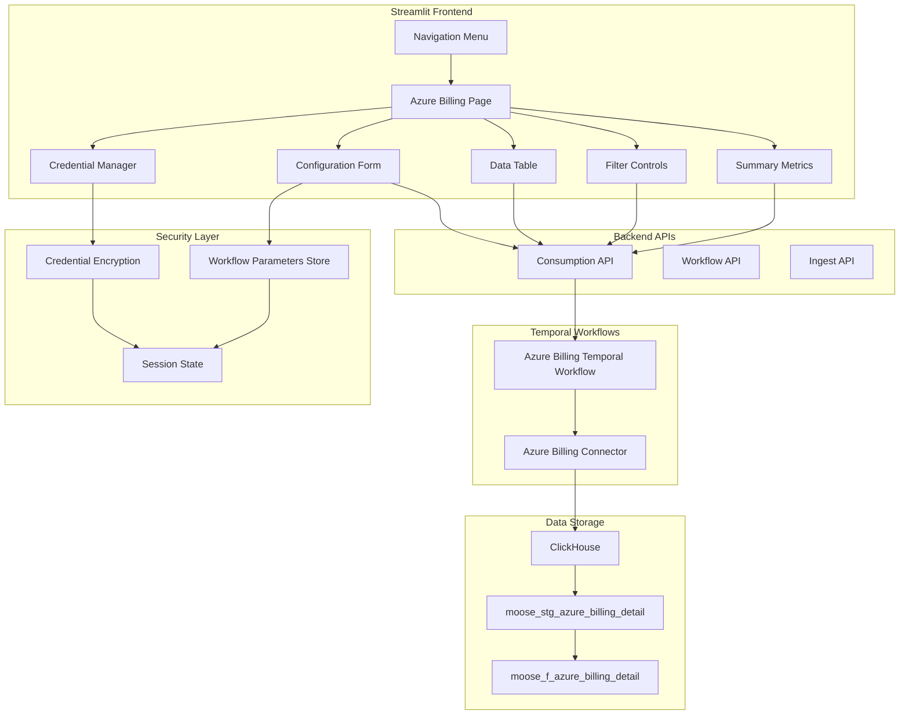

# Design Document

## Overview

The Azure Billing Frontend Integration adds a new page to the existing ODW Streamlit application that provides a user interface for configuring, executing, and monitoring Azure billing workflows. The design follows the established patterns used by other connector pages (blobs, logs, events) while incorporating specialized functionality for Azure billing data management, including secure credential handling, workflow configuration, and comprehensive data visualization.

## Architecture

### High-Level Architecture



### Integration with Existing Architecture

The Azure billing page integrates seamlessly with the existing ODW frontend architecture:

1. **Navigation System**: Extends the existing `st.navigation` structure in `main.py`
2. **API Layer**: Uses the same `utils/api_functions.py` patterns for backend communication
3. **Styling**: Follows the same UI patterns using `streamlit_shadcn_ui` components
4. **Status Management**: Leverages existing `utils/status_handler.py` for user feedback
5. **Workflow Integration**: Uses the same Temporal workflow patterns as other connectors

## Components and Interfaces

### Azure Billing Page Component

```python
# pages/azure_billing_view.py
def show():
    """Main Azure billing page function following existing page pattern"""
    
    # Header with trigger button (following blobs_view pattern)
    if title_with_button("Azure Billing", "Run Extract", "trigger_azure_billing_btn"):
        trigger_azure_billing_extract()
        st.session_state["refresh_azure_billing"] = True
        st.rerun()
    
    # Configuration section
    render_configuration_form()
    
    # Summary metrics
    render_summary_metrics()
    
    # Data table with filters
    render_billing_data_table()
    
    # Workflow status
    render_workflows_table("azure-billing-workflow", "Azure Billing")
    
    # Cost analysis charts
    render_cost_analysis_charts()
```

### Configuration Form Component

```python
def render_configuration_form():
    """Render Azure billing configuration form with credential management"""
    
    with st.expander("Azure Billing Configuration", expanded=False):
        col1, col2 = st.columns(2)
        
        # Load existing configuration
        existing_config = WorkflowParameterManager.load_workflow_config()
        
        with col1:
            # Azure credentials with secure handling
            enrollment_number = st.text_input(
                "Azure Enrollment Number",
                value=existing_config.enrollment_number if existing_config else CredentialManager.get_saved_credential("enrollment_number"),
                help="Your Azure Enterprise Agreement enrollment number"
            )
            
            api_key = st.text_input(
                "Azure API Key",
                type="password",
                value=CredentialManager.get_saved_credential("api_key"),
                help="Your Azure EA API key"
            )
            
            # Persistence options
            persistence_level = st.selectbox(
                "Save Configuration",
                options=["session", "browser", "export"],
                format_func=lambda x: {
                    "session": "Current Session Only",
                    "browser": "Persist in Browser",
                    "export": "Export to File"
                }[x],
                help="Choose how to save your configuration"
            )
            
            save_credentials = st.checkbox(
                "Save credentials securely",
                help="Credentials will be encrypted and stored according to persistence level"
            )
        
        with col2:
            # Date range configuration with persisted values
            default_start = existing_config.start_date if existing_config else get_default_start_date()
            default_end = existing_config.end_date if existing_config else get_default_end_date()
            default_batch = existing_config.batch_size if existing_config else 1000
            
            start_date = st.date_input("Start Date", value=default_start)
            end_date = st.date_input("End Date", value=default_end)
            
            # Processing parameters
            batch_size = st.number_input(
                "Batch Size",
                min_value=100,
                max_value=10000,
                value=default_batch,
                help="Number of records to process in each batch"
            )
        
        # Action buttons
        col_btn1, col_btn2, col_btn3, col_btn4 = st.columns(4)
        
        with col_btn1:
            if st.button("Save Configuration"):
                config = AzureBillingConfig(
                    enrollment_number=enrollment_number,
                    api_key=api_key,
                    start_date=start_date,
                    end_date=end_date,
                    batch_size=batch_size,
                    save_credentials=save_credentials
                )
                
                if persistence_level == "export":
                    # Export configuration to file
                    config_json = WorkflowParameterManager.export_config_to_file(config)
                    st.download_button(
                        "Download Configuration",
                        config_json,
                        f"azure_billing_config_{date.today().isoformat()}.json",
                        "application/json"
                    )
                else:
                    WorkflowParameterManager.save_workflow_config(config, persistence_level)
                    st.success(f"Configuration saved to {persistence_level}!")
        
        with col_btn2:
            # Import configuration file
            uploaded_file = st.file_uploader("Import Config", type="json", key="config_import")
            if uploaded_file:
                config_content = uploaded_file.read().decode()
                imported_config = WorkflowParameterManager.import_config_from_file(config_content)
                if imported_config:
                    st.success("Configuration imported successfully!")
                    st.rerun()
        
        with col_btn3:
            if st.button("Test Connection"):
                test_azure_connection(enrollment_number, api_key)
        
        with col_btn4:
            if st.button("Clear Saved Data"):
                clear_level = st.selectbox("Clear from:", ["session", "browser", "all"], key="clear_level")
                WorkflowParameterManager.clear_workflow_config(clear_level)
                CredentialManager.clear_saved_credentials(clear_level)
                st.success(f"Configuration cleared from {clear_level}!")
```

### Workflow Parameter Persistence

Workflow parameters are persisted in Streamlit's session state to maintain configuration across page interactions:

```python
class WorkflowParameterManager:
    """Manage persistence of workflow configuration parameters across multiple storage levels"""
    
    @staticmethod
    def save_workflow_config(config: AzureBillingConfig, persistence_level: str = "session"):
        """Save workflow configuration with specified persistence level"""
        config_data = {
            "enrollment_number": config.enrollment_number,
            "start_date": config.start_date.isoformat(),
            "end_date": config.end_date.isoformat(),
            "batch_size": config.batch_size,
            "last_saved": datetime.now().isoformat(),
            "persistence_level": persistence_level
        }
        
        # Always save to session state
        st.session_state["azure_billing_config"] = config_data
        
        # Save to browser localStorage if requested
        if persistence_level == "browser":
            WorkflowParameterManager._save_to_browser_storage(config_data)
        
        # Save encrypted credentials separately if requested
        if config.save_credentials:
            CredentialManager.save_credentials(config.enrollment_number, config.api_key, persistence_level)
    
    @staticmethod
    def _save_to_browser_storage(config_data: dict):
        """Save configuration to browser localStorage using JavaScript"""
        # Remove sensitive data before saving to browser
        safe_config = {k: v for k, v in config_data.items() if k != "enrollment_number"}
        
        js_code = f"""
        <script>
        localStorage.setItem('azure_billing_config', JSON.stringify({json.dumps(safe_config)}));
        </script>
        """
        st.components.v1.html(js_code, height=0)
    
    @staticmethod
    def load_workflow_config() -> Optional[AzureBillingConfig]:
        """Load workflow configuration from available storage sources"""
        config_data = None
        
        # Try session state first
        if "azure_billing_config" in st.session_state:
            config_data = st.session_state["azure_billing_config"]
        
        # Try browser localStorage if session state is empty
        elif WorkflowParameterManager._has_browser_storage():
            config_data = WorkflowParameterManager._load_from_browser_storage()
            if config_data:
                # Copy to session state for current session
                st.session_state["azure_billing_config"] = config_data
        
        # Try environment defaults as fallback
        else:
            config_data = WorkflowParameterManager._load_environment_defaults()
        
        if config_data:
            return AzureBillingConfig(
                enrollment_number=config_data.get("enrollment_number", ""),
                api_key=CredentialManager.get_saved_credential("api_key"),
                start_date=date.fromisoformat(config_data.get("start_date", date.today().isoformat())),
                end_date=date.fromisoformat(config_data.get("end_date", date.today().isoformat())),
                batch_size=config_data.get("batch_size", 1000)
            )
        return None
    
    @staticmethod
    def _has_browser_storage() -> bool:
        """Check if browser localStorage contains Azure billing config"""
        js_code = """
        <script>
        const config = localStorage.getItem('azure_billing_config');
        if (config) {
            window.parent.postMessage({type: 'azure_config_exists', exists: true}, '*');
        } else {
            window.parent.postMessage({type: 'azure_config_exists', exists: false}, '*');
        }
        </script>
        """
        # This would need to be implemented with proper JavaScript communication
        return False  # Simplified for design document
    
    @staticmethod
    def _load_from_browser_storage() -> Optional[dict]:
        """Load configuration from browser localStorage"""
        # This would use JavaScript to retrieve from localStorage
        # Implementation would require proper JS-Python communication
        return None
    
    @staticmethod
    def _load_environment_defaults() -> dict:
        """Load default configuration from environment variables"""
        return {
            "enrollment_number": os.getenv("AZURE_DEFAULT_ENROLLMENT", ""),
            "start_date": (date.today() - timedelta(days=30)).isoformat(),
            "end_date": date.today().isoformat(),
            "batch_size": int(os.getenv("AZURE_DEFAULT_BATCH_SIZE", "1000")),
            "last_saved": datetime.now().isoformat(),
            "persistence_level": "environment"
        }
    
    @staticmethod
    def export_config_to_file(config: AzureBillingConfig) -> str:
        """Export configuration to JSON string for file download"""
        export_data = {
            "azure_billing_config": {
                "enrollment_number": config.enrollment_number,
                "start_date": config.start_date.isoformat(),
                "end_date": config.end_date.isoformat(),
                "batch_size": config.batch_size,
                "exported_at": datetime.now().isoformat()
            },
            "version": "1.0",
            "type": "azure_billing_configuration"
        }
        return json.dumps(export_data, indent=2)
    
    @staticmethod
    def import_config_from_file(file_content: str) -> Optional[AzureBillingConfig]:
        """Import configuration from JSON file content"""
        try:
            data = json.loads(file_content)
            if data.get("type") != "azure_billing_configuration":
                raise ValueError("Invalid configuration file type")
            
            config_data = data.get("azure_billing_config", {})
            return AzureBillingConfig(
                enrollment_number=config_data.get("enrollment_number", ""),
                api_key="",  # Never import API keys from files
                start_date=date.fromisoformat(config_data.get("start_date", date.today().isoformat())),
                end_date=date.fromisoformat(config_data.get("end_date", date.today().isoformat())),
                batch_size=config_data.get("batch_size", 1000)
            )
        except Exception as e:
            st.error(f"Failed to import configuration: {e}")
            return None
    
    @staticmethod
    def clear_workflow_config(persistence_level: str = "all"):
        """Clear saved workflow configuration"""
        if persistence_level in ["all", "session"] and "azure_billing_config" in st.session_state:
            del st.session_state["azure_billing_config"]
        
        if persistence_level in ["all", "browser"]:
            WorkflowParameterManager._clear_browser_storage()
    
    @staticmethod
    def _clear_browser_storage():
        """Clear configuration from browser localStorage"""
        js_code = """
        <script>
        localStorage.removeItem('azure_billing_config');
        </script>
        """
        st.components.v1.html(js_code, height=0)

### Credential Management System

```python
class CredentialManager:
    """Secure credential management for Azure billing configuration with multiple persistence options"""
    
    @staticmethod
    def encrypt_credential(value: str, persistence_level: str = "session") -> str:
        """Encrypt credential using appropriate method for persistence level"""
        if not value:
            return ""
        
        if persistence_level == "browser":
            # Use stronger encryption for browser storage
            return CredentialManager._encrypt_for_browser(value)
        else:
            # Use session-based encryption
            return CredentialManager._encrypt_for_session(value)
    
    @staticmethod
    def _encrypt_for_session(value: str) -> str:
        """Encrypt credential for session storage"""
        session_key = st.session_state.get("credential_key")
        if not session_key:
            session_key = secrets.token_urlsafe(32)
            st.session_state["credential_key"] = session_key
        
        # Simple encryption for demo (use proper encryption in production)
        encoded = base64.b64encode(value.encode()).decode()
        return f"sess_{encoded}"
    
    @staticmethod
    def _encrypt_for_browser(value: str) -> str:
        """Encrypt credential for browser localStorage (stronger encryption)"""
        # Generate a browser-specific key based on user agent and timestamp
        browser_key = hashlib.sha256(f"{st.session_state.get('user_agent', 'default')}{date.today()}".encode()).hexdigest()[:32]
        
        # Use Fernet encryption for browser storage
        from cryptography.fernet import Fernet
        key = base64.urlsafe_b64encode(browser_key.encode()[:32].ljust(32, b'0'))
        f = Fernet(key)
        encrypted = f.encrypt(value.encode())
        return f"browser_{base64.b64encode(encrypted).decode()}"
    
    @staticmethod
    def decrypt_credential(encrypted_value: str) -> str:
        """Decrypt credential based on encryption type"""
        if not encrypted_value:
            return ""
        
        if encrypted_value.startswith("sess_"):
            return CredentialManager._decrypt_session(encrypted_value)
        elif encrypted_value.startswith("browser_"):
            return CredentialManager._decrypt_browser(encrypted_value)
        else:
            return ""
    
    @staticmethod
    def _decrypt_session(encrypted_value: str) -> str:
        """Decrypt session-encrypted credential"""
        try:
            encoded = encrypted_value[5:]  # Remove "sess_" prefix
            return base64.b64decode(encoded).decode()
        except Exception:
            return ""
    
    @staticmethod
    def _decrypt_browser(encrypted_value: str) -> str:
        """Decrypt browser-encrypted credential"""
        try:
            browser_key = hashlib.sha256(f"{st.session_state.get('user_agent', 'default')}{date.today()}".encode()).hexdigest()[:32]
            
            from cryptography.fernet import Fernet
            key = base64.urlsafe_b64encode(browser_key.encode()[:32].ljust(32, b'0'))
            f = Fernet(key)
            
            encrypted_data = base64.b64decode(encrypted_value[8:])  # Remove "browser_" prefix
            return f.decrypt(encrypted_data).decode()
        except Exception:
            return ""
    
    @staticmethod
    def save_credentials(enrollment_number: str, api_key: str, persistence_level: str = "session"):
        """Save encrypted credentials with specified persistence level"""
        if enrollment_number:
            encrypted_enrollment = CredentialManager.encrypt_credential(enrollment_number, persistence_level)
            st.session_state["saved_enrollment"] = encrypted_enrollment
            
            if persistence_level == "browser":
                CredentialManager._save_credential_to_browser("enrollment", encrypted_enrollment)
        
        if api_key:
            encrypted_api_key = CredentialManager.encrypt_credential(api_key, persistence_level)
            st.session_state["saved_api_key"] = encrypted_api_key
            
            if persistence_level == "browser":
                CredentialManager._save_credential_to_browser("api_key", encrypted_api_key)
    
    @staticmethod
    def _save_credential_to_browser(credential_type: str, encrypted_value: str):
        """Save encrypted credential to browser localStorage"""
        js_code = f"""
        <script>
        localStorage.setItem('azure_billing_{credential_type}', '{encrypted_value}');
        </script>
        """
        st.components.v1.html(js_code, height=0)
    
    @staticmethod
    def get_saved_credential(credential_type: str) -> str:
        """Retrieve and decrypt saved credential from available sources"""
        key_map = {
            "enrollment_number": "saved_enrollment",
            "api_key": "saved_api_key"
        }
        
        session_key = key_map.get(credential_type)
        
        # Try session state first
        if session_key and session_key in st.session_state:
            return CredentialManager.decrypt_credential(st.session_state[session_key])
        
        # Try browser storage as fallback
        browser_value = CredentialManager._get_credential_from_browser(credential_type)
        if browser_value:
            # Copy to session state for current session
            st.session_state[session_key] = browser_value
            return CredentialManager.decrypt_credential(browser_value)
        
        return ""
    
    @staticmethod
    def _get_credential_from_browser(credential_type: str) -> str:
        """Retrieve encrypted credential from browser localStorage"""
        # This would use JavaScript to retrieve from localStorage
        # Implementation would require proper JS-Python communication
        return ""
    
    @staticmethod
    def clear_saved_credentials(persistence_level: str = "all"):
        """Clear saved credentials from specified storage level"""
        if persistence_level in ["all", "session"]:
            for key in ["saved_enrollment", "saved_api_key", "credential_key"]:
                if key in st.session_state:
                    del st.session_state[key]
        
        if persistence_level in ["all", "browser"]:
            CredentialManager._clear_browser_credentials()
    
    @staticmethod
    def _clear_browser_credentials():
        """Clear credentials from browser localStorage"""
        js_code = """
        <script>
        localStorage.removeItem('azure_billing_enrollment');
        localStorage.removeItem('azure_billing_api_key');
        </script>
        """
        st.components.v1.html(js_code, height=0)
```

### API Integration Functions

```python
# Extension to utils/api_functions.py

def fetch_azure_billing_data(filters=None, limit=1000):
    """Fetch Azure billing data from consumption API (moose_f_azure_billing_detail table)"""
    params = {"limit": limit}
    
    if filters:
        if filters.get("start_date"):
            params["start_date"] = filters["start_date"].isoformat()
        if filters.get("end_date"):
            params["end_date"] = filters["end_date"].isoformat()
        if filters.get("subscription_id"):
            params["subscription_id"] = filters["subscription_id"]
        if filters.get("resource_group"):
            params["resource_group"] = filters["resource_group"]
    
    query_string = "&".join([f"{k}={v}" for k, v in params.items()])
    api_url = f"{CONSUMPTION_API_BASE}/getAzureBilling?{query_string}"
    
    try:
        response = requests.get(api_url)
        response.raise_for_status()
        data = response.json()
        return pd.DataFrame(data.get("items", []))
    except Exception as e:
        st.error(f"Failed to fetch Azure billing data: {e}")
        return pd.DataFrame()

def trigger_azure_billing_extract(config):
    """Trigger Azure billing workflow with configuration"""
    api_url = f"{CONSUMPTION_API_BASE}/extract-azure-billing"
    
    params = {
        "enrollment_number": config["enrollment_number"],
        "api_key": config["api_key"],
        "start_date": config["start_date"].isoformat(),
        "end_date": config["end_date"].isoformat(),
        "batch_size": config["batch_size"]
    }
    
    try:
        response = requests.post(api_url, json=params)
        response.raise_for_status()
        
        st.session_state["extract_status_msg"] = f"Azure billing extract triggered for {config['start_date']} to {config['end_date']}"
        st.session_state["extract_status_type"] = "success"
        st.session_state["extract_status_time"] = time.time()
        
        return True
    except Exception as e:
        st.session_state["extract_status_msg"] = f"Failed to trigger Azure billing extract: {e}"
        st.session_state["extract_status_type"] = "error"
        st.session_state["extract_status_time"] = time.time()
        
        return False

def test_azure_connection(enrollment_number, api_key):
    """Test Azure EA API connection"""
    api_url = f"{CONSUMPTION_API_BASE}/test-azure-connection"
    
    params = {
        "enrollment_number": enrollment_number,
        "api_key": api_key
    }
    
    try:
        response = requests.post(api_url, json=params)
        response.raise_for_status()
        
        st.success("Azure connection test successful!")
        return True
    except Exception as e:
        st.error(f"Azure connection test failed: {e}")
        return False

def fetch_azure_billing_summary():
    """Fetch summary metrics for Azure billing data"""
    api_url = f"{CONSUMPTION_API_BASE}/getAzureBillingSummary"
    
    try:
        response = requests.get(api_url)
        response.raise_for_status()
        return response.json()
    except Exception as e:
        st.error(f"Failed to fetch Azure billing summary: {e}")
        return {}
```

### Data Visualization Components

```python
def render_summary_metrics():
    """Render summary metrics cards for Azure billing data"""
    summary = fetch_azure_billing_summary()
    
    if summary:
        col1, col2, col3, col4 = st.columns(4)
        
        with col1:
            ui.metric_card(
                title="Total Cost",
                content=f"${summary.get('total_cost', 0):,.2f}",
                key="azure_billing_total_cost"
            )
        
        with col2:
            ui.metric_card(
                title="Resources",
                content=str(summary.get('resource_count', 0)),
                key="azure_billing_resource_count"
            )
        
        with col3:
            ui.metric_card(
                title="Subscriptions",
                content=str(summary.get('subscription_count', 0)),
                key="azure_billing_subscription_count"
            )
        
        with col4:
            ui.metric_card(
                title="Last Updated",
                content=summary.get('last_updated', 'Never'),
                key="azure_billing_last_updated"
            )

def render_billing_data_table():
    """Render interactive Azure billing data table with filters"""
    st.divider()
    
    # Filter controls
    with st.expander("Filters", expanded=False):
        col1, col2, col3 = st.columns(3)
        
        with col1:
            date_filter = st.date_input("Filter by Date Range", value=None)
        
        with col2:
            subscription_filter = st.selectbox("Subscription", options=["All"] + get_subscription_options())
        
        with col3:
            resource_group_filter = st.selectbox("Resource Group", options=["All"] + get_resource_group_options())
    
    # Build filters
    filters = {}
    if date_filter:
        filters["start_date"] = date_filter[0] if isinstance(date_filter, tuple) else date_filter
        filters["end_date"] = date_filter[1] if isinstance(date_filter, tuple) else date_filter
    
    if subscription_filter != "All":
        filters["subscription_id"] = subscription_filter
    
    if resource_group_filter != "All":
        filters["resource_group"] = resource_group_filter
    
    # Fetch and display data
    df = fetch_azure_billing_data(filters)
    
    if not df.empty:
        # Prepare display data
        display_df = prepare_azure_billing_display_data(df)
        
        st.subheader("Azure Billing Data")
        st.dataframe(display_df, use_container_width=True, height=400)
        
        # Export options
        col1, col2 = st.columns(2)
        with col1:
            if st.button("Export to CSV"):
                csv = display_df.to_csv(index=False)
                st.download_button("Download CSV", csv, "azure_billing_data.csv", "text/csv")
        
        with col2:
            if st.button("Export to Excel"):
                excel_buffer = io.BytesIO()
                display_df.to_excel(excel_buffer, index=False)
                st.download_button("Download Excel", excel_buffer.getvalue(), "azure_billing_data.xlsx", "application/vnd.openxmlformats-officedocument.spreadsheetml.sheet")
    else:
        st.info("No Azure billing data available. Configure and run an extract to see data.")

def render_cost_analysis_charts():
    """Render cost analysis charts and visualizations"""
    st.divider()
    st.subheader("Cost Analysis")
    
    df = fetch_azure_billing_data()
    
    if not df.empty and 'extended_cost' in df.columns:
        col1, col2 = st.columns(2)
        
        with col1:
            # Cost by subscription
            if 'subscription_name' in df.columns:
                cost_by_subscription = df.groupby('subscription_name')['extended_cost'].sum().sort_values(ascending=False)
                st.bar_chart(cost_by_subscription)
                st.caption("Cost by Subscription")
        
        with col2:
            # Cost trend over time
            if 'date' in df.columns:
                df['date'] = pd.to_datetime(df['date'])
                cost_trend = df.groupby(df['date'].dt.date)['extended_cost'].sum()
                st.line_chart(cost_trend)
                st.caption("Cost Trend Over Time")
        
        # Resource tracking analysis
        if 'resource_tracking' in df.columns:
            st.subheader("Resource Tracking Analysis")
            
            tracked_vs_untracked = df.groupby(df['resource_tracking'].notna())['extended_cost'].sum()
            tracked_vs_untracked.index = ['Untracked', 'Tracked']
            
            col1, col2 = st.columns([1, 2])
            with col1:
                st.metric("Tracked Resources Cost", f"${tracked_vs_untracked.get(True, 0):,.2f}")
                st.metric("Untracked Resources Cost", f"${tracked_vs_untracked.get(False, 0):,.2f}")
            
            with col2:
                fig = px.pie(
                    values=tracked_vs_untracked.values,
                    names=tracked_vs_untracked.index,
                    title="Cost Distribution: Tracked vs Untracked Resources"
                )
                st.plotly_chart(fig, use_container_width=True)
```

## Data Models

### Configuration Data Model

```python
@dataclass
class AzureBillingConfig:
    """Configuration model for Azure billing extraction"""
    enrollment_number: str
    api_key: str
    start_date: date
    end_date: date
    batch_size: int = 1000
    save_credentials: bool = False
    
    def validate(self) -> List[str]:
        """Validate configuration and return list of errors"""
        errors = []
        
        if not self.enrollment_number:
            errors.append("Azure enrollment number is required")
        
        if not self.api_key:
            errors.append("Azure API key is required")
        
        if self.start_date >= self.end_date:
            errors.append("Start date must be before end date")
        
        if self.batch_size < 100 or self.batch_size > 10000:
            errors.append("Batch size must be between 100 and 10000")
        
        return errors
    
    def to_dict(self) -> dict:
        """Convert to dictionary for API calls"""
        return {
            "enrollment_number": self.enrollment_number,
            "api_key": self.api_key,
            "start_date": self.start_date.isoformat(),
            "end_date": self.end_date.isoformat(),
            "batch_size": self.batch_size
        }
```

### Display Data Model

```python
def prepare_azure_billing_display_data(df: pd.DataFrame) -> pd.DataFrame:
    """Transform Azure billing data for optimal display"""
    if df.empty:
        return df
    
    # Column transformations
    display_columns = {
        "id": "ID",
        "date": "Date",
        "subscription_name": "Subscription",
        "resource_group": "Resource Group",
        "meter_category": "Service",
        "meter_name": "Meter",
        "consumed_quantity": "Quantity",
        "extended_cost": "Cost ($)",
        "resource_tracking": "Application",
        "cost_center": "Cost Center"
    }
    
    # Format currency columns
    if "extended_cost" in df.columns:
        df["extended_cost"] = df["extended_cost"].apply(lambda x: f"${x:,.2f}" if pd.notna(x) else "$0.00")
    
    # Format date columns
    if "date" in df.columns:
        df["date"] = pd.to_datetime(df["date"]).dt.strftime("%Y-%m-%d")
    
    # Format quantity columns
    if "consumed_quantity" in df.columns:
        df["consumed_quantity"] = df["consumed_quantity"].apply(lambda x: f"{x:,.2f}" if pd.notna(x) else "0.00")
    
    # Select and rename columns that exist
    available_columns = {k: v for k, v in display_columns.items() if k in df.columns}
    display_df = df[list(available_columns.keys())].rename(columns=available_columns)
    
    return display_df
```

## Error Handling

### Configuration Validation

```python
def validate_azure_config(config: AzureBillingConfig) -> Tuple[bool, List[str]]:
    """Validate Azure billing configuration"""
    errors = config.validate()
    
    # Additional frontend-specific validations
    if config.start_date < date.today() - timedelta(days=365):
        errors.append("Start date cannot be more than 1 year in the past")
    
    if config.end_date > date.today():
        errors.append("End date cannot be in the future")
    
    return len(errors) == 0, errors

def display_validation_errors(errors: List[str]):
    """Display validation errors to user"""
    if errors:
        st.error("Configuration validation failed:")
        for error in errors:
            st.error(f"• {error}")
```

### API Error Handling

```python
def handle_api_error(response: requests.Response, operation: str):
    """Handle API errors with user-friendly messages"""
    try:
        error_data = response.json()
        error_message = error_data.get("message", "Unknown error occurred")
    except:
        error_message = f"HTTP {response.status_code}: {response.reason}"
    
    if response.status_code == 401:
        st.error(f"Authentication failed for {operation}. Please check your Azure credentials.")
    elif response.status_code == 403:
        st.error(f"Access denied for {operation}. Please verify your Azure enrollment permissions.")
    elif response.status_code == 429:
        st.warning(f"Rate limit exceeded for {operation}. Please try again in a few minutes.")
    elif response.status_code >= 500:
        st.error(f"Server error during {operation}. Please try again later.")
    else:
        st.error(f"Error during {operation}: {error_message}")
```

## Testing Strategy

### Unit Testing

```python
# tests/test_azure_billing_page.py
def test_credential_encryption():
    """Test credential encryption/decryption"""
    original = "test_api_key_12345"
    encrypted = CredentialManager.encrypt_credential(original)
    decrypted = CredentialManager.decrypt_credential(encrypted)
    
    assert encrypted != original
    assert encrypted.startswith("enc_")
    assert decrypted == original

def test_config_validation():
    """Test configuration validation"""
    config = AzureBillingConfig(
        enrollment_number="",
        api_key="test_key",
        start_date=date.today(),
        end_date=date.today() - timedelta(days=1),
        batch_size=50
    )
    
    is_valid, errors = validate_azure_config(config)
    assert not is_valid
    assert "enrollment number is required" in str(errors)
    assert "Start date must be before end date" in str(errors)
    assert "Batch size must be between 100 and 10000" in str(errors)

def test_display_data_preparation():
    """Test data transformation for display"""
    test_data = pd.DataFrame([
        {
            "id": "test_1",
            "date": "2024-01-15",
            "extended_cost": 123.456,
            "consumed_quantity": 10.5
        }
    ])
    
    display_df = prepare_azure_billing_display_data(test_data)
    
    assert display_df["Cost ($)"].iloc[0] == "$123.46"
    assert display_df["Quantity"].iloc[0] == "10.50"
```

### Integration Testing

```python
# tests/test_azure_billing_integration.py
def test_api_integration():
    """Test API integration with mock responses"""
    with patch('requests.get') as mock_get:
        mock_get.return_value.json.return_value = {
            "items": [{"id": "test", "extended_cost": 100.0}]
        }
        mock_get.return_value.raise_for_status.return_value = None
        
        df = fetch_azure_billing_data()
        assert not df.empty
        assert df["extended_cost"].iloc[0] == 100.0

def test_workflow_trigger():
    """Test workflow trigger functionality"""
    config = AzureBillingConfig(
        enrollment_number="123456",
        api_key="test_key",
        start_date=date(2024, 1, 1),
        end_date=date(2024, 1, 31),
        batch_size=1000
    )
    
    with patch('requests.post') as mock_post:
        mock_post.return_value.raise_for_status.return_value = None
        
        result = trigger_azure_billing_extract(config.to_dict())
        assert result is True
```

## Data Persistence Strategy

### Workflow Parameter Persistence

Workflow parameters support multiple persistence levels for different use cases:

1. **Session State Storage**: Temporary storage for current session (default)
2. **Browser Local Storage**: Persistent storage across browser sessions using JavaScript
3. **File-based Storage**: Optional export/import of configuration files
4. **Environment Variables**: System-level defaults for deployment scenarios

#### Persistence Levels

- **Session Only**: Parameters persist only during current browser session
- **Browser Persistent**: Parameters persist across browser sessions using localStorage
- **Exportable**: Users can export/import configuration as JSON files
- **System Defaults**: Environment variables provide default values

### Storage Locations

```python
# Storage locations for different persistence levels
STORAGE_LOCATIONS = {
    "session_state": {
        "azure_billing_config": "Main workflow configuration (non-sensitive)",
        "saved_enrollment": "Encrypted enrollment number",
        "saved_api_key": "Encrypted API key", 
        "credential_key": "Session encryption key",
        "azure_billing_last_run": "Timestamp of last workflow execution",
        "azure_billing_filters": "User's current filter preferences"
    },
    "browser_localStorage": {
        "azure_billing_config": "Non-sensitive configuration parameters",
        "azure_billing_enrollment": "Encrypted enrollment number",
        "azure_billing_api_key": "Encrypted API key (stronger encryption)"
    },
    "file_export": {
        "format": "JSON file with configuration (no credentials)",
        "location": "User's download folder",
        "security": "No sensitive data included in exports"
    },
    "environment_variables": {
        "AZURE_DEFAULT_ENROLLMENT": "Default enrollment number",
        "AZURE_DEFAULT_BATCH_SIZE": "Default batch size",
        "AZURE_DEFAULT_API_BASE": "Default API base URL"
    }
}
```

### Configuration Lifecycle

1. **Initial Load**: Page checks for existing configuration in session state
2. **User Input**: Form fields are pre-populated with saved values
3. **Validation**: Configuration is validated before saving or execution
4. **Persistence**: Valid configuration is saved to session state
5. **Execution**: Workflow parameters are passed to backend APIs
6. **Cleanup**: Users can manually clear saved data or it expires with session

## Security Considerations

### Credential Security

1. **Encryption**: All stored credentials are encrypted using session-based keys
2. **No Persistence**: Credentials are only stored in session state, not in permanent storage
3. **Masked Input**: API key inputs are masked to prevent shoulder surfing
4. **Clear Option**: Users can explicitly clear saved credentials
5. **Session Expiry**: Credentials are automatically cleared when session expires

### Data Security

1. **API Communication**: All API calls use HTTPS in production
2. **Input Validation**: All user inputs are validated before processing
3. **Error Handling**: Error messages don't expose sensitive credential information
4. **Audit Logging**: All configuration changes and workflow triggers are logged

## Performance Considerations

### Data Loading

1. **Pagination**: Large datasets are paginated to prevent memory issues
2. **Lazy Loading**: Data is only loaded when requested
3. **Caching**: API responses are cached in session state to reduce redundant calls
4. **Filtering**: Server-side filtering reduces data transfer

### UI Responsiveness

1. **Async Operations**: Long-running operations show progress indicators
2. **Chunked Processing**: Large datasets are processed in chunks
3. **Virtual Scrolling**: Tables use virtual scrolling for large datasets
4. **Debounced Inputs**: Filter inputs are debounced to prevent excessive API calls

## Monitoring and Observability

### User Activity Tracking

```python
def log_user_action(action: str, details: dict = None):
    """Log user actions for monitoring and analytics"""
    log_entry = {
        "timestamp": datetime.now().isoformat(),
        "action": action,
        "user_session": st.session_state.get("session_id", "unknown"),
        "details": details or {}
    }
    
    # Log to application logs
    logger.info(f"User action: {action}", extra=log_entry)
```

### Error Monitoring

```python
def track_error(error: Exception, context: str):
    """Track errors for monitoring and debugging"""
    error_entry = {
        "timestamp": datetime.now().isoformat(),
        "error_type": type(error).__name__,
        "error_message": str(error),
        "context": context,
        "user_session": st.session_state.get("session_id", "unknown")
    }
    
    # Log error details
    logger.error(f"Frontend error in {context}: {error}", extra=error_entry)
```

## Deployment Considerations

### Environment Configuration

```python
# Configuration for different environments
ENVIRONMENT_CONFIGS = {
    "development": {
        "api_base_url": "http://localhost:4200",
        "azure_api_base": "https://ea.azure.cn/rest",
        "debug_mode": True
    },
    "production": {
        "api_base_url": "https://api.production.com",
        "azure_api_base": "https://ea.azure.com/rest",
        "debug_mode": False
    }
}
```

### Feature Flags

```python
def is_feature_enabled(feature_name: str) -> bool:
    """Check if a feature is enabled via environment variables"""
    return os.getenv(f"ENABLE_{feature_name.upper()}", "false").lower() == "true"

# Usage in components
if is_feature_enabled("azure_billing_export"):
    render_export_options()
```