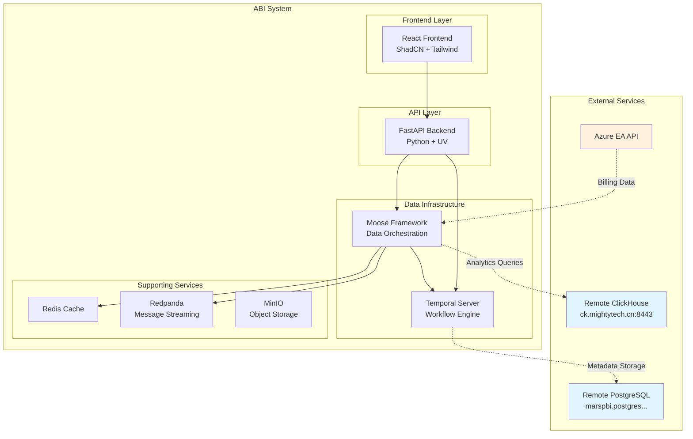
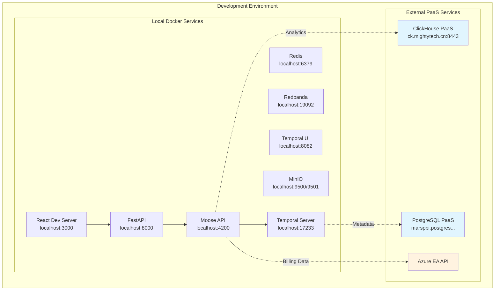

# Azure Billing Intelligence (ABI) Design Document

## Overview

The Azure Billing Intelligence (ABI) system is designed as a modern, cloud-native data platform that provides comprehensive Azure billing analytics and workflow orchestration. The system leverages the Moose framework for data infrastructure, Temporal for workflow orchestration, ClickHouse for high-performance analytics, and React with ShadCN UI for the frontend experience.

The architecture follows a microservices pattern with clear separation of concerns: data ingestion, processing, storage, and presentation layers. The system is designed to handle large-scale Azure billing data with real-time processing capabilities and provides intuitive interfaces for FinOps teams to analyze and optimize cloud costs.

## Architecture

### High-Level Architecture



### Deployment Architecture



## Components and Interfaces

### 1. Frontend Layer (React + ShadCN + Tailwind)

**Purpose**: Modern, responsive web interface for data visualization and system management.

**Key Components**:
- **Dashboard Component**: Real-time cost analytics with interactive charts
- **Workflow Management Component**: Temporal workflow monitoring and control
- **Data Explorer Component**: ClickHouse query interface with result visualization
- **Configuration Component**: System settings and connection management

**Technology Stack**:
- React 18+ with TypeScript
- ShadCN UI component library
- Tailwind CSS for styling
- Recharts for data visualization
- TanStack Query for data fetching
- Vite for build tooling

**Interfaces**:
```typescript
interface DashboardProps {
  dateRange: DateRange;
  subscriptionFilter?: string[];
  resourceGroupFilter?: string[];
}

interface WorkflowStatus {
  id: string;
  name: string;
  status: 'running' | 'completed' | 'failed' | 'cancelled';
  startTime: Date;
  endTime?: Date;
  progress?: number;
}

interface BillingData {
  subscriptionId: string;
  resourceGroup: string;
  service: string;
  cost: number;
  date: Date;
  currency: string;
}
```

### 2. API Layer (FastAPI Backend)

**Purpose**: RESTful API server providing data access, workflow management, and system orchestration.

**Key Endpoints**:
- `/api/v1/billing/data` - Azure billing data queries
- `/api/v1/workflows/` - Temporal workflow management
- `/api/v1/analytics/` - ClickHouse analytics queries
- `/api/v1/health` - System health monitoring

**Technology Stack**:
- FastAPI with Python 3.12+
- Pydantic for data validation
- SQLAlchemy for ORM (if needed)
- Temporal Python SDK
- ClickHouse Python client
- UV for package management

**API Interfaces**:
```python
from pydantic import BaseModel
from typing import List, Optional
from datetime import datetime

class BillingQueryRequest(BaseModel):
    start_date: datetime
    end_date: datetime
    subscription_ids: Optional[List[str]] = None
    resource_groups: Optional[List[str]] = None
    services: Optional[List[str]] = None
    limit: int = 1000

class WorkflowTriggerRequest(BaseModel):
    workflow_type: str
    parameters: dict
    schedule: Optional[str] = None

class AnalyticsQueryRequest(BaseModel):
    query: str
    parameters: Optional[dict] = None
    format: str = "json"
```

### 3. Data Infrastructure Layer (Moose Framework)

**Purpose**: Core data orchestration platform managing ingestion, transformation, and analytics.

**Key Components**:
- **Data Models**: Pydantic models for Azure billing data structures
- **Ingestion Pipelines**: Real-time data streaming from Azure EA API
- **Stream Functions**: Data transformation and enrichment logic
- **Consumption APIs**: Query interfaces for processed data
- **Workflow Integration**: Temporal workflow execution and monitoring

**Moose Configuration**:
```toml
[project]
name = "azure-billing-intelligence"
language = "python"
version = "0.1.0"

[clickhouse_config]
host = "ck.mightytech.cn"
host_port = 8443
use_ssl = true
db_name = "finops-odw"
user = "finops"
password = "cU2f947&9T{6d"

[temporal_config]
temporal_host = "localhost"
temporal_port = 17233
db_user = "maradmin"
db_password = "XQdaYh^4q&K9"
db_host = "marspbi.postgres.database.chinacloudapi.cn"
db_port = 5432

[redpanda_config]
host = "localhost"
port = 19092

[redis_config]
host = "localhost"
port = 6379
```

### 4. Workflow Engine (Temporal)

**Purpose**: Orchestrates long-running data processing workflows with reliability and observability.

**Key Workflows**:
- **Azure Billing Extraction**: Scheduled data extraction from Azure EA API
- **Data Transformation**: Processing and enrichment of billing records
- **Data Quality Monitoring**: Validation and anomaly detection
- **Report Generation**: Automated report creation and distribution

**Workflow Definitions**:
```python
from moose_lib import Task, TaskConfig, Workflow, WorkflowConfig
from pydantic import BaseModel
from typing import Optional

class AzureBillingWorkflowParams(BaseModel):
    start_date: str
    end_date: str
    subscription_ids: Optional[List[str]] = None
    batch_size: int = 1000

class DataQualityParams(BaseModel):
    table_name: str
    validation_rules: List[str]
    threshold: float = 0.95

# Azure Billing Extraction Workflow
azure_billing_task = Task[AzureBillingWorkflowParams, None](
    name="azure-billing-extraction",
    config=TaskConfig(
        run=extract_azure_billing_data,
        retries=3,
        timeout="30m"
    )
)

azure_billing_workflow = Workflow(
    name="azure-billing-workflow",
    config=WorkflowConfig(
        starting_task=azure_billing_task,
        schedule="0 2 * * *",  # Daily at 2 AM
        retries=2,
        timeout="2h"
    )
)
```

### 5. Database Layer

**ClickHouse (Analytics Database)**:
- **Purpose**: High-performance OLAP database for billing analytics
- **Schema**: Optimized for time-series billing data with proper partitioning
- **Queries**: Complex aggregations, trend analysis, and cost optimization queries

**PostgreSQL (Temporal Metadata)**:
- **Purpose**: Stores Temporal workflow metadata and execution history
- **Configuration**: External PaaS service for reliability and scalability

**Redis (Caching)**:
- **Purpose**: Application-level caching for frequently accessed data
- **Use Cases**: Query result caching, session management, rate limiting

## Data Models

### Azure Billing Data Model

```python
from moose_lib import Key
from pydantic import BaseModel
from typing import Optional
from datetime import datetime

class AzureBillingDetail(BaseModel):
    id: Key[str]
    account_name: Optional[str]
    subscription_id: Optional[str]
    subscription_guid: Optional[str]
    subscription_name: Optional[str]
    date: Optional[datetime]
    product: Optional[str]
    meter_category: Optional[str]
    meter_sub_category: Optional[str]
    meter_name: Optional[str]
    consumed_quantity: Optional[float]
    resource_rate: Optional[float]
    extended_cost: Optional[float]
    resource_location: Optional[str]
    consumed_service: Optional[str]
    instance_id: str
    resource_group: Optional[str]
    department_name: Optional[str]
    cost_center: Optional[str]
    tags: Optional[str]  # JSON string
    transform_timestamp: datetime

class WorkflowExecution(BaseModel):
    id: Key[str]
    workflow_name: str
    status: str
    start_time: datetime
    end_time: Optional[datetime]
    parameters: str  # JSON string
    error_message: Optional[str]
    records_processed: Optional[int]
```

### Stream Processing Models

```python
class BillingDataStream(BaseModel):
    """Stream model for real-time billing data processing"""
    raw_data: AzureBillingDetail
    processing_timestamp: datetime
    source: str = "azure_ea_api"

class CostAggregation(BaseModel):
    """Aggregated cost data for analytics"""
    subscription_id: str
    resource_group: str
    service: str
    date: datetime
    total_cost: float
    currency: str
    record_count: int
```

## Error Handling

### Error Categories and Strategies

**1. Data Source Errors (Azure EA API)**:
- **Rate Limiting**: Exponential backoff with jitter
- **Authentication Failures**: Credential refresh and retry
- **Data Quality Issues**: Validation and quarantine of bad records
- **Network Timeouts**: Circuit breaker pattern with fallback

**2. Database Errors (ClickHouse)**:
- **Connection Failures**: Connection pooling with health checks
- **Query Timeouts**: Query optimization and result streaming
- **Schema Evolution**: Automated migration scripts
- **Disk Space**: Monitoring and alerting with data retention policies

**3. Workflow Errors (Temporal)**:
- **Task Failures**: Automatic retries with exponential backoff
- **Workflow Timeouts**: Configurable timeouts per workflow type
- **Resource Exhaustion**: Resource monitoring and scaling
- **Data Consistency**: Transactional processing with rollback capabilities

**Error Handling Implementation**:
```python
from typing import Optional
import logging
from datetime import datetime

class ErrorHandler:
    def __init__(self, logger: logging.Logger):
        self.logger = logger
    
    async def handle_azure_api_error(self, error: Exception, context: dict) -> bool:
        """Handle Azure EA API errors with appropriate retry logic"""
        if isinstance(error, RateLimitError):
            await self.exponential_backoff(error.retry_after)
            return True  # Retry
        elif isinstance(error, AuthenticationError):
            await self.refresh_credentials()
            return True  # Retry
        else:
            self.logger.error(f"Unhandled Azure API error: {error}", extra=context)
            return False  # Don't retry
    
    async def handle_database_error(self, error: Exception, query: str) -> Optional[str]:
        """Handle database errors and provide fallback strategies"""
        if isinstance(error, ConnectionError):
            await self.reconnect_database()
            return "retry"
        elif isinstance(error, QueryTimeoutError):
            return await self.optimize_query(query)
        else:
            self.logger.error(f"Database error: {error}")
            return None
```

## Testing Strategy

### Unit Testing
- **Backend APIs**: FastAPI test client with mocked dependencies
- **Data Models**: Pydantic model validation and serialization tests
- **Workflow Tasks**: Isolated task testing with mock data
- **Frontend Components**: React Testing Library with Jest

### Integration Testing
- **Database Integration**: TestContainers for ClickHouse and PostgreSQL
- **API Integration**: End-to-end API testing with real database connections
- **Workflow Integration**: Temporal test environment with workflow execution
- **External Service Integration**: Mock Azure EA API for testing

### Performance Testing
- **Load Testing**: Artillery.js for API endpoint load testing
- **Database Performance**: Query performance benchmarking
- **Workflow Scalability**: Concurrent workflow execution testing
- **Frontend Performance**: Lighthouse CI for web performance metrics

### Testing Implementation
```python
import pytest
from fastapi.testclient import TestClient
from temporalio.testing import WorkflowEnvironment
from testcontainers.clickhouse import ClickHouseContainer

@pytest.fixture
async def test_environment():
    """Setup test environment with all dependencies"""
    async with WorkflowEnvironment.start_time_skipping() as temporal_env:
        with ClickHouseContainer() as clickhouse:
            yield {
                "temporal_client": temporal_env.client,
                "clickhouse_url": clickhouse.get_connection_url(),
                "test_data": load_test_data()
            }

@pytest.mark.asyncio
async def test_azure_billing_workflow(test_environment):
    """Test complete Azure billing data extraction workflow"""
    client = test_environment["temporal_client"]
    
    # Execute workflow with test parameters
    result = await client.execute_workflow(
        AzureBillingWorkflow.run,
        AzureBillingWorkflowParams(
            start_date="2024-01-01",
            end_date="2024-01-31",
            batch_size=100
        ),
        id="test-workflow",
        task_queue="test-queue"
    )
    
    assert result.status == "completed"
    assert result.records_processed > 0
```

## Security Considerations

### Authentication and Authorization
- **API Security**: JWT-based authentication with role-based access control
- **Database Security**: Encrypted connections and credential management
- **Workflow Security**: Temporal namespace isolation and mTLS
- **Frontend Security**: HTTPS enforcement and CSP headers

### Data Protection
- **Encryption at Rest**: Database-level encryption for sensitive billing data
- **Encryption in Transit**: TLS 1.3 for all network communications
- **Data Masking**: PII masking in logs and non-production environments
- **Access Logging**: Comprehensive audit trails for data access

### Infrastructure Security
- **Container Security**: Minimal base images and vulnerability scanning
- **Network Security**: VPC isolation and firewall rules
- **Secrets Management**: External secret management system integration
- **Monitoring**: Security event monitoring and alerting

## Performance Optimization

### Database Optimization
- **ClickHouse Tuning**: Proper partitioning by date and subscription
- **Query Optimization**: Materialized views for common aggregations
- **Connection Pooling**: Efficient database connection management
- **Caching Strategy**: Multi-level caching with Redis

### Application Optimization
- **Async Processing**: Non-blocking I/O for all external API calls
- **Batch Processing**: Efficient batch operations for data ingestion
- **Memory Management**: Streaming processing for large datasets
- **Resource Monitoring**: Application performance monitoring (APM)

### Frontend Optimization
- **Code Splitting**: Lazy loading of components and routes
- **Data Fetching**: Efficient data fetching with React Query
- **Virtualization**: Virtual scrolling for large data tables
- **Bundle Optimization**: Tree shaking and minification

## Monitoring and Observability

### Metrics Collection
- **Application Metrics**: Custom metrics for business logic
- **Infrastructure Metrics**: System resource utilization
- **Database Metrics**: Query performance and connection health
- **Workflow Metrics**: Temporal workflow execution statistics

### Logging Strategy
- **Structured Logging**: JSON-formatted logs with correlation IDs
- **Log Aggregation**: Centralized logging with ELK stack
- **Log Retention**: Configurable retention policies by log level
- **Security Logging**: Audit trails for sensitive operations

### Alerting and Monitoring
- **Health Checks**: Comprehensive health check endpoints
- **SLA Monitoring**: Service level agreement tracking
- **Error Rate Monitoring**: Automated alerting on error thresholds
- **Performance Monitoring**: Response time and throughput tracking

```python
from prometheus_client import Counter, Histogram, Gauge
import structlog

# Metrics
workflow_executions = Counter('workflow_executions_total', 'Total workflow executions', ['workflow_name', 'status'])
api_request_duration = Histogram('api_request_duration_seconds', 'API request duration', ['endpoint', 'method'])
active_connections = Gauge('database_connections_active', 'Active database connections', ['database'])

# Structured logging
logger = structlog.get_logger()

async def execute_workflow_with_monitoring(workflow_name: str, params: dict):
    """Execute workflow with comprehensive monitoring"""
    start_time = time.time()
    
    try:
        logger.info("Starting workflow", workflow_name=workflow_name, params=params)
        result = await execute_workflow(workflow_name, params)
        
        workflow_executions.labels(workflow_name=workflow_name, status='success').inc()
        logger.info("Workflow completed", workflow_name=workflow_name, duration=time.time() - start_time)
        
        return result
    except Exception as e:
        workflow_executions.labels(workflow_name=workflow_name, status='error').inc()
        logger.error("Workflow failed", workflow_name=workflow_name, error=str(e))
        raise
```