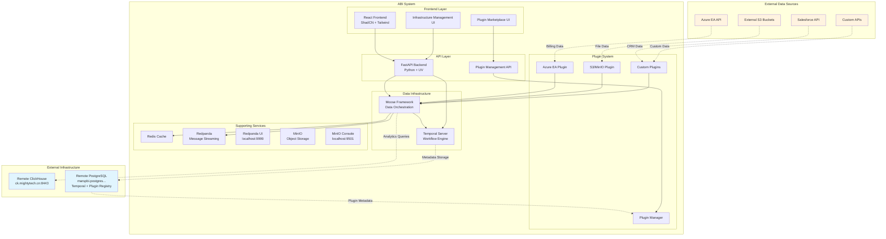
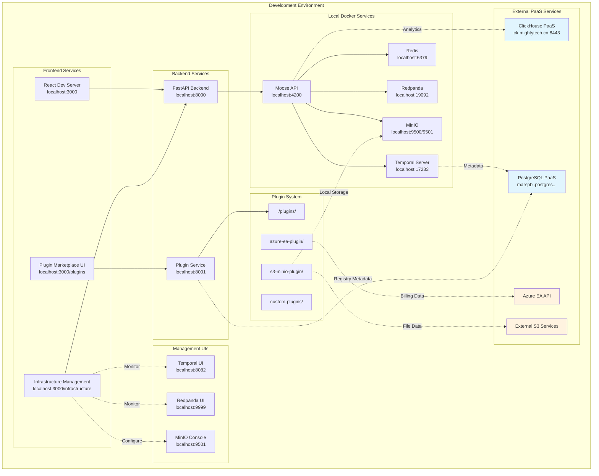
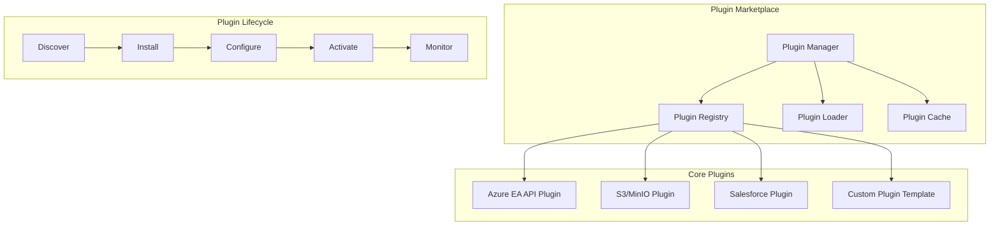
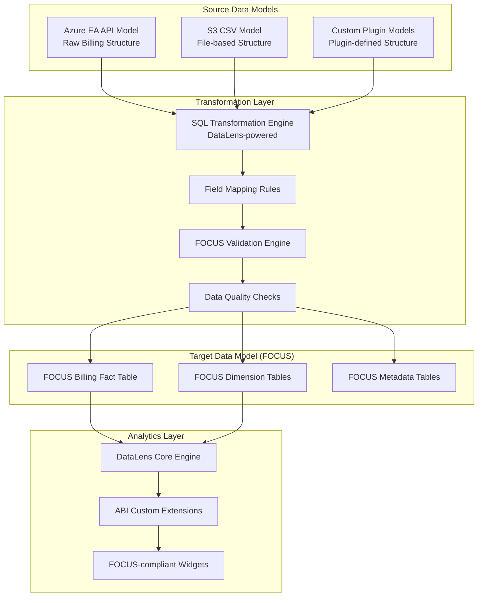

# Azure Billing Intelligence (ABI) Design Document

## Overview

The Azure Billing Intelligence (ABI) system is designed as a modern, cloud-native data platform that provides comprehensive Azure billing analytics and workflow orchestration. The system leverages the Moose framework for data infrastructure, Temporal for workflow orchestration, ClickHouse for high-performance analytics, and React with ShadCN UI for the frontend experience.

The architecture follows a microservices pattern with clear separation of concerns: data ingestion, processing, storage, and presentation layers. The system is designed to handle large-scale Azure billing data with real-time processing capabilities and provides intuitive interfaces for FinOps teams to analyze and optimize cloud costs.

## Architecture

### High-Level Architecture



### Deployment Architecture



## Components and Interfaces

### 1. Frontend Layer (React + ShadCN + Tailwind)

**Purpose**: Modern, responsive web interface for data visualization and system management.

**Key Components**:
- **Dashboard Component**: Real-time cost analytics with interactive charts
- **Workflow Management Component**: Temporal workflow monitoring and control
- **Data Explorer Component**: ClickHouse query interface with result visualization
- **Plugin Marketplace Component**: Data source connector discovery, installation, and configuration
- **Configuration Component**: System settings and connection management
- **MinIO Configuration Component**: Object storage connection and bucket management
- **Data Source Management Component**: Unified interface for all configured data connectors

**Technology Stack**:
- DataLens platform as base framework
- React 18+ with TypeScript extensions
- ShadCN UI component library for ABI-specific components
- Tailwind CSS for custom styling
- DataLens native visualization engine
- TanStack Query for additional data fetching
- Vite for build tooling and development
- Bun for package management and fast JavaScript runtime

**Interfaces**:
```typescript
interface DashboardProps {
  dateRange: DateRange;
  subscriptionFilter?: string[];
  resourceGroupFilter?: string[];
}

interface WorkflowStatus {
  id: string;
  name: string;
  status: 'running' | 'completed' | 'failed' | 'cancelled';
  startTime: Date;
  endTime?: Date;
  progress?: number;
}

interface BillingData {
  subscriptionId: string;
  resourceGroup: string;
  service: string;
  cost: number;
  date: Date;
  currency: string;
}

interface PluginMetadata {
  name: string;
  version: string;
  description: string;
  author: string;
  category: string;
  tags: string[];
  iconUrl?: string;
  documentationUrl?: string;
  configSchema: Record<string, any>;
  isInstalled: boolean;
  isConfigured: boolean;
  isActive: boolean;
}

interface PluginConfiguration {
  pluginName: string;
  config: Record<string, any>;
  isValid: boolean;
  lastTested?: Date;
  connectionStatus: 'connected' | 'disconnected' | 'error';
}

interface MinIOConfiguration {
  endpointUrl: string;
  accessKey: string;
  secretKey: string;
  bucketName: string;
  region: string;
  useSSL: boolean;
  connectionStatus: 'connected' | 'disconnected' | 'testing';
}

interface InfrastructureService {
  name: string;
  type: 'database' | 'messaging' | 'storage' | 'workflow' | 'cache';
  status: 'healthy' | 'unhealthy' | 'unknown';
  url: string;
  managementUrl?: string;
  lastHealthCheck: Date;
  metrics?: {
    cpu?: number;
    memory?: number;
    connections?: number;
    throughput?: number;
  };
}

interface InfrastructureManagementProps {
  services: InfrastructureService[];
  onServiceAction: (serviceId: string, action: string) => void;
  onConfigurationUpdate: (serviceId: string, config: any) => void;
}

interface DataSourceConnector {
  id: string;
  name: string;
  type: string;
  pluginName: string;
  configuration: Record<string, any>;
  status: 'active' | 'inactive' | 'error';
  lastSync?: Date;
  recordsProcessed?: number;
}
```

### 2. API Layer (FastAPI Backend)

**Purpose**: RESTful API server providing data access, workflow management, and system orchestration.

**Key Endpoints**:
- `/api/v1/billing/data` - Azure billing data queries
- `/api/v1/workflows/` - Temporal workflow management
- `/api/v1/analytics/` - ClickHouse analytics queries
- `/api/v1/plugins/` - Plugin marketplace and management
- `/api/v1/connectors/` - Data source connector management
- `/api/v1/storage/` - MinIO and S3 configuration
- `/api/v1/health` - System health monitoring

**Technology Stack**:
- FastAPI with Python 3.12+
- Pydantic for data validation
- SQLAlchemy for ORM (if needed)
- Temporal Python SDK
- ClickHouse Python client
- UV for fast Python package management and dependency resolution

**API Interfaces**:
```python
from pydantic import BaseModel
from typing import List, Optional, Dict, Any
from datetime import datetime

class BillingQueryRequest(BaseModel):
    start_date: datetime
    end_date: datetime
    subscription_ids: Optional[List[str]] = None
    resource_groups: Optional[List[str]] = None
    services: Optional[List[str]] = None
    limit: int = 1000

class WorkflowTriggerRequest(BaseModel):
    workflow_type: str
    parameters: dict
    schedule: Optional[str] = None

class AnalyticsQueryRequest(BaseModel):
    query: str
    parameters: Optional[dict] = None
    format: str = "json"

class PluginInstallRequest(BaseModel):
    plugin_name: str
    version: Optional[str] = "latest"
    auto_configure: bool = False

class PluginConfigurationRequest(BaseModel):
    plugin_name: str
    configuration: Dict[str, Any]
    test_connection: bool = True

class DataSourceConnectorRequest(BaseModel):
    name: str
    plugin_name: str
    configuration: Dict[str, Any]
    auto_activate: bool = True

class MinIOConfigurationRequest(BaseModel):
    endpoint_url: str
    access_key: str
    secret_key: str
    bucket_name: str
    region: str = "us-east-1"
    use_ssl: bool = True

class PluginMarketplaceResponse(BaseModel):
    plugins: List[Dict[str, Any]]
    categories: List[str]
    total_count: int
    featured_plugins: List[str]

class ConnectorStatusResponse(BaseModel):
    connectors: List[Dict[str, Any]]
    active_count: int
    total_records_processed: int
    last_sync_times: Dict[str, datetime]
```

### 3. Data Infrastructure Layer (Moose Framework)

**Purpose**: Core data orchestration platform managing ingestion, transformation, and analytics.

**Key Components**:
- **Source Data Models**: Pydantic models for raw data from Azure EA API, S3 CSV, and custom sources
- **Target Data Model**: FOCUS-compliant canonical schema for standardized analytics
- **Transformation Engine**: SQL-based mapping modules powered by DataLens transformation capabilities
- **Plugin System**: Extensible data source connector architecture with lazy loading
- **Ingestion Pipelines**: Real-time data streaming from multiple data sources
- **Stream Functions**: Data transformation and enrichment logic with FOCUS validation
- **Consumption APIs**: Query interfaces for FOCUS-compliant processed data
- **Workflow Integration**: Temporal workflow execution and monitoring
- **Connector Registry**: Dynamic plugin discovery and lifecycle management

**Moose Configuration**:
```toml
[project]
name = "azure-billing-intelligence"
language = "python"
version = "0.1.0"

[data_model]
specification = "focus"
source_models = ["azure_ea", "s3_csv", "custom_plugins"]
target_model = "focus_billing_data"
transformation_engine = "datalens"

[clickhouse_config]
host = "ck.mightytech.cn"
host_port = 8443
use_ssl = true
db_name = "finops-odw"
user = "finops"
password = "cU2f947&9T{6d"

[temporal_config]
temporal_host = "localhost"
temporal_port = 17233
db_user = "maradmin"
db_password = "XQdaYh^4q&K9"
db_host = "marspbi.postgres.database.chinacloudapi.cn"
db_port = 5432

[redpanda_config]
host = "localhost"
port = 19092
ui_port = 9999

[redis_config]
host = "localhost"
port = 6379

[minio_config]
endpoint_url = "http://localhost:9500"
console_port = 9501
access_key = "minioadmin"
secret_key = "minioadmin"
default_bucket = "abi-data"

[plugin_system]
plugin_directory = "./plugins"
marketplace_url = "https://abi-plugins.registry.com"
auto_update = false
lazy_loading = true
cache_plugins = true

[plugin_registry_db]
host = "marspbi.postgres.database.chinacloudapi.cn"
port = 5432
database = "abi_registry"
user = "maradmin"
password = "XQdaYh^4q&K9"
schema = "plugin_registry"

[ui_config]
redpanda_ui_url = "http://localhost:9999"
minio_console_url = "http://localhost:9501"
temporal_ui_url = "http://localhost:8082"

[datalens_config]
base_url = "http://localhost:8080"
api_endpoint = "/api/v1"
auth_type = "none"  # For development
default_connection = "clickhouse_focus"
enable_abi_extensions = true

[focus_config]
specification_version = "1.0"
validation_strict = true
required_dimensions = ["billing_account_id", "usage_date", "billed_cost"]
currency_default = "USD"
```

### 4. Workflow Engine (Temporal)

**Purpose**: Orchestrates long-running data processing workflows with reliability and observability.

**Key Workflows**:
- **Azure Billing Extraction**: Scheduled data extraction from Azure EA API
- **Data Transformation**: Processing and enrichment of billing records
- **Data Quality Monitoring**: Validation and anomaly detection
- **Report Generation**: Automated report creation and distribution

**Workflow Definitions**:
```python
from moose_lib import Task, TaskConfig, Workflow, WorkflowConfig
from pydantic import BaseModel
from typing import Optional

class AzureBillingWorkflowParams(BaseModel):
    start_date: str
    end_date: str
    subscription_ids: Optional[List[str]] = None
    batch_size: int = 1000

class DataQualityParams(BaseModel):
    table_name: str
    validation_rules: List[str]
    threshold: float = 0.95

# Azure Billing Extraction Workflow
azure_billing_task = Task[AzureBillingWorkflowParams, None](
    name="azure-billing-extraction",
    config=TaskConfig(
        run=extract_azure_billing_data,
        retries=3,
        timeout="30m"
    )
)

azure_billing_workflow = Workflow(
    name="azure-billing-workflow",
    config=WorkflowConfig(
        starting_task=azure_billing_task,
        schedule="0 2 * * *",  # Daily at 2 AM
        retries=2,
        timeout="2h"
    )
)
```

### 5. Plugin Marketplace Architecture

**Purpose**: Extensible plugin system for data source connectors with lazy loading and dynamic configuration.

**Plugin Architecture**:


**Plugin Interface**:
```python
from abc import ABC, abstractmethod
from typing import Dict, Any, List, Optional
from pydantic import BaseModel

class PluginMetadata(BaseModel):
    name: str
    version: str
    description: str
    author: str
    category: str  # "billing", "storage", "analytics", etc.
    tags: List[str]
    requirements: List[str]
    config_schema: Dict[str, Any]
    icon_url: Optional[str] = None
    documentation_url: Optional[str] = None

class DataSourcePlugin(ABC):
    """Base class for all data source plugins"""
    
    @property
    @abstractmethod
    def metadata(self) -> PluginMetadata:
        """Plugin metadata and configuration schema"""
        pass
    
    @abstractmethod
    async def validate_config(self, config: Dict[str, Any]) -> bool:
        """Validate plugin configuration"""
        pass
    
    @abstractmethod
    async def test_connection(self, config: Dict[str, Any]) -> bool:
        """Test connection with provided configuration"""
        pass
    
    @abstractmethod
    async def extract_data(self, config: Dict[str, Any], params: Dict[str, Any]) -> List[Dict[str, Any]]:
        """Extract data from the source"""
        pass
    
    @abstractmethod
    async def get_schema(self, config: Dict[str, Any]) -> Dict[str, Any]:
        """Get data schema from the source"""
        pass

class PluginRegistry:
    """PostgreSQL-based plugin registry for metadata storage"""
    
    def __init__(self, db_connection: str):
        self.db = db_connection
        self.schema = "plugin_registry"
    
    async def initialize_schema(self):
        """Initialize plugin registry database schema"""
        await self.db.execute(f"""
            CREATE SCHEMA IF NOT EXISTS {self.schema};
            
            CREATE TABLE IF NOT EXISTS {self.schema}.plugins (
                id UUID PRIMARY KEY DEFAULT gen_random_uuid(),
                name VARCHAR(255) UNIQUE NOT NULL,
                version VARCHAR(50) NOT NULL,
                description TEXT,
                author VARCHAR(255),
                category VARCHAR(100),
                tags TEXT[],
                config_schema JSONB,
                requirements TEXT[],
                icon_url TEXT,
                documentation_url TEXT,
                download_url TEXT,
                checksum VARCHAR(64),
                created_at TIMESTAMP DEFAULT NOW(),
                updated_at TIMESTAMP DEFAULT NOW()
            );
            
            CREATE TABLE IF NOT EXISTS {self.schema}.plugin_installations (
                id UUID PRIMARY KEY DEFAULT gen_random_uuid(),
                plugin_name VARCHAR(255) REFERENCES {self.schema}.plugins(name),
                version VARCHAR(50),
                installation_path TEXT,
                configuration JSONB,
                status VARCHAR(50) DEFAULT 'installed',
                installed_at TIMESTAMP DEFAULT NOW(),
                last_used TIMESTAMP
            );
            
            CREATE TABLE IF NOT EXISTS {self.schema}.plugin_configurations (
                id UUID PRIMARY KEY DEFAULT gen_random_uuid(),
                plugin_name VARCHAR(255),
                connector_name VARCHAR(255),
                configuration JSONB,
                is_active BOOLEAN DEFAULT false,
                created_at TIMESTAMP DEFAULT NOW(),
                updated_at TIMESTAMP DEFAULT NOW()
            );
        """)

class PluginManager:
    """Manages plugin lifecycle and lazy loading with PostgreSQL registry"""
    
    def __init__(self, registry: PluginRegistry):
        self.registry = registry
        self.loaded_plugins = {}
        self.plugin_configs = {}
    
    async def discover_plugins(self) -> List[PluginMetadata]:
        """Discover available plugins from PostgreSQL registry"""
        query = f"""
            SELECT name, version, description, author, category, tags, 
                   config_schema, icon_url, documentation_url
            FROM {self.registry.schema}.plugins 
            ORDER BY category, name
        """
        results = await self.registry.db.fetch(query)
        return [PluginMetadata(**row) for row in results]
    
    async def install_plugin(self, plugin_name: str, version: str = "latest") -> bool:
        """Install plugin with lazy loading and PostgreSQL tracking"""
        # Download and install plugin
        plugin_path = await self._download_plugin(plugin_name, version)
        
        # Record installation in PostgreSQL
        await self.registry.db.execute(f"""
            INSERT INTO {self.registry.schema}.plugin_installations 
            (plugin_name, version, installation_path, status)
            VALUES ($1, $2, $3, 'installed')
        """, plugin_name, version, plugin_path)
        
        return True
    
    async def load_plugin(self, plugin_name: str) -> DataSourcePlugin:
        """Lazy load plugin when needed"""
        if plugin_name not in self.loaded_plugins:
            # Get installation info from PostgreSQL
            installation = await self.registry.db.fetchrow(f"""
                SELECT installation_path, configuration 
                FROM {self.registry.schema}.plugin_installations 
                WHERE plugin_name = $1 AND status = 'installed'
                ORDER BY installed_at DESC LIMIT 1
            """, plugin_name)
            
            if not installation:
                raise ValueError(f"Plugin {plugin_name} not installed")
            
            plugin_module = await self._import_plugin(installation['installation_path'])
            self.loaded_plugins[plugin_name] = plugin_module
            
            # Update last used timestamp
            await self.registry.db.execute(f"""
                UPDATE {self.registry.schema}.plugin_installations 
                SET last_used = NOW() 
                WHERE plugin_name = $1
            """, plugin_name)
        
        return self.loaded_plugins[plugin_name]
    
    async def configure_plugin(self, plugin_name: str, connector_name: str, config: Dict[str, Any]) -> bool:
        """Configure plugin with validation and PostgreSQL storage"""
        plugin = await self.load_plugin(plugin_name)
        
        if await plugin.validate_config(config):
            # Store configuration in PostgreSQL
            await self.registry.db.execute(f"""
                INSERT INTO {self.registry.schema}.plugin_configurations 
                (plugin_name, connector_name, configuration, is_active)
                VALUES ($1, $2, $3, true)
                ON CONFLICT (plugin_name, connector_name) 
                DO UPDATE SET configuration = $3, updated_at = NOW()
            """, plugin_name, connector_name, config)
            
            self.plugin_configs[f"{plugin_name}:{connector_name}"] = config
            return True
        return False
```

**Azure EA API Plugin Implementation**:
```python
class AzureEAPlugin(DataSourcePlugin):
    @property
    def metadata(self) -> PluginMetadata:
        return PluginMetadata(
            name="azure-ea-api",
            version="1.0.0",
            description="Azure Enterprise Agreement API connector for billing data",
            author="ABI Team",
            category="billing",
            tags=["azure", "billing", "enterprise"],
            requirements=["requests>=2.28.0", "azure-identity>=1.12.0"],
            config_schema={
                "type": "object",
                "properties": {
                    "enrollment_number": {"type": "string", "description": "Azure EA enrollment number"},
                    "api_key": {"type": "string", "description": "Azure EA API key", "format": "password"},
                    "base_url": {"type": "string", "default": "https://consumption.azure.com"},
                    "timeout": {"type": "integer", "default": 30, "minimum": 5, "maximum": 300}
                },
                "required": ["enrollment_number", "api_key"]
            }
        )
    
    async def validate_config(self, config: Dict[str, Any]) -> bool:
        required_fields = ["enrollment_number", "api_key"]
        return all(field in config and config[field] for field in required_fields)
    
    async def test_connection(self, config: Dict[str, Any]) -> bool:
        # Implementation for testing Azure EA API connection
        pass
    
    async def extract_data(self, config: Dict[str, Any], params: Dict[str, Any]) -> List[Dict[str, Any]]:
        # Implementation for extracting Azure billing data
        pass
```

**S3/MinIO Plugin Implementation**:
```python
class S3MinIOPlugin(DataSourcePlugin):
    @property
    def metadata(self) -> PluginMetadata:
        return PluginMetadata(
            name="s3-minio",
            version="1.0.0",
            description="S3 and MinIO object storage connector",
            author="ABI Team",
            category="storage",
            tags=["s3", "minio", "object-storage"],
            requirements=["boto3>=1.26.0", "minio>=7.1.0"],
            config_schema={
                "type": "object",
                "properties": {
                    "endpoint_url": {"type": "string", "description": "S3/MinIO endpoint URL"},
                    "access_key": {"type": "string", "description": "Access key ID"},
                    "secret_key": {"type": "string", "description": "Secret access key", "format": "password"},
                    "bucket_name": {"type": "string", "description": "Bucket name"},
                    "region": {"type": "string", "default": "us-east-1"},
                    "use_ssl": {"type": "boolean", "default": true}
                },
                "required": ["access_key", "secret_key", "bucket_name"]
            }
        )
    
    async def validate_config(self, config: Dict[str, Any]) -> bool:
        required_fields = ["access_key", "secret_key", "bucket_name"]
        return all(field in config and config[field] for field in required_fields)
    
    async def test_connection(self, config: Dict[str, Any]) -> bool:
        # Implementation for testing S3/MinIO connection
        pass
    
    async def extract_data(self, config: Dict[str, Any], params: Dict[str, Any]) -> List[Dict[str, Any]]:
        # Implementation for extracting data from S3/MinIO
        pass
```

### 6. Data Model Architecture

**FOCUS Specification Implementation**:

The system implements a dual data model approach with source-to-target transformations:



**Source Data Models**:

```python
# Azure EA API Source Model
class AzureEASourceModel(BaseModel):
    account_owner_id: Optional[str]
    subscription_id: Optional[str]
    subscription_guid: Optional[str]
    subscription_name: Optional[str]
    date: Optional[datetime]
    product: Optional[str]
    meter_category: Optional[str]
    meter_sub_category: Optional[str]
    consumed_quantity: Optional[float]
    resource_rate: Optional[float]
    extended_cost: Optional[float]
    resource_location: Optional[str]
    consumed_service: Optional[str]
    instance_id: Optional[str]
    resource_group: Optional[str]
    department_name: Optional[str]
    cost_center: Optional[str]
    tags: Optional[str]

# S3 CSV Source Model
class S3CSVSourceModel(BaseModel):
    file_path: str
    file_name: str
    headers: List[str]
    row_data: Dict[str, Any]
    row_number: int
    processed_at: datetime
    source_system: str
```

**FOCUS Target Data Model**:

```python
class FOCUSBillingModel(BaseModel):
    # FOCUS Required Dimensions
    billing_account_id: str
    billing_account_name: Optional[str]
    billing_currency: str
    billing_period_start_date: date
    billing_period_end_date: date
    
    # FOCUS Cost Dimensions
    billed_cost: Decimal
    effective_cost: Optional[Decimal]
    list_cost: Optional[Decimal]
    list_unit_price: Optional[Decimal]
    
    # FOCUS Usage Dimensions
    usage_date: date
    usage_quantity: Optional[Decimal]
    usage_unit: Optional[str]
    
    # FOCUS Resource Dimensions
    resource_id: Optional[str]
    resource_name: Optional[str]
    resource_type: Optional[str]
    
    # FOCUS Service Dimensions
    service_category: Optional[str]
    service_name: Optional[str]
    
    # FOCUS Geographic Dimensions
    availability_zone: Optional[str]
    region: Optional[str]
    
    # FOCUS Provider Dimensions
    provider: str = "Azure"
```

**Transformation Engine**:

```python
class DataLensTransformationEngine:
    """SQL-based transformation engine using DataLens capabilities"""
    
    def __init__(self, datalens_config: Dict[str, Any]):
        self.datalens = DataLensClient(datalens_config)
        self.transformations = {}
    
    async def register_transformation(self, 
                                   source_model: str, 
                                   target_model: str, 
                                   sql_template: str) -> str:
        """Register a new source-to-target transformation"""
        
        transformation_id = f"{source_model}_to_{target_model}"
        
        # Create DataLens dataset with transformation SQL
        dataset_config = {
            "source_connection": source_model,
            "target_schema": target_model,
            "transformation_sql": sql_template,
            "validation_rules": self._get_focus_validation_rules()
        }
        
        dataset_id = await self.datalens.create_dataset(dataset_config)
        self.transformations[transformation_id] = dataset_id
        
        return transformation_id
    
    async def execute_transformation(self, transformation_id: str, batch_size: int = 10000):
        """Execute transformation using DataLens batch processing"""
        
        dataset_id = self.transformations[transformation_id]
        
        # Use DataLens materialization engine
        result = await self.datalens.materialize_dataset(
            dataset_id=dataset_id,
            batch_size=batch_size,
            target_table="focus_billing_data"
        )
        
        return result
```

### 7. Infrastructure Management UI

**Purpose**: Provide centralized management interface for all supporting infrastructure services with direct access to their native management UIs.

**Design Decision**: Integrate infrastructure management directly into the ABI frontend while providing seamless access to native service UIs (RedPanda UI, MinIO Console, Temporal UI).

**Key Components**:

**Infrastructure Dashboard Component**:
```typescript
interface InfrastructureManagementComponent {
  // Service health monitoring
  serviceHealthDashboard: {
    realTimeStatus: boolean;
    healthCheckInterval: number;
    alertThresholds: Record<string, number>;
  };
  
  // Direct UI access
  serviceManagementLinks: {
    redpandaUI: 'http://localhost:9999';
    minioConsole: 'http://localhost:9501';
    temporalUI: 'http://localhost:8082';
    clickhouseUI?: string; // If available
  };
  
  // Configuration management
  configurationPanels: {
    minioConfig: MinIOConfigurationPanel;
    redpandaConfig: RedPandaConfigurationPanel;
    temporalConfig: TemporalConfigurationPanel;
  };
}

class InfrastructureManager {
  async getServiceStatus(serviceName: string): Promise<InfrastructureService> {
    switch (serviceName) {
      case 'redpanda':
        return await this.checkRedPandaHealth();
      case 'minio':
        return await this.checkMinIOHealth();
      case 'temporal':
        return await this.checkTemporalHealth();
      case 'clickhouse':
        return await this.checkClickHouseHealth();
      case 'redis':
        return await this.checkRedisHealth();
      default:
        throw new Error(`Unknown service: ${serviceName}`);
    }
  }
  
  private async checkRedPandaHealth(): Promise<InfrastructureService> {
    try {
      const response = await fetch('http://localhost:19092/health');
      return {
        name: 'RedPanda',
        type: 'messaging',
        status: response.ok ? 'healthy' : 'unhealthy',
        url: 'http://localhost:19092',
        managementUrl: 'http://localhost:9999',
        lastHealthCheck: new Date(),
        metrics: {
          throughput: await this.getRedPandaThroughput()
        }
      };
    } catch (error) {
      return {
        name: 'RedPanda',
        type: 'messaging',
        status: 'unhealthy',
        url: 'http://localhost:19092',
        managementUrl: 'http://localhost:9999',
        lastHealthCheck: new Date()
      };
    }
  }
  
  private async checkMinIOHealth(): Promise<InfrastructureService> {
    try {
      // MinIO health check implementation
      const response = await fetch('http://localhost:9500/minio/health/live');
      return {
        name: 'MinIO',
        type: 'storage',
        status: response.ok ? 'healthy' : 'unhealthy',
        url: 'http://localhost:9500',
        managementUrl: 'http://localhost:9501',
        lastHealthCheck: new Date()
      };
    } catch (error) {
      return {
        name: 'MinIO',
        type: 'storage',
        status: 'unhealthy',
        url: 'http://localhost:9500',
        managementUrl: 'http://localhost:9501',
        lastHealthCheck: new Date()
      };
    }
  }
}
```

**MinIO Configuration Panel**:
```typescript
interface MinIOConfigurationPanel {
  connectionSettings: {
    endpointUrl: string;
    accessKey: string;
    secretKey: string;
    region: string;
    useSSL: boolean;
  };
  
  bucketManagement: {
    listBuckets: () => Promise<string[]>;
    createBucket: (name: string) => Promise<boolean>;
    deleteBucket: (name: string) => Promise<boolean>;
    setBucketPolicy: (name: string, policy: any) => Promise<boolean>;
  };
  
  connectionTesting: {
    testConnection: () => Promise<boolean>;
    validateCredentials: () => Promise<boolean>;
    checkBucketAccess: (bucketName: string) => Promise<boolean>;
  };
}

class MinIOConfigurationManager {
  async testMinIOConnection(config: MinIOConfiguration): Promise<boolean> {
    try {
      const minioClient = new MinIO.Client({
        endPoint: new URL(config.endpointUrl).hostname,
        port: parseInt(new URL(config.endpointUrl).port) || (config.useSSL ? 443 : 80),
        useSSL: config.useSSL,
        accessKey: config.accessKey,
        secretKey: config.secretKey,
        region: config.region
      });
      
      // Test connection by listing buckets
      await minioClient.listBuckets();
      return true;
    } catch (error) {
      console.error('MinIO connection test failed:', error);
      return false;
    }
  }
  
  async validateBucketAccess(config: MinIOConfiguration): Promise<boolean> {
    try {
      const minioClient = new MinIO.Client({
        endPoint: new URL(config.endpointUrl).hostname,
        port: parseInt(new URL(config.endpointUrl).port) || (config.useSSL ? 443 : 80),
        useSSL: config.useSSL,
        accessKey: config.accessKey,
        secretKey: config.secretKey,
        region: config.region
      });
      
      // Test bucket access
      const bucketExists = await minioClient.bucketExists(config.bucketName);
      if (!bucketExists) {
        await minioClient.makeBucket(config.bucketName, config.region);
      }
      
      return true;
    } catch (error) {
      console.error('MinIO bucket access validation failed:', error);
      return false;
    }
  }
}
```

**Infrastructure Management API Endpoints**:
```python
from fastapi import APIRouter, HTTPException
from typing import List, Dict, Any

infrastructure_router = APIRouter(prefix="/api/v1/infrastructure", tags=["infrastructure"])

@infrastructure_router.get("/services/status")
async def get_services_status() -> List[Dict[str, Any]]:
    """Get status of all infrastructure services"""
    services = []
    
    # Check RedPanda
    redpanda_status = await check_redpanda_health()
    services.append({
        "name": "redpanda",
        "status": redpanda_status,
        "management_url": "http://localhost:9999",
        "description": "Message streaming platform"
    })
    
    # Check MinIO
    minio_status = await check_minio_health()
    services.append({
        "name": "minio",
        "status": minio_status,
        "management_url": "http://localhost:9501",
        "description": "S3-compatible object storage"
    })
    
    # Check Temporal
    temporal_status = await check_temporal_health()
    services.append({
        "name": "temporal",
        "status": temporal_status,
        "management_url": "http://localhost:8082",
        "description": "Workflow orchestration engine"
    })
    
    return services

@infrastructure_router.post("/minio/test-connection")
async def test_minio_connection(config: MinIOConfigurationRequest) -> Dict[str, Any]:
    """Test MinIO connection with provided configuration"""
    try:
        # Test connection logic
        is_connected = await test_minio_connectivity(config)
        return {
            "success": is_connected,
            "message": "Connection successful" if is_connected else "Connection failed"
        }
    except Exception as e:
        raise HTTPException(status_code=400, detail=str(e))

@infrastructure_router.get("/minio/buckets")
async def list_minio_buckets() -> List[str]:
    """List available MinIO buckets"""
    try:
        buckets = await get_minio_buckets()
        return buckets
    except Exception as e:
        raise HTTPException(status_code=500, detail=str(e))
```

### 8. DataLens Frontend Integration

**Purpose**: Extend DataLens open-source BI platform with ABI-specific functionality while maintaining compatibility with the core DataLens ecosystem.

**Design Decision**: Use DataLens as the foundational frontend platform and extend it with ABI-specific widgets, dashboards, and FOCUS-compliant analytics capabilities rather than building a custom frontend from scratch.

**Rationale**: DataLens provides a proven, enterprise-grade BI platform with robust visualization capabilities, SQL-based dataset management, and extensible architecture. This approach reduces development time while ensuring professional-grade analytics capabilities.

**Extended DataLens Architecture**:

```typescript
interface ABIDataLensConfig {
  // Base DataLens configuration
  baseConfig: {
    apiEndpoint: string;
    authConfig: AuthConfig;
    defaultConnection: string;
  };
  
  // ABI-specific extensions
  extensions: {
    focusCompliance: boolean;
    azureBillingWidgets: boolean;
    workflowIntegration: boolean;
    pluginMarketplace: boolean;
  };
  
  // Custom dashboard templates
  dashboardTemplates: {
    costOptimization: FOCUSCostDashboard;
    resourceUtilization: ResourceUtilizationDashboard;
    budgetTracking: BudgetTrackingDashboard;
    anomalyDetection: AnomalyDetectionDashboard;
  };
}

class ABIDataLensExtension extends DataLensCore {
  constructor(config: ABIDataLensConfig) {
    super(config.baseConfig);
    this.initializeABIExtensions(config.extensions);
  }
  
  private async initializeABIExtensions(extensions: any): Promise<void> {
    // Register FOCUS-compliant widgets
    if (extensions.focusCompliance) {
      await this.registerFOCUSWidgets();
    }
    
    // Setup Azure billing visualizations
    if (extensions.azureBillingWidgets) {
      await this.setupAzureBillingCharts();
    }
    
    // Integrate workflow monitoring
    if (extensions.workflowIntegration) {
      await this.integrateWorkflowDashboards();
    }
    
    // Setup plugin marketplace UI
    if (extensions.pluginMarketplace) {
      await this.setupPluginMarketplaceUI();
    }
  }
  
  private async registerFOCUSWidgets(): Promise<void> {
    // FOCUS cost trend widget
    this.registerWidget('focus-cost-trend', {
      type: 'line-chart',
      dataSource: 'focus_billing_data',
      dimensions: ['usage_date'],
      measures: ['billed_cost', 'effective_cost'],
      filters: ['service_category', 'region'],
      focusCompliant: true,
      defaultConfig: {
        title: 'FOCUS Cost Trends',
        xAxis: { field: 'usage_date', title: 'Date' },
        yAxis: { field: 'billed_cost', title: 'Cost (USD)' },
        legend: { position: 'bottom' }
      }
    });
    
    // FOCUS resource utilization heatmap
    this.registerWidget('focus-resource-heatmap', {
      type: 'heatmap',
      dataSource: 'focus_billing_data',
      dimensions: ['service_name', 'region'],
      measures: ['usage_quantity'],
      colorScale: 'usage_quantity',
      focusCompliant: true,
      defaultConfig: {
        title: 'Resource Utilization by Service and Region',
        colorScheme: 'blues',
        tooltip: ['service_name', 'region', 'usage_quantity']
      }
    });
    
    // FOCUS cost allocation pie chart
    this.registerWidget('focus-cost-allocation', {
      type: 'pie-chart',
      dataSource: 'focus_billing_data',
      dimensions: ['service_category'],
      measures: ['billed_cost'],
      focusCompliant: true,
      defaultConfig: {
        title: 'Cost Allocation by Service Category',
        showLabels: true,
        showPercentages: true
      }
    });
    
    // FOCUS budget variance analysis
    this.registerWidget('focus-budget-variance', {
      type: 'bar-chart',
      dataSource: 'focus_billing_data_with_budget',
      dimensions: ['billing_account_name'],
      measures: ['billed_cost', 'budget_amount', 'variance'],
      focusCompliant: true,
      defaultConfig: {
        title: 'Budget vs Actual Cost Analysis',
        orientation: 'horizontal',
        colorMapping: {
          'billed_cost': '#2563eb',
          'budget_amount': '#16a34a',
          'variance': '#dc2626'
        }
      }
    });
  }
  
  private async setupAzureBillingCharts(): Promise<void> {
    // Azure-specific cost optimization dashboard
    this.createDashboard('azure-cost-optimization', {
      title: 'Azure Cost Optimization Dashboard',
      widgets: [
        {
          id: 'cost-trends',
          type: 'focus-cost-trend',
          position: { x: 0, y: 0, w: 12, h: 6 },
          filters: { provider: 'Azure' }
        },
        {
          id: 'service-breakdown',
          type: 'focus-cost-allocation',
          position: { x: 0, y: 6, w: 6, h: 6 },
          filters: { provider: 'Azure' }
        },
        {
          id: 'resource-utilization',
          type: 'focus-resource-heatmap',
          position: { x: 6, y: 6, w: 6, h: 6 },
          filters: { provider: 'Azure' }
        }
      ],
      filters: [
        { field: 'usage_date', type: 'date-range', default: 'last-30-days' },
        { field: 'billing_account_id', type: 'multi-select' },
        { field: 'service_category', type: 'multi-select' }
      ]
    });
    
    // Azure resource efficiency dashboard
    this.createDashboard('azure-resource-efficiency', {
      title: 'Azure Resource Efficiency Analysis',
      widgets: [
        {
          id: 'efficiency-metrics',
          type: 'metric-cards',
          position: { x: 0, y: 0, w: 12, h: 3 },
          metrics: ['cost_per_unit', 'utilization_rate', 'efficiency_score']
        },
        {
          id: 'underutilized-resources',
          type: 'table',
          position: { x: 0, y: 3, w: 12, h: 6 },
          columns: ['resource_id', 'service_name', 'usage_quantity', 'billed_cost', 'efficiency_score']
        }
      ]
    });
  }
  
  private async integrateWorkflowDashboards(): Promise<void> {
    // Workflow monitoring integration
    this.createDashboard('workflow-monitoring', {
      title: 'Data Processing Workflow Status',
      widgets: [
        {
          id: 'workflow-status',
          type: 'status-grid',
          position: { x: 0, y: 0, w: 12, h: 4 },
          dataSource: 'temporal_workflows'
        },
        {
          id: 'processing-metrics',
          type: 'line-chart',
          position: { x: 0, y: 4, w: 6, h: 6 },
          dataSource: 'workflow_metrics',
          dimensions: ['execution_time'],
          measures: ['records_processed']
        },
        {
          id: 'error-analysis',
          type: 'bar-chart',
          position: { x: 6, y: 4, w: 6, h: 6 },
          dataSource: 'workflow_errors',
          dimensions: ['error_type'],
          measures: ['error_count']
        }
      ]
    });
  }
}
```

### 8. Database Layer

**ClickHouse (Analytics Database)**:
- **Purpose**: High-performance OLAP database for FOCUS-compliant billing analytics
- **Schema**: FOCUS specification implementation with optimized partitioning by usage_date
- **Tables**: focus_billing_data (fact), dim_service_category, dim_resource_type, dim_geography (dimensions)
- **Queries**: FOCUS-compliant aggregations, trend analysis, and cost optimization queries

**PostgreSQL (Temporal Metadata & Plugin Registry)**:
- **Purpose**: Stores Temporal workflow metadata, execution history, and plugin registry metadata
- **Configuration**: External PaaS service for reliability and scalability
- **Schema**: Separate schemas for temporal metadata and plugin registry data

**Redis (Caching)**:
- **Purpose**: Application-level caching for frequently accessed data
- **Use Cases**: Query result caching, session management, rate limiting

## Data Models

### Azure Billing Data Model

```python
from moose_lib import Key
from pydantic import BaseModel
from typing import Optional
from datetime import datetime

class AzureBillingDetail(BaseModel):
    id: Key[str]
    account_name: Optional[str]
    subscription_id: Optional[str]
    subscription_guid: Optional[str]
    subscription_name: Optional[str]
    date: Optional[datetime]
    product: Optional[str]
    meter_category: Optional[str]
    meter_sub_category: Optional[str]
    meter_name: Optional[str]
    consumed_quantity: Optional[float]
    resource_rate: Optional[float]
    extended_cost: Optional[float]
    resource_location: Optional[str]
    consumed_service: Optional[str]
    instance_id: str
    resource_group: Optional[str]
    department_name: Optional[str]
    cost_center: Optional[str]
    tags: Optional[str]  # JSON string
    transform_timestamp: datetime

class WorkflowExecution(BaseModel):
    id: Key[str]
    workflow_name: str
    status: str
    start_time: datetime
    end_time: Optional[datetime]
    parameters: str  # JSON string
    error_message: Optional[str]
    records_processed: Optional[int]
```

### Stream Processing Models

```python
class BillingDataStream(BaseModel):
    """Stream model for real-time billing data processing"""
    raw_data: AzureBillingDetail
    processing_timestamp: datetime
    source: str = "azure_ea_api"

class CostAggregation(BaseModel):
    """Aggregated cost data for analytics"""
    subscription_id: str
    resource_group: str
    service: str
    date: datetime
    total_cost: float
    currency: str
    record_count: int
```

## Error Handling

### Error Categories and Strategies

**1. Data Source Errors (Azure EA API)**:
- **Rate Limiting**: Exponential backoff with jitter
- **Authentication Failures**: Credential refresh and retry
- **Data Quality Issues**: Validation and quarantine of bad records
- **Network Timeouts**: Circuit breaker pattern with fallback

**2. Database Errors (ClickHouse)**:
- **Connection Failures**: Connection pooling with health checks
- **Query Timeouts**: Query optimization and result streaming
- **Schema Evolution**: Automated migration scripts
- **Disk Space**: Monitoring and alerting with data retention policies

**3. Workflow Errors (Temporal)**:
- **Task Failures**: Automatic retries with exponential backoff
- **Workflow Timeouts**: Configurable timeouts per workflow type
- **Resource Exhaustion**: Resource monitoring and scaling
- **Data Consistency**: Transactional processing with rollback capabilities

**Error Handling Implementation**:
```python
from typing import Optional
import logging
from datetime import datetime

class ErrorHandler:
    def __init__(self, logger: logging.Logger):
        self.logger = logger
    
    async def handle_azure_api_error(self, error: Exception, context: dict) -> bool:
        """Handle Azure EA API errors with appropriate retry logic"""
        if isinstance(error, RateLimitError):
            await self.exponential_backoff(error.retry_after)
            return True  # Retry
        elif isinstance(error, AuthenticationError):
            await self.refresh_credentials()
            return True  # Retry
        else:
            self.logger.error(f"Unhandled Azure API error: {error}", extra=context)
            return False  # Don't retry
    
    async def handle_database_error(self, error: Exception, query: str) -> Optional[str]:
        """Handle database errors and provide fallback strategies"""
        if isinstance(error, ConnectionError):
            await self.reconnect_database()
            return "retry"
        elif isinstance(error, QueryTimeoutError):
            return await self.optimize_query(query)
        else:
            self.logger.error(f"Database error: {error}")
            return None
```

## Testing Strategy

### Unit Testing
- **Backend APIs**: FastAPI test client with mocked dependencies
- **Data Models**: Pydantic model validation and serialization tests
- **Workflow Tasks**: Isolated task testing with mock data
- **Frontend Components**: React Testing Library with Jest

### Integration Testing
- **Database Integration**: TestContainers for ClickHouse and PostgreSQL
- **API Integration**: End-to-end API testing with real database connections
- **Workflow Integration**: Temporal test environment with workflow execution
- **External Service Integration**: Mock Azure EA API for testing

### Performance Testing
- **Load Testing**: Artillery.js for API endpoint load testing
- **Database Performance**: Query performance benchmarking
- **Workflow Scalability**: Concurrent workflow execution testing
- **Frontend Performance**: Lighthouse CI for web performance metrics

### Testing Implementation
```python
import pytest
from fastapi.testclient import TestClient
from temporalio.testing import WorkflowEnvironment
from testcontainers.clickhouse import ClickHouseContainer

@pytest.fixture
async def test_environment():
    """Setup test environment with all dependencies"""
    async with WorkflowEnvironment.start_time_skipping() as temporal_env:
        with ClickHouseContainer() as clickhouse:
            yield {
                "temporal_client": temporal_env.client,
                "clickhouse_url": clickhouse.get_connection_url(),
                "test_data": load_test_data()
            }

@pytest.mark.asyncio
async def test_azure_billing_workflow(test_environment):
    """Test complete Azure billing data extraction workflow"""
    client = test_environment["temporal_client"]
    
    # Execute workflow with test parameters
    result = await client.execute_workflow(
        AzureBillingWorkflow.run,
        AzureBillingWorkflowParams(
            start_date="2024-01-01",
            end_date="2024-01-31",
            batch_size=100
        ),
        id="test-workflow",
        task_queue="test-queue"
    )
    
    assert result.status == "completed"
    assert result.records_processed > 0
```

## Development Environment and Monorepo Structure

### Monorepo Architecture

**Design Decision**: Organize the ABI system as a monorepo using Turbo for orchestration, with clear separation between apps, services, and packages.

**Structure**:
```
azure-billing-intelligence/
├── apps/
│   ├── abi-frontend/                 # DataLens-based frontend
│   └── abi-admin/                    # Admin interface (optional)
├── services/
│   ├── @workspace/abi-api/           # FastAPI backend
│   ├── @workspace/abi-workflows/     # Temporal workflows
│   └── @workspace/abi-plugins/       # Plugin system
├── packages/
│   ├── @workspace/abi-models/        # Shared data models
│   ├── @workspace/abi-config/        # Shared configurations
│   └── @workspace/abi-ui/            # Shared UI components
├── turbo.json                        # Turbo configuration
├── package.json                      # Root package.json
└── docker-compose.yml               # Infrastructure services
```

**Turbo Configuration**:
```json
{
  "$schema": "https://turbo.build/schema.json",
  "pipeline": {
    "build": {
      "dependsOn": ["^build"],
      "outputs": ["dist/**", "build/**"]
    },
    "dev": {
      "cache": false,
      "persistent": true
    },
    "lint": {
      "outputs": []
    },
    "test": {
      "dependsOn": ["^build"],
      "outputs": ["coverage/**"]
    },
    "clean": {
      "cache": false
    }
  }
}
```

### Docker Port Configuration

**Design Decision**: Use fixed port assignments for all Docker services to prevent silent port conflicts and ensure consistent development environments.

**Port Allocation Strategy**:
```yaml
# docker-compose.yml
version: '3.8'
services:
  clickhouse:
    image: clickhouse/clickhouse-server:latest
    ports:
      - "8123:8123"  # HTTP interface
      - "9000:9000"  # Native protocol
    # No port auto-assignment - fail if ports are occupied
    
  postgres:
    image: postgres:15
    ports:
      - "5432:5432"  # Fixed PostgreSQL port
    
  redis:
    image: redis:7-alpine
    ports:
      - "6379:6379"  # Fixed Redis port
    
  redpanda:
    image: redpandadata/redpanda:latest
    ports:
      - "19092:19092"  # Kafka API
      - "9999:9644"    # Admin UI
    
  minio:
    image: minio/minio:latest
    ports:
      - "9500:9000"   # API
      - "9501:9001"   # Console
    
  temporal:
    image: temporalio/auto-setup:latest
    ports:
      - "17233:7233"  # Frontend
      - "8082:8080"   # Web UI
```

**Rationale**: Fixed ports prevent configuration drift, make debugging easier, and ensure that service discovery works consistently across different development environments.

## Package Management Strategy

### Backend Package Management (UV)

**Design Decision**: Use UV for Python package management to ensure fast, reliable dependency resolution and consistent development environments across the team.

**Rationale**: UV provides significant performance improvements over traditional pip, with faster dependency resolution, better lock file management, and improved security through dependency verification.

**Implementation**:
```toml
# pyproject.toml
[project]
name = "azure-billing-intelligence"
version = "0.1.0"
description = "Azure Billing Intelligence Platform"
requires-python = ">=3.12"
dependencies = [
    "fastapi>=0.104.0",
    "pydantic>=2.5.0",
    "temporalio>=1.5.0",
    "clickhouse-driver>=0.2.6",
    "redis>=5.0.0",
    "boto3>=1.34.0",
    "uvicorn>=0.24.0"
]

[project.optional-dependencies]
dev = [
    "pytest>=7.4.0",
    "pytest-asyncio>=0.21.0",
    "black>=23.0.0",
    "ruff>=0.1.0",
    "mypy>=1.7.0"
]

[build-system]
requires = ["hatchling"]
build-backend = "hatchling.build"

[tool.uv]
dev-dependencies = [
    "pytest>=7.4.0",
    "pytest-asyncio>=0.21.0",
    "testcontainers>=3.7.0"
]
```

**Development Workflow**:
```bash
# Install dependencies
uv sync

# Add new dependency
uv add fastapi

# Add development dependency
uv add --dev pytest

# Run application
uv run python -m app.main

# Run tests
uv run pytest
```

### Frontend Package Management (Bun)

**Design Decision**: Use Bun for JavaScript/TypeScript package management and runtime to achieve maximum performance in development and build processes.

**Rationale**: Bun provides significantly faster package installation, bundling, and runtime performance compared to npm/yarn, which is crucial for the DataLens-based frontend with complex visualization components.

**Implementation**:
```json
{
  "name": "@workspace/abi-frontend",
  "version": "0.1.0",
  "type": "module",
  "scripts": {
    "dev": "bun run vite",
    "build": "bun run vite build",
    "preview": "bun run vite preview",
    "test": "bun test",
    "lint": "bun run eslint . --ext ts,tsx --report-unused-disable-directives --max-warnings 0",
    "type-check": "bun run tsc --noEmit"
  },
  "dependencies": {
    "react": "^18.2.0",
    "react-dom": "^18.2.0",
    "@tanstack/react-query": "^5.8.0",
    "@radix-ui/react-slot": "^1.0.2",
    "class-variance-authority": "^0.7.0",
    "clsx": "^2.0.0",
    "tailwind-merge": "^2.0.0",
    "lucide-react": "^0.294.0"
  },
  "devDependencies": {
    "@types/react": "^18.2.37",
    "@types/react-dom": "^18.2.15",
    "@typescript-eslint/eslint-plugin": "^6.10.0",
    "@typescript-eslint/parser": "^6.10.0",
    "@vitejs/plugin-react": "^4.1.1",
    "autoprefixer": "^10.4.16",
    "eslint": "^8.53.0",
    "eslint-plugin-react-hooks": "^4.6.0",
    "eslint-plugin-react-refresh": "^0.4.4",
    "postcss": "^8.4.31",
    "tailwindcss": "^3.3.5",
    "typescript": "^5.2.2",
    "vite": "^5.0.0"
  }
}
```

**Development Workflow**:
```bash
# Install dependencies
bun install

# Add new dependency
bun add react-router-dom

# Add development dependency
bun add -d @types/node

# Run development server
bun run dev

# Build for production
bun run build

# Run tests
bun test
```

### Monorepo Package Management

**Design Decision**: Leverage Turbo for monorepo orchestration while maintaining UV and Bun for respective package management domains.

**Implementation**:
```json
{
  "name": "azure-billing-intelligence-monorepo",
  "private": true,
  "workspaces": [
    "apps/*",
    "services/*",
    "packages/*"
  ],
  "scripts": {
    "build": "turbo run build",
    "dev": "turbo run dev",
    "lint": "turbo run lint",
    "test": "turbo run test",
    "clean": "turbo run clean"
  },
  "devDependencies": {
    "turbo": "^1.10.0"
  },
  "packageManager": "bun@1.0.0"
}
```

## Security Considerations

### Authentication and Authorization
- **API Security**: JWT-based authentication with role-based access control
- **Database Security**: Encrypted connections and credential management
- **Workflow Security**: Temporal namespace isolation and mTLS
- **Frontend Security**: HTTPS enforcement and CSP headers

### Data Protection
- **Encryption at Rest**: Database-level encryption for sensitive billing data
- **Encryption in Transit**: TLS 1.3 for all network communications
- **Data Masking**: PII masking in logs and non-production environments
- **Access Logging**: Comprehensive audit trails for data access

### Infrastructure Security
- **Container Security**: Minimal base images and vulnerability scanning
- **Network Security**: VPC isolation and firewall rules
- **Secrets Management**: External secret management system integration
- **Monitoring**: Security event monitoring and alerting

## Performance Optimization

### Database Optimization
- **ClickHouse Tuning**: Proper partitioning by date and subscription
- **Query Optimization**: Materialized views for common aggregations
- **Connection Pooling**: Efficient database connection management
- **Caching Strategy**: Multi-level caching with Redis

### Application Optimization
- **Async Processing**: Non-blocking I/O for all external API calls
- **Batch Processing**: Efficient batch operations for data ingestion
- **Memory Management**: Streaming processing for large datasets
- **Resource Monitoring**: Application performance monitoring (APM)

### Frontend Optimization
- **Code Splitting**: Lazy loading of components and routes
- **Data Fetching**: Efficient data fetching with React Query
- **Virtualization**: Virtual scrolling for large data tables
- **Bundle Optimization**: Tree shaking and minification

## Monitoring and Observability

### Metrics Collection
- **Application Metrics**: Custom metrics for business logic
- **Infrastructure Metrics**: System resource utilization
- **Database Metrics**: Query performance and connection health
- **Workflow Metrics**: Temporal workflow execution statistics

### Logging Strategy
- **Structured Logging**: JSON-formatted logs with correlation IDs
- **Log Aggregation**: Centralized logging with ELK stack
- **Log Retention**: Configurable retention policies by log level
- **Security Logging**: Audit trails for sensitive operations

### Alerting and Monitoring
- **Health Checks**: Comprehensive health check endpoints
- **SLA Monitoring**: Service level agreement tracking
- **Error Rate Monitoring**: Automated alerting on error thresholds
- **Performance Monitoring**: Response time and throughput tracking

```python
from prometheus_client import Counter, Histogram, Gauge
import structlog

# Metrics
workflow_executions = Counter('workflow_executions_total', 'Total workflow executions', ['workflow_name', 'status'])
api_request_duration = Histogram('api_request_duration_seconds', 'API request duration', ['endpoint', 'method'])
active_connections = Gauge('database_connections_active', 'Active database connections', ['database'])

# Structured logging
logger = structlog.get_logger()

async def execute_workflow_with_monitoring(workflow_name: str, params: dict):
    """Execute workflow with comprehensive monitoring"""
    start_time = time.time()
    
    try:
        logger.info("Starting workflow", workflow_name=workflow_name, params=params)
        result = await execute_workflow(workflow_name, params)
        
        workflow_executions.labels(workflow_name=workflow_name, status='success').inc()
        logger.info("Workflow completed", workflow_name=workflow_name, duration=time.time() - start_time)
        
        return result
    except Exception as e:
        workflow_executions.labels(workflow_name=workflow_name, status='error').inc()
        logger.error("Workflow failed", workflow_name=workflow_name, error=str(e))
        raise
```