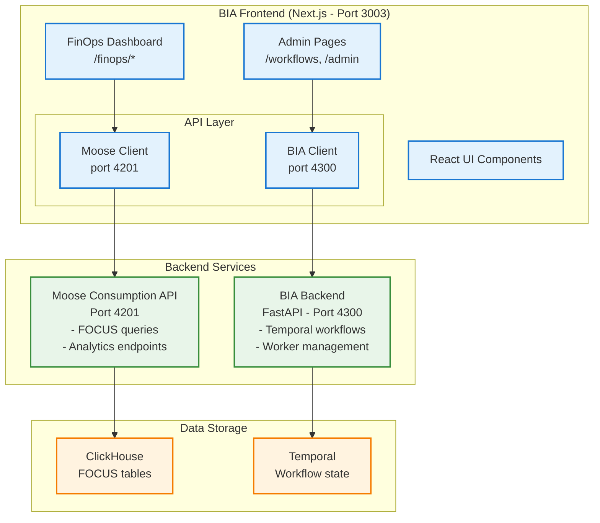

# Focus Billing Integration Design - Moose OLAP + Temporal Schema-Aware ETL

## Overview

This specification defines a modular, schema-aware architecture that integrates Moose OLAP with Temporalio to:
- **Automatically detect schema drift** between source data and canonical FOCUS schema
- **Generate transformation logic** dynamically using Moose OLAP
- **Apply migrations safely** using versioned ClickHouse tables and materialized views
- **Orchestrate end-to-end** via Temporal workflows for auditability and resilience

## Context
- FOCUS 1.2 exports (Parquet with nested period folders) live in `focus-mcp-main/data/focus`.
- Official column metadata lives in `resources/specifications/columns.yaml`; curated FOCUS use-case SQL lives in `resources/queries/*.yaml`.
- ClickHouse `finops-odw` is the primary analytical store (accessible via the Moose MCP ClickHouse tooling).
- Existing Moose app exposes consumption APIs and workflows through `moose_lib`. No FOCUS-specific module exists yet.

## Objectives
1. Materialize FOCUS-compliant tables in ClickHouse so queries from the YAML library can run without manual rewrites.
2. Expose those queries as Moose consumption APIs (list queries, fetch SQL, execute with runtime parameters).
3. Build a Moose workflow that ingests the local Parquet exports into the new tables and keeps a manifest of processed files.

## Target Schema & Storage Strategy
### Cost & Usage Table (`focus_cost_usage`)
- Capture the full FOCUS export grain (one row per charge line).
- Column naming strategy: store in ClickHouse using snake_case for ergonomics, but expose a view with the canonical FOCUS casing.
- Key columns: `id` (deterministic hash of BillingAccountId + ChargePeriodStart + ResourceId + SkuMeter + row_number), `billing_account_id`, `usage_date`, cost metrics (`billed_cost`, `effective_cost`, etc.), provider metadata, tags payload.
- Data types:
  - Monetary metrics: `Decimal(38, 18)` mapped to ClickHouse `Decimal(38, 18)` (converted to `Decimal(18, 6)` if precision exceeds ClickHouse limits).
  - Dates: convert Parquet `INT96` to `Date`/`DateTime64`.
  - Nullable strings remain `Nullable(String)`.
  - Extended provider columns (`x_*`) inherit their native types (string vs decimal) so downstream rules stay intact.
  - Boolean flags (e.g., `x_sku_is_credit_eligible`) store as `Nullable(UInt8)` for ClickHouse compatibility.
  - JSON payloads (`tags`, `sku_price_details`, etc.) stay in `Nullable(String)` for local development, but production ingestion can cast them into ClickHouse's native `JSON` type so downstream SQL can rely on dot-notation (`tags.ApplicationId`). Document both modes and keep compatibility helpers (e.g., `JSON_VALUE`) until the production schema is finalized.
- Partitions: `PARTITION BY toYYYYMM(usage_date)` (matches common query filters).
- Order by: `(usage_date, billing_account_id, service_category, service_name)` for efficient scans.
- Indexes: min/max on `(billing_account_id, usage_date)`, set indexes on `service_category`, `provider`, `region`.
- Columns stay 1:1 with the Cost and Usage dataset specification (`FOCUS_Spec/specification/datasets/cost_and_usage/dataset.md`).
- Each column definition carries Moose `metadata` tags so we can surface FOCUS semantics alongside schema:
  - `metadata.column_type` = spec "Column Type" (Dimension vs Metric).
  - `metadata.feature_level` = spec "Feature Level" (Mandatory, Recommended, Conditional).
  - `metadata.allows_nulls` and `metadata.data_type` mirror the spec for quick introspection.
- Persist JSON-oriented spec fields (e.g., `allocated_tags`) as `JSONEachRow` compatible `String` columns and validate shape in ingestion.

### Contract Commitment Table (`focus_contract_commitment`)
- Mirrors the FOCUS Contract Commitment dataset (`FOCUS_Spec/specification/datasets/contract_commitment/dataset.md`).
- Columns stay 1:1 with the specification while remaining snake_case in storage; metadata preserves canonical FOCUS casing for API consumers.
- Each column definition carries Moose `metadata` tags so we can surface FOCUS semantics alongside schema:
  - `metadata.column_type` = spec "Column Type" (Dimension vs Metric).
  - `metadata.feature_level` = spec "Feature Level" (Mandatory, Recommended, Conditional).
  - `metadata.allows_nulls` and `metadata.data_type` mirror the spec for quick introspection.
- Use ClickHouse `Nullable` types wherever "Allows Nulls" is `True`; map Decimal/Numeric to `Decimal(38, 18)` and Date/Time to `DateTime64(3)`.
- `contract_commitment_id` serves as the shared key between `focus_cost_usage` and `focus_contract_commitment`, enabling joins without custom SQL.
- Persist JSON-oriented spec fields (e.g., `contract_commitment_description`) as `String` columns while validating shape in ingestion as needed.

### Helper Objects
- `focus_data_table` VIEW: `SELECT ...` projected from `focus_cost_usage`, renaming snake_case columns back to FOCUS PascalCase so YAML SQL works unchanged.
- `focus_contract_commitment_view`: exposes the Contract Commitment table with canonical casing to simplify joins with YAML queries.
- Optional dimensions (phase 2): service category, geography, billing account. For the initial deliverable we can postpone unless queries require them.

### Table Creation Flow
1. Generate DDL using Moose MCP ClickHouse tool (`moose-dev__query_olap`) so schema lives in ClickHouse, not just docs.
2. DDL order:
   - `DROP/CREATE TABLE focus_cost_usage` (with column metadata populated from the Cost and Usage dataset).
   - `DROP/CREATE TABLE focus_contract_commitment` (with column metadata populated from the Contract Commitment dataset).
   - Create supporting views (`focus_data_table`, `focus_contract_commitment_view`).
   - Create indexes.
3. Store companion DDL in repo (`app/focus_billing/tables.py` or SQL file) so engineers can reapply.

## Query Exposure Plan
### Query Catalog Loader
- Add module that reads `resources/queries/*.yaml` at startup and converts entries into `FocusQuery` models.
- Replace placeholder `focus_data_table` reference with ClickHouse view.
- Track parameter specs: majority expect `[start_date, end_date]`. Validate and coerce to `Date`.
- Provide ability to list queries (with metadata) and fetch SQL preview for UI clients.

### Moose Consumption APIs
- Build new APIs under `app/apis/focus_billing/`:
  1. `list_focus_use_cases`: returns metadata for all queries.
  2. `get_focus_use_case`: details + SQL for a given slug.
  3. `execute_focus_use_case`: runs SQL with runtime parameters, returns rows (paged) and metrics (row count, elapsed).
  4. `list_supported_features`: surfaces the contents of `FOCUS_Spec/specification/supported_features` so clients can discover optional capabilities aligned with the spec.
     - Parse individual Markdown files (e.g., `cost_and_usage_attribution.md`) and expose them as structured metadata for UI rendering and API consumers.
- Use `moose_lib.ConsumptionApi` (consistent with existing APIs). Provide pydantic models for request/response validation.
- Parameter handling:
  - Accept `start_date`, `end_date`, optional dict of named bind variables if present.
  - Replace positional `?` placeholders with prepared statement dictionary (ClickHouse client expects named parameters).
  - Validate that required params are supplied before execution; raise descriptive errors otherwise.
- Caching: rely on Moose default caching (optional future enhancement).

## Ingestion Workflow (Updated: Moose-Native Approach)
### Architecture Change
**Previous**: Direct ClickHouse insertion via `clickhouse_connect` with manual DDL management
**New**: Moose-native ingestion using data models in `app/ingest/focus/` with automatic schema sync

### Benefits of Moose-Native Approach
1. **Automatic Schema Management**: Moose handles table creation, migrations, and schema sync from Pydantic models
2. **Type Safety**: Pydantic models provide validation and type checking aligned with FOCUS spec
3. **Streaming + Batch**: Support both streaming ingestion APIs and batch Parquet processing
4. **Consistent Patterns**: Aligns with existing Moose app architecture (see `app/ingest/models.py`)
5. **Built-in Monitoring**: Leverage Moose's observability for ingestion metrics

### Data Model Structure
Create Moose data models in `app/ingest/focus/models.py`:

```python
from moose_lib import Key, IngestPipeline, IngestPipelineConfig
from pydantic import BaseModel, Field
from typing import Optional
from decimal import Decimal
from datetime import datetime

class FocusCostUsage(BaseModel):
    """FOCUS 1.2 Cost and Usage dataset - snake_case for ClickHouse storage"""

    # Primary key - deterministic hash
    id: Key[str] = Field(description="Deterministic hash: billing_account_id + charge_period_start + resource_id + sku_meter")

    # Mandatory dimensions (FOCUS spec)
    billing_account_id: str = Field(description="FOCUS: BillingAccountId (Mandatory)")
    billing_account_name: Optional[str] = Field(description="FOCUS: BillingAccountName (Mandatory, allows nulls)")
    billing_currency: str = Field(description="FOCUS: BillingCurrency (Mandatory)")
    billing_period_start: datetime = Field(description="FOCUS: BillingPeriodStart (Mandatory)")
    billing_period_end: datetime = Field(description="FOCUS: BillingPeriodEnd (Mandatory)")
    charge_period_start: datetime = Field(description="FOCUS: ChargePeriodStart (Mandatory)")
    charge_period_end: datetime = Field(description="FOCUS: ChargePeriodEnd (Mandatory)")
    charge_category: str = Field(description="FOCUS: ChargeCategory (Mandatory)")
    provider_name: str = Field(description="FOCUS: Provider (Mandatory)")
    publisher_name: str = Field(description="FOCUS: Publisher (Mandatory)")
    invoice_issuer_name: str = Field(description="FOCUS: InvoiceIssuer (Mandatory)")
    service_category: str = Field(description="FOCUS: ServiceCategory (Mandatory)")
    service_name: str = Field(description="FOCUS: ServiceName (Mandatory)")

    # Mandatory metrics (FOCUS spec)
    billed_cost: Decimal = Field(description="FOCUS: BilledCost (Mandatory, Decimal(38,18))")
    contracted_cost: Decimal = Field(description="FOCUS: ContractedCost (Mandatory, Decimal(38,18))")
    effective_cost: Decimal = Field(description="FOCUS: EffectiveCost (Mandatory, Decimal(38,18))")
    list_cost: Decimal = Field(description="FOCUS: ListCost (Mandatory, Decimal(38,18))")
    pricing_quantity: Optional[Decimal] = Field(description="FOCUS: PricingQuantity (Mandatory, allows nulls)")
    pricing_unit: Optional[str] = Field(description="FOCUS: PricingUnit (Mandatory, allows nulls)")

    # Conditional/Recommended dimensions (FOCUS spec - allows nulls)
    charge_class: Optional[str] = Field(description="FOCUS: ChargeClass (Mandatory, allows nulls)")
    charge_description: Optional[str] = Field(description="FOCUS: ChargeDescription (Mandatory, allows nulls)")
    charge_frequency: Optional[str] = Field(description="FOCUS: ChargeFrequency (Recommended)")
    availability_zone: Optional[str] = Field(description="FOCUS: AvailabilityZone (Recommended)")
    region_id: Optional[str] = Field(description="FOCUS: RegionId (Conditional)")
    region_name: Optional[str] = Field(description="FOCUS: RegionName (Conditional)")
    resource_id: Optional[str] = Field(description="FOCUS: ResourceId (Conditional)")
    resource_name: Optional[str] = Field(description="FOCUS: ResourceName (Conditional)")
    resource_type: Optional[str] = Field(description="FOCUS: ResourceType (Conditional)")
    service_subcategory: Optional[str] = Field(description="FOCUS: ServiceSubcategory (Recommended)")
    sku_id: Optional[str] = Field(description="FOCUS: SkuId (Conditional)")
    sku_meter: Optional[str] = Field(description="FOCUS: SkuMeter (Conditional)")
    sku_price_id: Optional[str] = Field(description="FOCUS: SkuPriceId (Conditional)")

    # JSON fields (FOCUS spec)
    tags: Optional[str] = Field(description="FOCUS: Tags (Conditional, JSON as String)")
    sku_price_details: Optional[str] = Field(description="FOCUS: SkuPriceDetails (Conditional, JSON as String)")

    # Extended provider columns (x_* fields from Azure)
    x_account_id: Optional[str] = None
    x_billed_cost_in_usd: Optional[Decimal] = None
    x_effective_cost_in_usd: Optional[Decimal] = None
    # ... (additional x_* fields as needed from parquet schema)

    # Audit fields
    source_system: str = Field(default="focus_parquet")
    ingested_at: datetime = Field(default_factory=datetime.utcnow)

# Create Moose IngestPipeline
focusCostUsageModel = IngestPipeline[FocusCostUsage](
    "FocusCostUsage",
    IngestPipelineConfig(
        ingest=True,      # Enable HTTP ingestion endpoint
        stream=True,      # Create Kafka/Redpanda topic
        table=True,       # Create ClickHouse table
        dead_letter_queue=True
    )
)
```

**Key Design Decisions:**
- **Column names**: Use `snake_case` in Pydantic models → Moose generates ClickHouse tables with `snake_case`
- **FOCUS metadata**: Capture in Field `description` for documentation and introspection
- **Type mapping**:
  - FOCUS `Decimal` → Python `Decimal` → ClickHouse `Decimal(38,18)`
  - FOCUS `Date/Time` → Python `datetime` → ClickHouse `DateTime64(3)`
  - FOCUS `JSON` → Python `str` (JSON string) → ClickHouse `Nullable(String)`
  - Extended `x_*` columns → Optional fields for Azure-specific metadata
- **Primary key**: Deterministic hash `id` as `Key[str]` for deduplication
- **Nullability**: Use `Optional[T]` for FOCUS columns with "Allows Nulls = True"

### PascalCase View for YAML Queries
Create ClickHouse view `focus_data_table` that aliases `snake_case` → `PascalCase`:

```sql
CREATE VIEW focus_data_table AS
SELECT
    id,
    billing_account_id AS BillingAccountId,
    billing_account_name AS BillingAccountName,
    billing_currency AS BillingCurrency,
    billing_period_start AS BillingPeriodStart,
    billing_period_end AS BillingPeriodEnd,
    charge_period_start AS ChargePeriodStart,
    charge_period_end AS ChargePeriodEnd,
    billed_cost AS BilledCost,
    effective_cost AS EffectiveCost,
    -- ... (all columns renamed to PascalCase)
FROM FocusCostUsage_0_0;
```

This view enables FOCUS YAML queries to run without modification.

### Workflow Steps (Revised)
`FocusBillingIngestWorkflow` in `app/focus_billing/workflow.py`:

1. **Discover Parquet files** under `FOCUS_DATA_ROOT` (env var or default path)
2. **Read manifest metadata** (period, dataset type, row count)
3. **Transform Parquet → Moose format**:
   - Load with `pyarrow.parquet.read_table()`
   - Map PascalCase → snake_case column names
   - Convert types: timestamps, decimals, booleans, JSON strings
   - Generate deterministic `id` hash
   - Add `source_system`, `ingested_at` audit fields
4. **Batch ingestion to Moose**:
   - Convert to list of Pydantic `FocusCostUsage` instances
   - POST batches to Moose HTTP API: `POST /ingest/FocusCostUsage`
   - Moose validates schema, writes to ClickHouse `FocusCostUsage_0_0` table
5. **Track processing** in `focus_ingest_manifest` table
6. **Skip already-processed files** (checksum-based deduplication)

### Ingestion Code Pattern
```python
import httpx
from .ingest.focus.models import FocusCostUsage

async def ingest_focus_batch(records: List[FocusCostUsage]):
    """Send batch to Moose ingestion API"""
    moose_url = "http://localhost:4200/ingest/FocusCostUsage"
    payload = [record.model_dump(mode='json') for record in records]

    async with httpx.AsyncClient() as client:
        response = await client.post(moose_url, json=payload, timeout=30.0)
        response.raise_for_status()
        return response.json()
```

### Schema Management
- **Source of Truth**: Pydantic models in `app/ingest/focus/models.py` define schema
- **Automatic DDL**: Moose CLI generates and applies ClickHouse DDL on startup
- **Schema Evolution**: Version models (e.g., `FocusCostUsage_0_1`) for breaking changes
- **Views**: Create PascalCase view manually or via Moose aggregations

### Error Handling
- **Validation**: Pydantic validates data before ingestion (type errors, required fields)
- **DLQ**: Moose routes failed records to dead-letter queue for inspection
- **Retry Logic**: Temporal workflow retries on transient failures (network, ClickHouse unavailable)
- **Dry-Run Mode**: Workflow parameter to validate transformations without sending to Moose

## Configuration
- Add `FOCUS_DATA_ROOT` env (default to path in focus-mcp project). Document fallback.
- Reuse ClickHouse credentials from `moose.config.toml`; avoid duplicating secrets.
- Optionally allow workflow params (batch size, concurrency).

## Observability & Validation
- Before ingest, verify target table exists (and create if missing).
- Emit metrics: rows ingested, files processed, duration.
- Validate `contract_commitment_id` referential integrity between the two dataset tables, logging gaps for downstream remediation.
- Optionally call existing focus compliance tests after insert (future work).

---

## Schema-Aware Transformation Orchestration (Auto ETL)

### 🎯 Goals
- Automatically detect schema drift between source Parquet data and canonical FOCUS schema
- Generate transformation logic dynamically when drift is detected
- Apply migration plans safely using versioned ClickHouse tables and materialized views
- Orchestrate the entire process via Temporal workflows for deterministic replay and auditability

### 🧩 Components

#### 1. Canonical Schema Source
- **Location**: `/home/chris/repo/area-code/FOCUS_Spec/specification/datasets`
- **Format**: JSON/YAML spec defining target FOCUS schema
- **Parser**: Custom parser converts spec to Moose OLAP Python types (Pydantic models)

#### 2. Source Data Schema Inference
- **Format**: Parquet files in `focus-mcp-main/data/focus/`
- **Schema Discovery**: PyArrow reads Parquet schema metadata
- **Moose Integration**: Infer source schema and compare against canonical FOCUS spec

#### 3. Schema Versioning Strategy
- **Table Naming**: `FocusCostUsage_<major>_<minor>` (e.g., `FocusCostUsage_0_0`, `FocusCostUsage_0_1`)
- **Moose Config**: Use `config.version` to suffix ClickHouse table names automatically
- **Materialized Views**: Backfill and migrate data from old → new schema versions
- **View Aliasing**: `focus_data_table` always points to latest version for query stability
- **Cutover**: Readers/writers switch to new version after validation passes

#### 4. Temporal Workflow: `SchemaMigrationWorkflow`

**Purpose**: Orchestrate schema drift detection, transformation generation, and safe migration

```python
from temporalio import workflow
from dataclasses import dataclass
from typing import Optional

@dataclass
class SchemaDiff:
    """Represents schema differences between source and canonical"""
    requires_migration: bool
    added_columns: list[str]
    removed_columns: list[str]
    type_changes: dict[str, tuple[str, str]]  # column -> (old_type, new_type)
    new_version: str  # e.g., "0_1"

@workflow.defn
class SchemaMigrationWorkflow:
    """Detects schema drift and applies transformations"""

    @workflow.run
    async def run(
        self,
        source_parquet_path: str,
        canonical_schema_path: str,
        current_version: str = "0_0"
    ) -> dict:
        """
        Main workflow execution:
        1. Detect schema differences
        2. Generate transformation code if needed
        3. Apply migration and load data
        """
        # Activity 1: Detect schema drift
        diff = await workflow.execute_activity(
            detect_schema_diff,
            args=[source_parquet_path, canonical_schema_path, current_version],
            start_to_close_timeout=timedelta(minutes=5)
        )

        if not diff.requires_migration:
            workflow.logger.info("No schema drift detected, using existing version")
            return {"migration_needed": False, "version": current_version}

        # Activity 2: Generate transformation logic
        transform_code = await workflow.execute_activity(
            generate_transformation_code,
            args=[diff],
            start_to_close_timeout=timedelta(minutes=10)
        )

        # Activity 3: Apply transformation and create new table version
        migration_result = await workflow.execute_activity(
            apply_transformation_and_load_data,
            args=[transform_code, diff.new_version],
            start_to_close_timeout=timedelta(hours=1)
        )

        return {
            "migration_needed": True,
            "old_version": current_version,
            "new_version": diff.new_version,
            "diff": diff,
            "rows_migrated": migration_result.get("rows_migrated")
        }
```

### 🔧 Temporal Activities

#### Activity 1: `detect_schema_diff`

**Purpose**: Compare source Parquet schema against canonical FOCUS spec

```python
from temporalio import activity
import pyarrow.parquet as pq
import yaml
from pathlib import Path

@activity.defn
async def detect_schema_diff(
    source_parquet_path: str,
    canonical_schema_path: str,
    current_version: str
) -> SchemaDiff:
    """
    Detect schema differences between source and canonical schemas.

    Returns:
        SchemaDiff object with migration requirements
    """
    # 1. Read source Parquet schema
    parquet_table = pq.read_table(source_parquet_path)
    source_schema = parquet_table.schema

    # 2. Load canonical FOCUS spec
    spec_path = Path(canonical_schema_path) / "cost_and_usage" / "dataset.md"
    canonical_columns = parse_focus_spec(spec_path)

    # 3. Compare schemas
    added_columns = []
    removed_columns = []
    type_changes = {}

    source_cols = {col.name: col.type for col in source_schema}
    canonical_cols = {col['name']: col['type'] for col in canonical_columns}

    for col_name, col_type in canonical_cols.items():
        if col_name not in source_cols:
            removed_columns.append(col_name)
        elif source_cols[col_name] != col_type:
            type_changes[col_name] = (source_cols[col_name], col_type)

    for col_name in source_cols:
        if col_name not in canonical_cols:
            added_columns.append(col_name)

    requires_migration = bool(added_columns or removed_columns or type_changes)

    # Calculate new version
    major, minor = map(int, current_version.split('_'))
    new_version = f"{major}_{minor + 1}" if requires_migration else current_version

    return SchemaDiff(
        requires_migration=requires_migration,
        added_columns=added_columns,
        removed_columns=removed_columns,
        type_changes=type_changes,
        new_version=new_version
    )
```

#### Activity 2: `generate_transformation_code`

**Purpose**: Generate SQL/Python transformation logic based on schema diff

```python
@activity.defn
async def generate_transformation_code(diff: SchemaDiff) -> str:
    """
    Generate transformation code to migrate from old to new schema.

    Returns:
        SQL transformation code as string
    """
    sql_parts = []

    # Handle added columns (set defaults)
    for col in diff.added_columns:
        sql_parts.append(f"    NULL AS {col}")

    # Handle removed columns (drop from SELECT)
    # (implicitly handled by not including them)

    # Handle type changes (cast expressions)
    for col_name, (old_type, new_type) in diff.type_changes.items():
        cast_expr = generate_cast_expression(col_name, old_type, new_type)
        sql_parts.append(f"    {cast_expr} AS {col_name}")

    # Generate materialized view SQL
    transformation_sql = f"""
-- Materialized view to migrate data to version {diff.new_version}
CREATE MATERIALIZED VIEW FocusCostUsage_{diff.new_version}_migration_mv
ENGINE = MergeTree()
ORDER BY (billing_account_id, charge_period_start)
PARTITION BY toYYYYMM(charge_period_start)
AS
SELECT
    *,
{chr(10).join(sql_parts)}
FROM FocusCostUsage_{diff.new_version.rsplit('_', 1)[0]}_{int(diff.new_version.rsplit('_', 1)[1]) - 1}
"""

    return transformation_sql
```

#### Activity 3: `apply_transformation_and_load_data`

**Purpose**: Execute migration plan and create new versioned table

```python
@activity.defn
async def apply_transformation_and_load_data(
    transform_code: str,
    new_version: str
) -> dict:
    """
    Apply schema migration:
    1. Create new versioned table with updated schema
    2. Run materialized view to backfill data
    3. Validate row counts match
    4. Update focus_data_table view to point to new version

    Returns:
        Migration result with row counts and status
    """
    import clickhouse_connect

    client = clickhouse_connect.get_client(
        host='localhost',
        port=8123,
        database='default'
    )

    try:
        # 1. Execute transformation SQL (creates materialized view)
        client.command(transform_code)
        activity.logger.info(f"Created migration materialized view for version {new_version}")

        # 2. Wait for materialized view to populate (poll until complete)
        old_version = f"0_{int(new_version.split('_')[1]) - 1}"
        old_count = client.query(f"SELECT COUNT(*) FROM FocusCostUsage_{old_version}").first_row[0]
        new_count = client.query(f"SELECT COUNT(*) FROM FocusCostUsage_{new_version}_migration_mv").first_row[0]

        # 3. Validate migration
        if old_count != new_count:
            raise ValueError(f"Row count mismatch: {old_count} -> {new_count}")

        # 4. Update focus_data_table view to point to new version
        client.command(f"""
            CREATE OR REPLACE VIEW focus_data_table AS
            SELECT * FROM FocusCostUsage_{new_version}_migration_mv
        """)

        activity.logger.info(f"Migration complete: {old_count} rows migrated to version {new_version}")

        return {
            "rows_migrated": new_count,
            "old_version": old_version,
            "new_version": new_version,
            "status": "success"
        }

    except Exception as e:
        activity.logger.error(f"Migration failed: {e}")
        raise
```

### 🧾 Audit & Observability

#### Schema Change Tracking
- **Metadata Table**: `focus_schema_versions`
  ```sql
  CREATE TABLE focus_schema_versions (
      version String,
      applied_at DateTime64(3),
      schema_diff String,  -- JSON of SchemaDiff
      transformation_code_hash String,
      migration_status Enum8('pending', 'success', 'failed'),
      rows_migrated UInt64
  ) ENGINE = MergeTree()
  ORDER BY applied_at;
  ```

#### Observability Hooks
- **Temporal Signals**: Emit schema change events for downstream consumers
- **Metrics**: Track migration duration, row counts, validation results
- **Git Integration**: Optionally commit transformation code to repo for audit trail
- **Transformation Hash**: SHA256 hash of transformation SQL for traceability

### 🧰 Integration with Existing Workflow

The `SchemaMigrationWorkflow` runs **before** `FocusBillingIngestWorkflow`:

```python
@workflow.defn
class FocusBillingIngestWorkflow:
    """Main ingestion workflow with schema-aware migration"""

    @workflow.run
    async def run(self, params: FocusBillingIngestParams):
        # Step 1: Check for schema drift and migrate if needed
        migration_result = await workflow.execute_child_workflow(
            SchemaMigrationWorkflow,
            args=[
                params.sample_parquet_path,
                params.canonical_schema_path,
                params.current_version or "0_0"
            ]
        )

        # Update target version if migration occurred
        target_version = migration_result["new_version"]

        # Step 2: Proceed with normal ingestion to versioned table
        # ... (existing ingestion logic using target_version)
```

### 🚀 Deployment & Usage

#### Starting the Worker
```bash
# Workers must register SchemaMigrationWorkflow and all activities
python app/azure_billing/workflows/temporal_worker.py
```

#### Triggering Schema Migration
```bash
# Via API
curl -X POST "http://localhost:4300/api/v1/workflows/trigger" \
  -H "Content-Type: application/json" \
  -d '{
    "workflow_type": "schema_migration",
    "parameters": {
      "source_parquet_path": "/path/to/sample.parquet",
      "canonical_schema_path": "/home/chris/repo/area-code/FOCUS_Spec/specification/datasets",
      "current_version": "0_0"
    }
  }'
```

#### Local Development
```bash
# Use Moose CLI to validate schema changes locally
moose-cli dev --port 4200

# Run schema diff detection only (dry run)
python -m app.focus_billing.schema_migration_cli --dry-run
```

### 🧬 Optional Enhancements
- **Retry Logic**: Temporal automatically retries failed activities with exponential backoff
- **Signal-Based Updates**: Send signals to running workflows to trigger schema checks
- **Moose Deploy Integration**: Use Boreal for zero-config deployment of versioned models
- **Automated Testing**: Run FOCUS compliance tests after each migration
- **Rollback Capability**: Keep old table versions for quick rollback if needed

---

## FinOps Dashboard - BIA Frontend Integration

### Architecture Overview

The BIA (Business Intelligence Application) frontend integrates with two backend systems:

1. **Admin Functions** → BIA Backend API (port 4300)
   - Workflow management (trigger, status, list)
   - Worker management (start, restart, status)
   - System health checks
   - Plugin management

2. **FinOps Dashboard** → Moose Consumption API (port 4201)
   - FOCUS billing analytics
   - Cost comparison and analysis
   - Supported features catalog
   - Real-time data queries

### Frontend Architecture



### FOCUS Supported Features Integration

The FinOps dashboard exposes all 18 FOCUS supported features as interactive dashboards:

#### Core Features (Tier 1)
1. **Cost Comparison** - Compare BilledCost, ContractedCost, EffectiveCost, ListCost
2. **Effective Cost Analysis** - Analyze spending trends with amortized costs
3. **Billed Cost & Invoice Alignment** - Reconcile costs with invoices
4. **Cost and Usage Attribution** - Tag-based cost allocation

#### Resource & Service Management (Tier 2)
5. **Resource Usage** - Track resource consumption metrics
6. **Provider Services** - Service-level cost breakdown
7. **Service Categorization** - Organize services by category
8. **Location** - Geographic cost distribution
9. **Account Structures** - Multi-account cost visibility

#### Commitment & Purchase Management (Tier 3)
10. **Commit Usage and Under Usage** - Track commitment utilization
11. **Marketplace Purchases** - Third-party marketplace spending
12. **Verify, Compare, Track Unit Prices** - Unit price analysis

#### Advanced Analytics (Tier 4)
13. **Charge Categorization** - Categorize charges by type
14. **Data Granularity** - Adjust data aggregation levels
15. **Provider Calculated Split Cost Allocation** - Shared resource costs
16. **Custom Columns** - Provider-specific extensions
17. **Schema Metadata** - FOCUS schema introspection
18. **Supported Features Overview** - Feature catalog

### API Structure

#### Moose Consumption API Endpoints

```typescript
// Base URL: http://localhost:4201/api

// FOCUS Analytics Endpoints
GET  /focus/features                    // List all supported features
GET  /focus/features/:feature_id        // Get feature details
POST /focus/queries/:feature_id/execute // Execute feature query

// Pre-built Analytics
POST /consumption/CostComparison
POST /consumption/EffectiveCostAnalysis
POST /consumption/CommitmentDiscountPurchases
POST /consumption/CorrectionCharges
POST /consumption/RecurringCharges
POST /consumption/ResourceUsageByService
POST /consumption/CostByLocation
POST /consumption/AccountCostBreakdown
POST /consumption/MarketplacePurchases
POST /consumption/UnitPriceAnalysis
```

### Frontend Implementation Plan

#### 1. API Client Layer

**File**: `src/api/focus.ts`

```typescript
import { mooseClient } from './client'

export interface FocusSupportedFeature {
  id: string
  name: string
  description: string
  introduced_version: string
  dependent_columns: string[]
  supporting_columns: string[]
  example_sql?: string
}

export interface CostComparisonRequest {
  billing_period_start: string
  billing_period_end: string
  provider_name?: string
  billing_account_id?: string
}

export interface CostComparisonResponse {
  provider_name: string
  billing_account_id: string
  billing_account_name: string
  service_name: string
  total_effective_cost: number
  total_billed_cost: number
  total_contracted_cost: number
  total_list_cost: number
  contracted_discount: number
  effective_discount: number
}

export const focusApi = {
  listSupportedFeatures: () =>
    mooseClient.get<FocusSupportedFeature[]>('/focus/features'),

  getFeature: (featureId: string) =>
    mooseClient.get<FocusSupportedFeature>(`/focus/features/${featureId}`),

  costComparison: (params: CostComparisonRequest) =>
    mooseClient.post<CostComparisonResponse[]>('/consumption/CostComparison', params),

  effectiveCostAnalysis: (params: CostComparisonRequest) =>
    mooseClient.post<any[]>('/consumption/EffectiveCostAnalysis', params),
}
```

#### 2. React Hooks

**File**: `src/hooks/useFocus.ts`

```typescript
import { useQuery, useMutation } from '@tanstack/react-query'
import { focusApi } from '@/api/focus'

export function useSupportedFeatures() {
  return useQuery({
    queryKey: ['focus', 'features'],
    queryFn: () => focusApi.listSupportedFeatures(),
  })
}

export function useCostComparison() {
  return useMutation({
    mutationFn: focusApi.costComparison,
  })
}
```

#### 3. Dashboard Pages

**File Structure**:
```
src/app/finops/
├── layout.tsx                    # FinOps dashboard layout
├── page.tsx                      # Dashboard overview
├── features/
│   ├── page.tsx                  # Features catalog
│   └── [featureId]/
│       └── page.tsx              # Individual feature dashboard
├── cost-comparison/
│   └── page.tsx                  # Cost comparison dashboard
├── effective-cost/
│   └── page.tsx                  # Effective cost analysis
├── commitments/
│   └── page.tsx                  # Commitment tracking
└── resources/
    └── page.tsx                  # Resource usage
```

#### 4. UI Components

**Key Components**:
- `<CostComparisonChart>` - Visualize cost metrics
- `<EffectiveCostTimeline>` - Spending trends over time
- `<CommitmentUtilization>` - Commitment usage gauges
- `<ServiceCategoryBreakdown>` - Service cost pie chart
- `<ResourceUsageTable>` - Detailed resource metrics
- `<FeatureCard>` - Supported feature display
- `<DateRangePicker>` - Date range selector for queries

#### 5. Navigation Structure

```typescript
// src/components/navigation.tsx additions

const finopsNavItems = [
  { name: 'Dashboard', href: '/finops', icon: ChartBarIcon },
  { name: 'Features', href: '/finops/features', icon: SparklesIcon },
  { name: 'Cost Analysis', href: '/finops/cost-comparison', icon: CurrencyDollarIcon },
  { name: 'Commitments', href: '/finops/commitments', icon: CalendarIcon },
  { name: 'Resources', href: '/finops/resources', icon: ServerIcon },
]
```

### Data Flow

1. **User Action** → FinOps dashboard page loads
2. **Frontend** → Fetch supported features via `mooseClient` (port 4201)
3. **Moose API** → Query ClickHouse FOCUS tables
4. **Response** → JSON data rendered in React components
5. **Visualization** → Charts, tables, metrics displayed

### Configuration

**Environment Variables** (already configured in `src/lib/env.ts`):
```env
NEXT_PUBLIC_MOOSE_CONSUMPTION_BASE_URL=http://localhost:4201/api
NEXT_PUBLIC_API_BASE_URL=http://localhost:4300
```

### Security & Access Control

- **CORS**: Moose consumption API must allow origin `http://localhost:3003`
- **Authentication**: Optional - can add token-based auth later
- **Rate Limiting**: Consider implementing for production

### Testing Strategy

1. **API Integration Tests**: Verify Moose consumption endpoints
2. **Component Tests**: Test individual dashboard components
3. **E2E Tests**: Full user workflows (select date range → view cost comparison)

### Deployment Considerations

- **Port Configuration**: Ensure frontend, BIA backend, and Moose API are on separate ports
- **Reverse Proxy**: Use Next.js API routes (`/api/bia/*`) to proxy BIA backend calls
- **Direct Connection**: Moose consumption API called directly from browser
- **Error Handling**: Implement fallback UI for API failures

---

## Open Questions / Assumptions
- Initial delivery focuses on the two dataset tables + views; dimension tables staged for later if needed.
- Queries in YAML currently use positional `?` parameters for date ranges; assume first two parameters are `start` and `end`.
- Parquet exports might include additional provider-specific columns; ingest pipeline should store them as JSON in `extended_attributes` if they aren't mapped (fallback plan).
- Manifest table retention strategy (basic logging is acceptable for now).
- **Schema Migration**: Initial version is `0_0`; migrations increment minor version (`0_1`, `0_2`, etc.)
- **FinOps Dashboard**: Moose consumption API port changed to 4201 (proxy_port in moose.config.toml)
