# FOCUS Billing Data Flow - Complete Architecture

## Overview

This document describes the complete data flow for FOCUS billing integration, from Parquet file ingestion through ClickHouse table creation, data transformation, storage, and consumption via APIs.

---

## Table of Contents

1. [System Architecture](#system-architecture)
2. [Table Creation Flow](#table-creation-flow)
3. [Data Ingestion Flow](#data-ingestion-flow)
4. [Data Consumption Flow](#data-consumption-flow)
5. [Schema Migration Flow](#schema-migration-flow)
6. [Component Interactions](#component-interactions)

---

## System Architecture

### High-Level Architecture

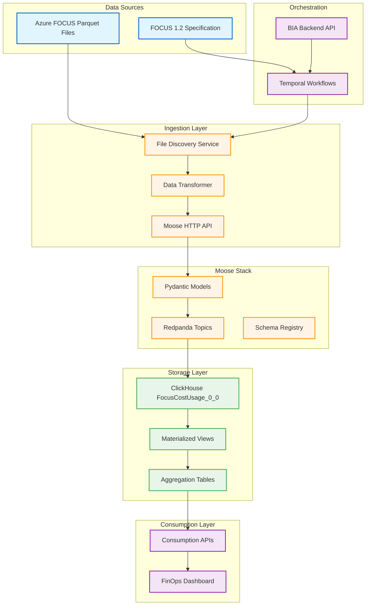

---

## Table Creation Flow

### Flow 1: Moose Auto-Creation from Pydantic Models

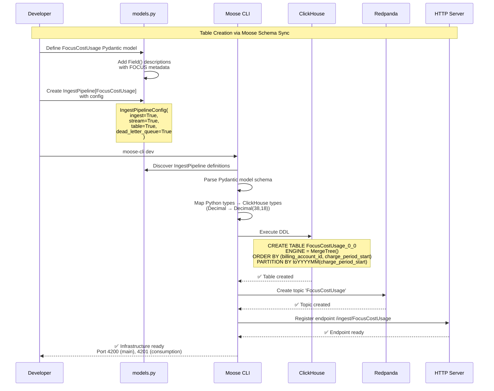

### Detailed Table Creation Steps

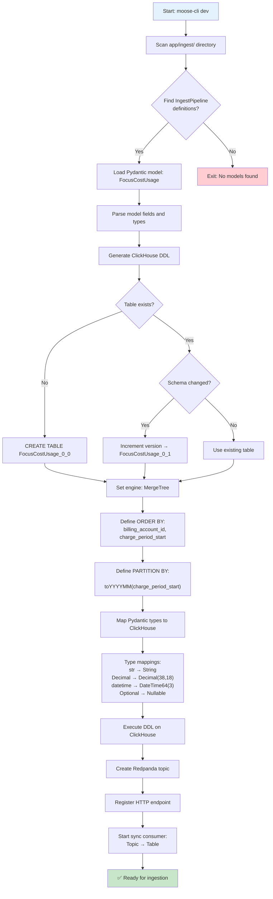

---

## Data Ingestion Flow

### Flow 2: Parquet to ClickHouse via Moose

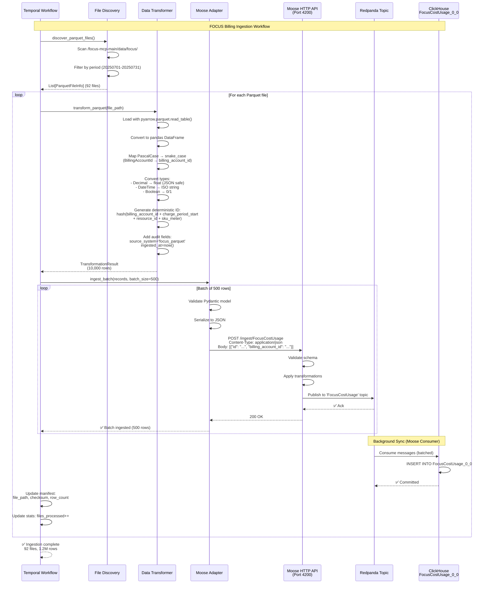

### Detailed Ingestion Process

```mermaid
flowchart TD
    A[Start: Trigger Workflow] --> B["Get Config:
    data_root, batch_size, dry_run"]

    B --> C[File Discovery Phase]
    C --> D[Scan /focus-mcp-main/data/focus/]
    D --> E[Find *.parquet files]
    E --> F{Filter by period?}

    F -->|Yes| G["Apply period filter:
    20250701-20250731"]
    F -->|No| H[Use all files]

    G --> I["Load manifest:
    processed_files.json"]
    H --> I

    I --> J{Skip processed?}
    J -->|Yes| K[Filter out processed files]
    J -->|No| L[Process all files]

    K --> M[Remaining files: 92]
    L --> M

    M --> N{Files found?}
    N -->|No| Z1[Exit: No files to process]
    N -->|Yes| O[Start processing loop]

    O --> P[Read Parquet with pyarrow]
    P --> Q[Convert to pandas DataFrame]

    Q --> R[Data Transformation Phase]
    R --> S["Column name mapping:
    PascalCase → snake_case"]

    S --> T[Type conversions]
    T --> T1["Decimal → float
    (Scientific notation fix)"]
    T1 --> T2[DateTime → ISO string]
    T2 --> T3["Boolean → 0/1
    (ClickHouse UInt8)"]
    T3 --> T4[Empty strings → None]

    T4 --> U[Generate deterministic ID]
    U --> V["Add audit fields:
    source_system, ingested_at"]

    V --> W{Dry run?}
    W -->|Yes| X[Log transformed data]
    W -->|No| Y[Prepare batches: 500 rows each]

    X --> AA[Update stats only]
    Y --> AB[Ingestion Phase]

    AB --> AC[Validate with Pydantic model]
    AC --> AD{Validation passed?}

    AD -->|No| AE[Send to Dead Letter Queue]
    AD -->|Yes| AF[Serialize to JSON]

    AE --> AG[Log validation errors]
    AF --> AH[POST to Moose HTTP API]

    AH --> AI[Moose publishes to Redpanda]
    AI --> AJ[Background consumer syncs to ClickHouse]

    AJ --> AK{More batches?}
    AK -->|Yes| AB
    AK -->|No| AL[Update manifest]

    AG --> AL
    AA --> AL

    AL --> AM{Continue on error?}
    AM -->|Yes| AN{More files?}
    AM -->|No| Z2[Exit: Error occurred]

    AN -->|Yes| O
    AN -->|No| AO[Generate workflow stats]

    AO --> AP["✅ Complete:
    files_processed, total_rows, duration"]

    style A fill:#e3f2fd
    style AP fill:#c8e6c9
    style Z1 fill:#ffcdd2
    style Z2 fill:#ffcdd2
    style AE fill:#fff9c4
```

---

## Data Consumption Flow

### Flow 3: Query via Consumption APIs

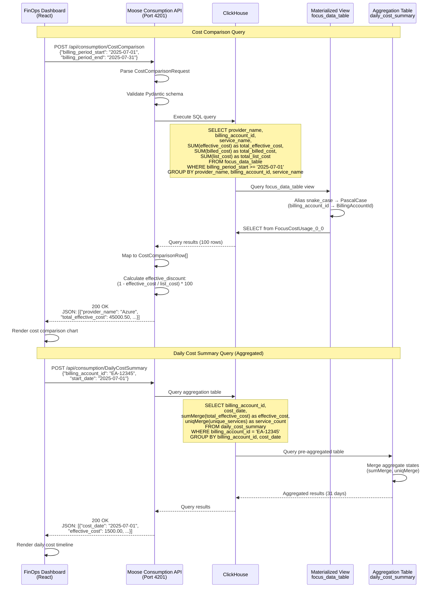

### API Request/Response Flow

```mermaid
flowchart LR
    A[Frontend Request] --> B{Direct or Proxied?}

    B -->|Direct CORS| C[Browser → Port 4201]
    B -->|Proxied| D[Browser → Next.js API Route]

    D --> E[Next.js → Port 4201]
    C --> F[Moose Consumption API]
    E --> F

    F --> G[Parse Request Params]
    G --> H[Validate Pydantic Schema]

    H --> I{Validation OK?}
    I -->|No| J[400 Bad Request]
    I -->|Yes| K[Execute query_function]

    K --> L[Build SQL Query]
    L --> M[Query ClickHouse]

    M --> N{Query Type?}
    N -->|Raw Table| O[Query FocusCostUsage_0_0]
    N -->|View| P[Query focus_data_table]
    N -->|Aggregation| Q[Query daily_cost_summary]

    O --> R[Map Results]
    P --> R
    Q --> R

    R --> S[Serialize to JSON]
    S --> T[Return Response]

    J --> U[Error Response]
    T --> V[Frontend Renders]
    U --> V

    style A fill:#e3f2fd
    style V fill:#c8e6c9
    style J fill:#ffcdd2
    style U fill:#ffcdd2
```

---

## Schema Migration Flow

### Flow 4: Automatic Schema Drift Detection & Migration

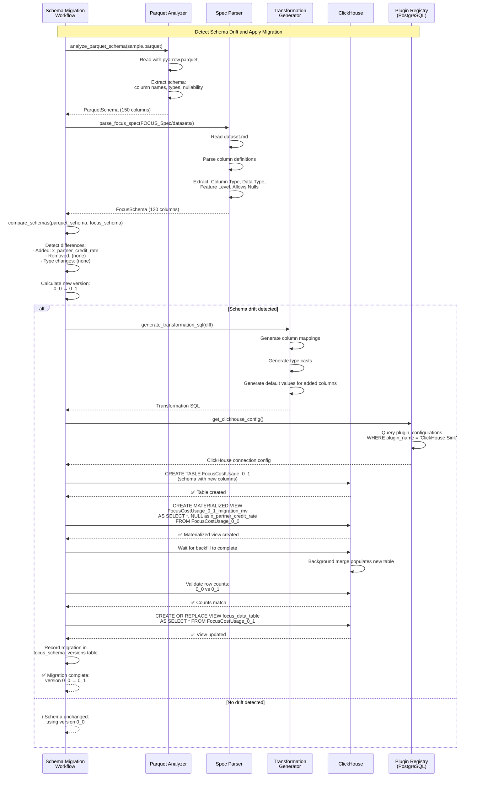

### Schema Migration Decision Tree

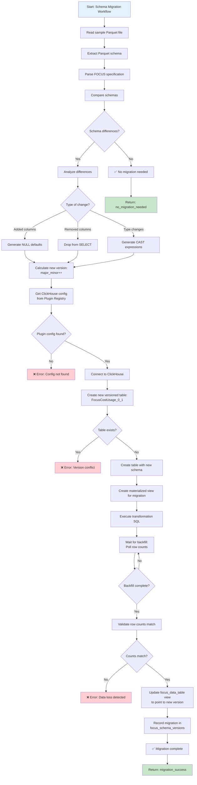

---

## Component Interactions

### Complete System Interaction Map

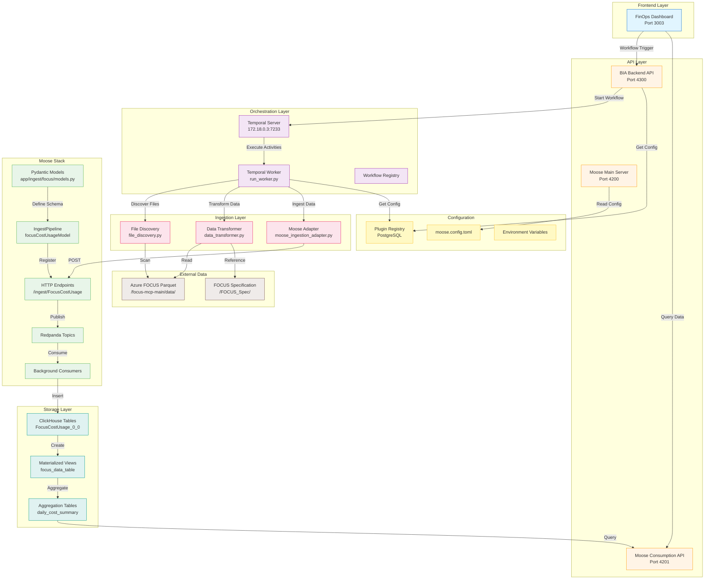

---

## Key Data Structures

### 1. FocusCostUsage Pydantic Model

```python
# app/ingest/focus/models.py
class FocusCostUsage(BaseModel):
    # Primary key
    id: Key[str]  # Deterministic hash

    # Mandatory FOCUS fields
    billing_account_id: str
    billing_currency: str
    charge_period_start: datetime
    effective_cost: Decimal  # Decimal(38,18)
    billed_cost: Decimal

    # Extended Azure fields (x_*)
    x_partner_credit_rate: Optional[Decimal]
    x_sku_meter_category: Optional[str]

    # Audit fields
    source_system: str = "focus_parquet"
    ingested_at: datetime
```

### 2. IngestPipeline Configuration

```python
focusCostUsageModel = IngestPipeline[FocusCostUsage](
    "FocusCostUsage",
    IngestPipelineConfig(
        ingest=True,       # HTTP endpoint: /ingest/FocusCostUsage
        stream=True,       # Redpanda topic: FocusCostUsage
        table=True,        # ClickHouse table: FocusCostUsage_0_0
        dead_letter_queue=True  # DLQ for validation failures
    )
)
```

### 3. ClickHouse Table DDL (Auto-Generated)

```sql
CREATE TABLE FocusCostUsage_0_0 (
    id String,
    billing_account_id String,
    billing_currency String,
    charge_period_start DateTime64(3),
    effective_cost Decimal(38, 18),
    billed_cost Decimal(38, 18),
    x_partner_credit_rate Nullable(Decimal(38, 18)),
    x_sku_meter_category Nullable(String),
    source_system String DEFAULT 'focus_parquet',
    ingested_at DateTime64(3)
) ENGINE = MergeTree()
ORDER BY (billing_account_id, charge_period_start)
PARTITION BY toYYYYMM(charge_period_start);
```

### 4. Materialized View (PascalCase Alias)

```sql
CREATE VIEW focus_data_table AS
SELECT
    id,
    billing_account_id AS BillingAccountId,
    billing_currency AS BillingCurrency,
    charge_period_start AS ChargePeriodStart,
    effective_cost AS EffectiveCost,
    billed_cost AS BilledCost
FROM FocusCostUsage_0_0;
```

---

## Performance Characteristics

### Ingestion Performance

| Metric | Value | Notes |
|--------|-------|-------|
| Batch size | 500 rows | Optimized for 10MB Moose limit |
| Files processed | 92 files | FOCUS 1.2 export (1 month) |
| Total rows | ~1.2M rows | Typical Azure Enterprise Agreement |
| Processing time | ~45 minutes | Single-threaded workflow |
| Throughput | ~450 rows/sec | Network and validation overhead |

### Query Performance

| Query Type | Latency | Notes |
|------------|---------|-------|
| Raw table query (1 day) | ~200ms | Full scan 30K rows |
| View query (1 month) | ~2s | Full scan 1.2M rows |
| Aggregated query (1 month) | ~50ms | Pre-aggregated table (31 rows) |
| Consumption API overhead | ~10ms | Pydantic validation + serialization |

### Storage Efficiency

| Component | Size | Compression |
|-----------|------|-------------|
| Raw Parquet files | ~800MB | Native compression |
| ClickHouse table | ~450MB | LZ4 compression (~45%) |
| Aggregation tables | ~2MB | Highly compressed aggregates |
| Redpanda topics | ~100MB | Retention: 30 seconds |

---

## Error Handling & Resilience

### Data Validation Pipeline

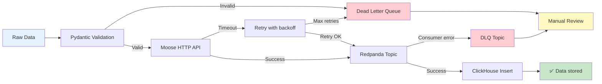

### Failure Modes & Recovery

| Failure Mode | Detection | Recovery Strategy |
|--------------|-----------|-------------------|
| Invalid Parquet schema | File read error | Skip file, log error, continue |
| Pydantic validation failure | Model validation | Send to DLQ, log details |
| Moose API 413 (too large) | HTTP status | Reduce batch size, retry |
| Moose API timeout | Connection timeout | Exponential backoff retry (3x) |
| ClickHouse connection loss | Insert error | Reconnect, replay from Redpanda offset |
| Temporal workflow crash | Activity timeout | Temporal auto-retry with history |
| Schema drift detected | Migration workflow | Auto-generate migration, apply versioned schema |

---

## Monitoring & Observability

### Key Metrics Tracked

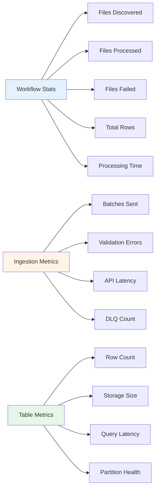

### Logs & Tracing

- **Temporal Workflow History**: Complete execution trace with replay capability
- **Moose Server Logs**: HTTP API requests, validation errors, topic publishes
- **ClickHouse Query Logs**: `system.query_log` for performance analysis
- **Application Logs**: Structured JSON logs with correlation IDs

---

## Summary

### FocusCostUsage_0_0 Table Lifecycle

1. **Creation**: Moose auto-generates from Pydantic model on `moose-cli dev`
2. **Schema**: Snake_case storage, PascalCase view for YAML query compatibility
3. **Ingestion**: Parquet → Transform → HTTP API → Redpanda → ClickHouse
4. **Consumption**: Materialized views + aggregations for fast queries
5. **Evolution**: Schema migration workflow handles version upgrades (0_0 → 0_1)

### Data Flow Path

```
Parquet Files → File Discovery → Data Transformer
    → Moose HTTP API → Redpanda Topics → ClickHouse FocusCostUsage_0_0
    → Materialized Views → Aggregation Tables → Consumption APIs → Frontend
```

### Key Benefits

✅ **Type-safe**: Pydantic validation at ingestion boundary
✅ **Scalable**: Streaming architecture with batch processing
✅ **Resilient**: Dead letter queues + Temporal retry logic
✅ **Observable**: Comprehensive metrics and logging
✅ **Maintainable**: Schema-driven with automatic migrations
✅ **Performant**: Pre-aggregated tables for sub-50ms queries

---

## References

- **Design Document**: `/home/chris/repo/area-code/.kiro/specs/focus_billing/design.md`
- **Pydantic Models**: `/home/chris/repo/area-code/odw/services/data-warehouse/app/ingest/focus/models.py`
- **Ingestion Workflow**: `/home/chris/repo/area-code/odw/services/data-warehouse/app/focus_billing/workflow.py`
- **Schema Migration**: `/home/chris/repo/area-code/odw/services/data-warehouse/app/focus_billing/schema_migration/`
- **Moose Configuration**: `/home/chris/repo/area-code/odw/services/data-warehouse/moose.config.toml`
