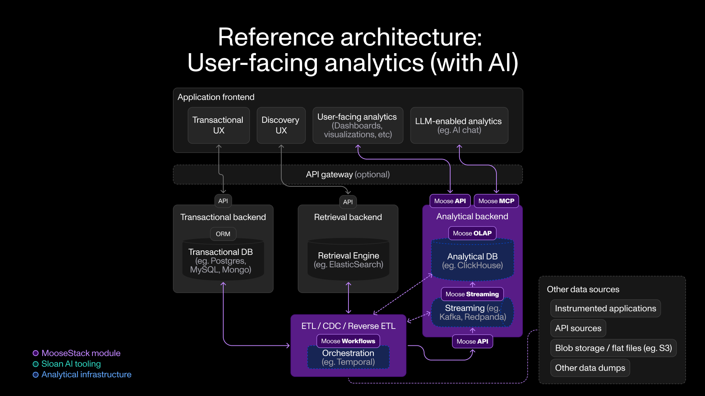
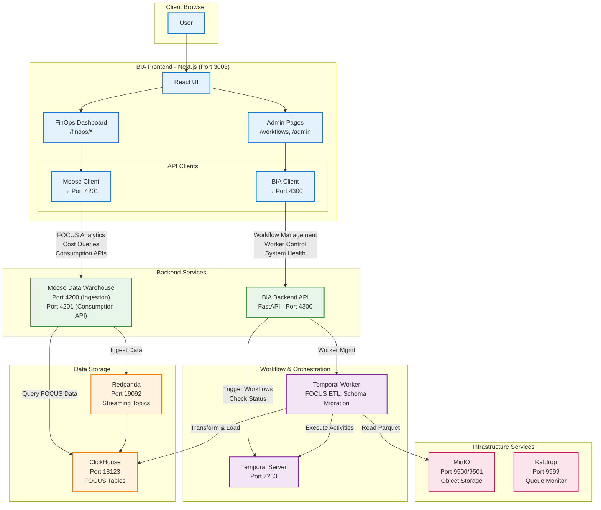
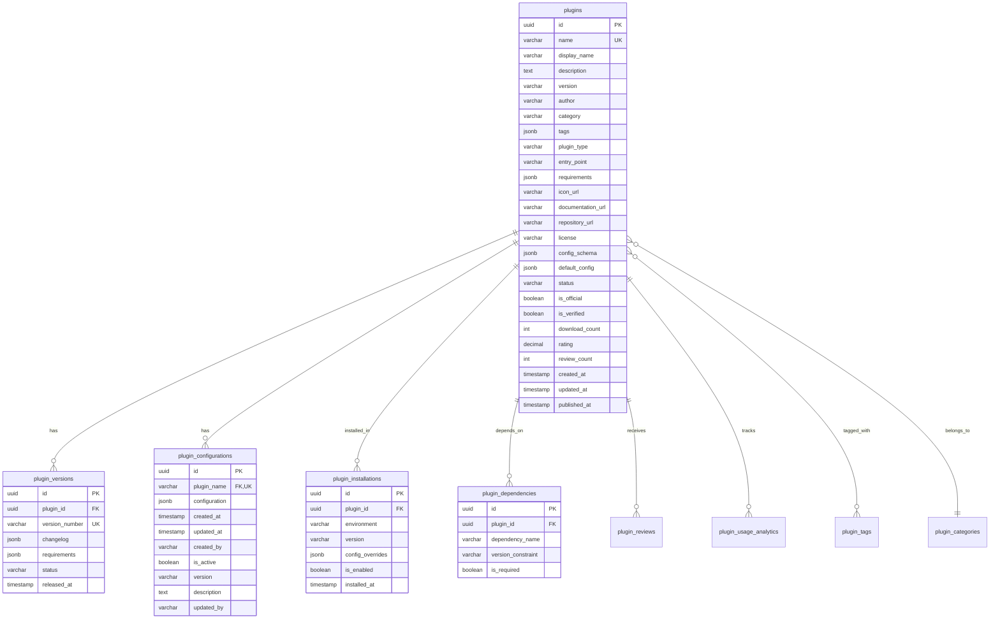
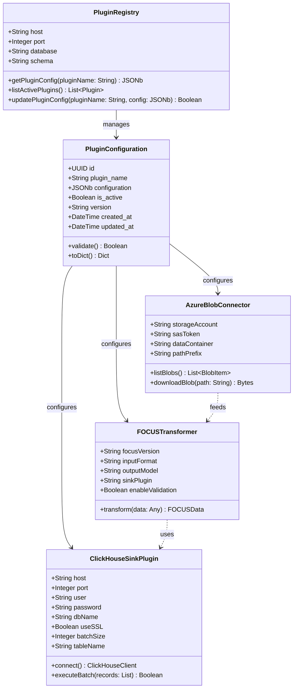
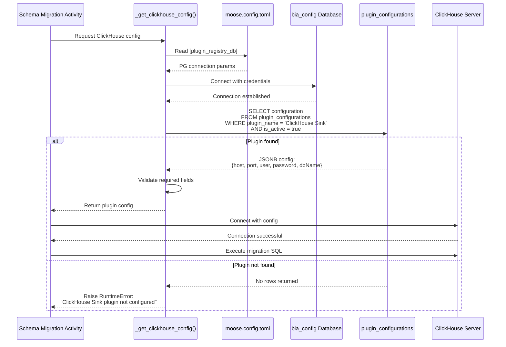
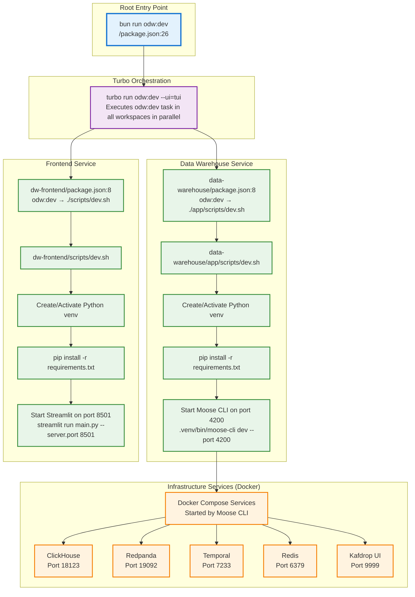
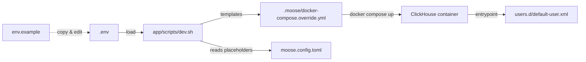
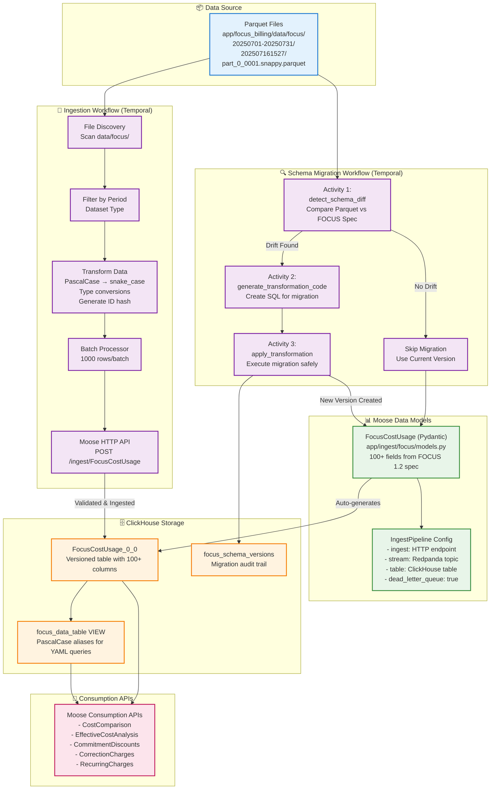
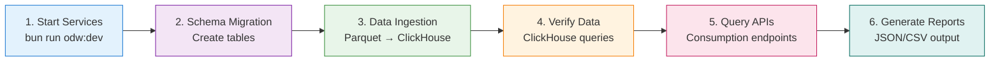

# Starter Applications

Area Code is a starter repo with all the necessary building blocks for a feature-rich, enterprise-ready application that requires specialized infrastructure.

There are two sample applications: [User Facing Analytics](/ufa/) and [Operational Data Warehouse](/odw/). Quickstarts for each of those projects live in the readme of their respective folders ([UFA](/ufa/README.md), [ODW](/odw/README.md)).

## User Facing Analytics

The UFA monorepo is a starter kit for building applications with a multi-modal backend that combines transactional (PostgreSQL), analytical (ClickHouse), and search (Elasticsearch) capabilities. The stack is configured for real-time data synchronization across services.

### UFA Stack:

Backend & Data:

- Transactional: PostgreSQL | Fastify | Drizzle ORM
- Analytical: ClickHouse | Moose (API & Ingest)
- Search: Elasticsearch

Sync & Streaming: Moose Workflows (with Temporal) | Moose Stream (with Redpanda) | Supabase Realtime
Frontend: Vite | React 19 | TypeScript | TanStack (Router, Query, Form) | Tailwind CSS

### Reference Architecture



## Operational Data Warehouse

> ⚠️ **ALPHA RELEASE** - This is an early alpha version under active development. We are actively testing on different machines and adding production deployment capabilities. Use at your own risk and expect breaking changes.

The odw project is a production-ready starter kit for an operational data warehouse, using the Moose framework to ingest data from various sources (Blobs, Events, Logs, FOCUS billing data) into an analytical backend (ClickHouse).

### 🏗️ BIA Admin Frontend Architecture

The BIA (Business Intelligence Application) frontend integrates with two backend systems for comprehensive data warehouse management and FinOps analytics:



**Key Features:**

1. **Dual Backend Integration**
   - **Admin Functions** → BIA Backend API (port 4300)
     - Workflow management (trigger, status, list)
     - Worker management (start, restart, status)
     - System health checks
     - Plugin management

   - **FinOps Dashboard** → Moose Consumption API (port 4201)
     - FOCUS billing analytics
     - Cost comparison and analysis
     - 18 supported FOCUS features
     - Real-time data queries

2. **Port Configuration**
   - Frontend: `3003` (Next.js)
   - BIA Backend: `4300` (FastAPI)
   - Moose Ingestion: `4200` (HTTP ingestion, MCP)
   - Moose Consumption: `4201` (Analytics APIs)
   - Temporal: `7233` (Workflow engine)
   - ClickHouse: `18123` (OLAP database)
   - Redpanda: `19092` (Message queue)
   - MinIO: `9500/9501` (Object storage)
   - Kafdrop: `9999` (Queue monitoring)
   - Temporal UI: `8080` (Workflow UI)

3. **Data Flow**
   ```
   Parquet Files → Temporal Workflow → Transform → Moose Ingestion (4200) →
   Redpanda → ClickHouse → Moose Consumption API (4201) → FinOps Dashboard
   ```

4. **FOCUS Supported Features** (18 Total)
   - Cost Comparison
   - Effective Cost Analysis
   - Billed Cost & Invoice Alignment
   - Cost and Usage Attribution
   - Resource Usage
   - Provider Services
   - Service Categorization
   - Location Analysis
   - Account Structures
   - Commitment Usage & Under-usage
   - Marketplace Purchases
   - Unit Price Verification
   - Charge Categorization
   - Data Granularity
   - Split Cost Allocation
   - Custom Columns
   - Schema Metadata
   - Features Overview

### 🔌 Plugin Management System

The BIA system includes a centralized plugin registry stored in the `bia_config` PostgreSQL database. All connectors, transformers, and sinks are configured through this registry.

#### Plugin Registry Database Schema



#### Plugin Configuration Class Diagram



#### Configuration Retrieval Sequence



#### Plugin Configuration Example

**ClickHouse Sink Plugin** (`plugin_registry.plugin_configurations`):
```json
{
  "host": "ck.mightytech.cn",
  "port": 8443,
  "user": "finops",
  "password": "cU2f947&9T{6d",
  "dbName": "finops-odw",
  "useSSL": true,
  "batchSize": 1000,
  "tableName": "focus_billing_data",
  "createTableIfNotExists": true
}
```

**Configuration Source:**
- **Plugin Registry Database** - `plugin_configurations` table (single source of truth)
- No environment variable overrides
- No fallback defaults - fails if plugin not configured

#### Available Plugins

| Plugin Name | Type | Description | Status |
|------------|------|-------------|--------|
| ClickHouse Sink | Sink | Write FOCUS data to ClickHouse OLAP database | Active |
| Azure Blob Storage Connector | Source | Read billing data from Azure Blob Storage | Active |
| Azure EA Connector | Source | Connect to Azure Enterprise Agreement API | Inactive |
| FOCUS 1.2 Transformer | Transformer | Transform billing data to FOCUS 1.2 spec | Active |
| GCP Billing Export | Source | Read GCP BigQuery billing export | Inactive |

#### Plugin Management APIs

**Query Plugin Configuration:**
```sql
SELECT configuration
FROM plugin_registry.plugin_configurations
WHERE plugin_name = 'ClickHouse Sink'
AND is_active = true;
```

**Update Plugin Configuration:**
```sql
UPDATE plugin_registry.plugin_configurations
SET configuration = '{"host": "localhost", "port": 18123, ...}'::jsonb,
    updated_at = NOW(),
    updated_by = 'user@example.com'
WHERE plugin_name = 'ClickHouse Sink';
```

**List All Active Plugins:**
```sql
SELECT plugin_name, version, description
FROM plugin_registry.plugin_configurations
WHERE is_active = true
ORDER BY plugin_name;
```

### 🚀 Quick Start

Get up and running in minutes with our automated setup:

```bash
# 1. Ensure Docker Desktop is running

# 2. Install dependencies & start development environment
bun run odw:dev

# 3. Seed databases with sample data
bun run odw:dev:seed

# 4. Open the data warehouse frontend
http://localhost:8501/
```

This will:
- Install all Python dependencies and create virtual environment
- Start the data warehouse service (Moose app) on port 4200
- Start the Streamlit frontend on port 8501
- Launch Kafdrop UI for message queue monitoring on port 9999
- Open the dashboard in your browser automatically

### 🛠️ Startup Script Flow



**Key Points:**
- **Parallel Execution**: Turbo runs both `data-warehouse` and `dw-frontend` services concurrently (defined in `turbo.json:42-44`)
- **Virtual Environments**: Each service creates and manages its own Python venv
- **Dependency Installation**: Uses `uv pip install` with intelligent caching:
  1. First attempts to install from uv's local cache with `--offline` flag
  2. If packages not in cache, falls back to fetching from PyPI
  3. This ensures resilience against PyPI timeouts by using cached packages when available
- **Port Allocation**:
  - Data Warehouse (Moose): 4200
  - Frontend (Streamlit): 8501
  - ClickHouse: 18123
  - Redpanda: 19092
  - Temporal: 7233
  - Kafdrop: 9999
- **Docker Management**: Moose CLI automatically starts required Docker services

### ODW Stack

| Category             | Technologies                                        |
| -------------------- | --------------------------------------------------- |
| **Frontend**         | Streamlit, Python 3.12+                            |
| **Backend**          | Moose, Python, FastAPI                             |
| **Database**         | ClickHouse (analytical), PostgreSQL (temporal)     |
| **Message Queue**    | Redpanda (Kafka-compatible)                        |
| **Workflow Engine**  | Temporal                                           |
| **Caching**          | Redis                                              |
| **Data Processing**  | Kafka Python, ClickHouse Connect                   |
| **Infrastructure**   | Docker, Docker Compose                             |
| **Build Tool**       | Python setuptools, pip, Turbo                      |

### 🛠️ Available Scripts

```bash
# Development
bun run odw:dev              # Start all services (parallel)
bun run odw:dev:clean        # Clean all services
bun run odw:dev:seed         # Seed databases with sample data

# Individual services
bun run --cwd odw/apps/dw-frontend dev            # Frontend only
bun run --cwd odw/services/data-warehouse dev     # Data Warehouse only
bun run --cwd odw/services/kafdrop dev            # Kafdrop only
```

### 📁 Project Structure

```
area-code/
├── odw/                      # Operational Data Warehouse
│   ├── services/            # Backend services
│   │   ├── data-warehouse/  # Main Moose data warehouse service
│   │   │   ├── app/
│   │   │   │   ├── apis/    # REST API endpoints for data consumption
│   │   │   │   │   └── focus_billing/  # FOCUS billing consumption APIs
│   │   │   │   ├── blobs/   # Blob data extraction workflows
│   │   │   │   ├── events/  # Events data extraction workflows
│   │   │   │   ├── focus_billing/      # FOCUS billing integration
│   │   │   │   │   ├── temporal_workflow.py # Temporal workflow orchestration
│   │   │   │   │   ├── config.py       # Configuration management
│   │   │   │   │   ├── ddl_generator.py # ClickHouse schema generation
│   │   │   │   │   ├── query_loader.py  # YAML query catalog loader
│   │   │   │   │   └── data_transformer.py # Parquet transformation
│   │   │   │   ├── ingest/  # Data models and stream transformations
│   │   │   │   ├── logs/    # Log data extraction workflows
│   │   │   │   └── views/   # Materialized views for analytics
│   │   │   ├── docs/        # Documentation and walkthrough guides
│   │   │   │   ├── FOCUS_OPERATIONS.md    # FOCUS operations guide
│   │   │   │   └── FOCUS_CONFIGURATION.md # FOCUS configuration reference
│   │   │   ├── app/scripts/dev.sh # Data warehouse startup script
│   │   │   ├── moose.config.toml # Moose framework configuration
│   │   │   └── requirements.txt # Python dependencies
│   │   └── connectors/      # External data source connectors
│   │       └── src/
│   │           ├── blob_connector.py    # Blob storage data connector
│   │           ├── events_connector.py  # Events data connector
│   │           ├── logs_connector.py    # Logs data connector
│   │           └── connector_factory.py # Connector factory pattern
│   └── apps/
│       └── dw-frontend/     # Streamlit web application
│           ├── pages/       # Frontend page components
│           ├── utils/       # Frontend utility functions
│           ├── scripts/dev.sh # Frontend startup script
│           └── main.py      # Streamlit application entry point
├── FOCUS_Spec/              # FOCUS specification files (submodule)
│   └── specification/       # FOCUS 1.2 specification documents
└── focus-mcp-main/          # FOCUS MCP server with query catalog (deprecated)
    └── resources/           # FOCUS query definitions and specifications
        ├── queries/         # Pre-built FOCUS use case queries (YAML)
        └── specifications/  # FOCUS column and attribute definitions
```

### ⚙️ Configuration Workflow

The operational data warehouse uses a layered configuration model so that secrets stay local while shared defaults live in version control.

**Key Files**
- `services/data-warehouse/.env`: Local developer secrets (ignored by git). Populate ClickHouse credentials and any machine-specific overrides here.
- `services/data-warehouse/env.example`: Safe template that documents required variables. Update placeholders when the default setup changes.
- `services/data-warehouse/moose.config.toml`: Moose service configuration checked into git. It references `${CLICKHOUSE_*}` placeholders so no credentials are committed.
- `services/data-warehouse/app/scripts/dev.sh`: Loads `.env`, regenerates `.moose/docker-compose.override.yml`, and starts the Moose service. The generated override injects credentials into Docker and rewrites the ClickHouse `default-user.xml` on each run.
- `services/data-warehouse/app/focus_billing/temporal_workflow.py`: Temporal workflow that ingests FOCUS Parquet files into ClickHouse.



**Updating ClickHouse credentials**
1. Edit `services/data-warehouse/.env` with the new values (and mirror the placeholder in `env.example` if the team needs to know about the change).
2. Rerun `services/data-warehouse/app/scripts/dev.sh` (or `bun run odw:dev`) so the Docker override and container user config are regenerated.
3. Restart the stack; no direct edits to `moose.config.toml` or Docker volumes are required.

This flow keeps credentials out of source control while ensuring the running containers always receive the latest configuration.

### 🏦 FOCUS Billing Integration

The ODW includes a comprehensive FOCUS (FinOps Open Cost and Usage Specification) billing integration that provides automated ingestion, transformation, and querying of FOCUS 1.2 compliant billing data.

#### 🎯 FOCUS Features

- **FOCUS 1.2 Compliance**: Full specification compliance with automated schema generation
- **Parquet Ingestion**: Batch processing of FOCUS Parquet exports with comprehensive transformation
- **Query Catalog**: 50+ pre-built FOCUS use case queries with parameter binding
- **REST APIs**: Complete consumption APIs for listing, executing, and managing FOCUS queries
- **Workflow Orchestration**: Temporal-based workflows for reliable, resumable data processing
- **Real-time Monitoring**: Comprehensive observability, validation, and error handling

#### 🏗️ FOCUS Architecture - Moose-Native with Schema Migration

The FOCUS billing integration uses a modern, schema-aware architecture with Moose OLAP and Temporal workflows for automated ETL with schema drift detection.



**Key Features:**

1. **Schema-Aware Migration** (Temporal Workflow)
   - Automatically detects schema drift between source Parquet and FOCUS spec
   - Generates transformation SQL dynamically when drift detected
   - Creates versioned tables (`FocusCostUsage_0_0`, `FocusCostUsage_0_1`, etc.)
   - Uses materialized views for zero-downtime migrations
   - Tracks all migrations in audit table

2. **Moose-Native Ingestion**
   - Pydantic models define schema with full FOCUS 1.2 compliance
   - Moose auto-generates ClickHouse DDL from Python models
   - HTTP ingestion endpoint with validation
   - Streaming support via Redpanda topics
   - Dead-letter queue for failed records

3. **Versioned Schema Management**
   - Tables suffixed with version: `FocusCostUsage_0_0`
   - `focus_data_table` view always points to latest version
   - Safe rollback capability by keeping old versions
   - Audit trail in `focus_schema_versions` metadata table

4. **Data Flow**
   ```
   Parquet → Schema Check → Migration (if needed) →
   Moose Models → Transform → Batch → HTTP API →
   ClickHouse → Consumption APIs
   ```

#### 🚀 End-to-End User Guide: Parquet → ClickHouse → Reports

This guide walks you through the complete FOCUS billing data pipeline from raw Parquet files to generated reports.

##### Prerequisites

Ensure you have sample FOCUS data in the correct location:
```bash
# Verify data exists
ls bia_admin/bia_backend/workflows/focus_billing/data/focus/20250701-20250731/
```

If data doesn't exist, you can generate sample data or use your own FOCUS 1.2 compliant Parquet exports.

---

##### Step 1: Start All Services

```bash
# Start the complete ODW stack
bun run odw:dev
```

**What starts:**
- ✅ Moose data warehouse (port 4200)
- ✅ BIA Backend API (port 4300)
- ✅ BIA Admin UI (port 3003)
- ✅ Temporal workflow engine (port 7233)
- ✅ Temporal UI (port 8080)
- ✅ ClickHouse (port 18123)
- ✅ Redpanda (port 19092)

**Verify services are running:**
```bash
# Check Moose health
curl http://localhost:4200/health

# Check BIA backend
curl http://localhost:4300/health

# Check Temporal UI
open http://localhost:8080
```

---

##### Step 2: Schema Migration (First-Time Setup)

Before ingesting data, ensure the ClickHouse schema matches your Parquet files:

**Option A: Via BIA Admin UI (Recommended)**
1. Open [http://localhost:3003](http://localhost:3003)
2. Navigate to **Workflows** → **Start New**
3. Select **Schema Migration**
4. Fill in parameters:
   - **Source Parquet Path**: `app/focus_billing/data/focus/20250701-20250731/202507161527/cc47e41e-a6ab-462e-9b26-fe7237024648/part_0_0001.snappy.parquet`
   - **Canonical Schema Path**: `/home/chris/repo/area-code/FOCUS_Spec/specification/datasets`
   - **Current Version**: `0_0`
5. Click **Start Workflow**

**Option B: Via API**
```bash
curl -X POST "http://localhost:4300/api/v1/workflows/trigger" \
  -H "Content-Type: application/json" \
  -d '{
    "workflow_type": "schema_migration",
    "parameters": {
      "source_parquet_path": "app/focus_billing/data/focus/20250701-20250731/202507161527/cc47e41e-a6ab-462e-9b26-fe7237024648/part_0_0001.snappy.parquet",
      "canonical_schema_path": "/home/chris/repo/area-code/FOCUS_Spec/specification/datasets",
      "current_version": "0_0"
    }
  }'
```

**Expected Response:**
```json
{
  "success": true,
  "workflow_id": "wf_schema_migration_20251026_123456",
  "message": "Workflow triggered successfully",
  "estimated_duration": "5-30 minutes"
}
```

**What happens:**
- ✅ Parquet schema compared against FOCUS 1.2 specification
- ✅ Schema drift detected (if any)
- ✅ Transformation SQL generated
- ✅ ClickHouse table `FocusCostUsage_0_0` created
- ✅ Materialized view for migration created
- ✅ `focus_data_table` view created with PascalCase aliases

---

##### Step 3: Ingest FOCUS Data

Now ingest your Parquet files into ClickHouse:

**Option A: Via BIA Admin UI (Recommended)**
1. Open [http://localhost:3003](http://localhost:3003)
2. Navigate to **Workflows** → **Start New**
3. Select **FOCUS Billing Ingest**
4. Fill in parameters:
   - **Data Root**: `app/focus_billing/data/focus`
   - **Batch Size**: `1000`
   - **Max Files**: Leave empty (ingest all)
   - **Period Filter**: `20250701-20250731`
5. Click **Start Workflow**

**Option B: Via API**
```bash
curl -X POST "http://localhost:4300/api/v1/workflows/trigger" \
  -H "Content-Type: application/json" \
  -d '{
    "workflow_type": "focus_billing_ingest",
    "parameters": {
      "data_root": "app/focus_billing/data/focus",
      "batch_size": 1000,
      "max_files": null,
      "period_filter": "20250701-20250731"
    }
  }'
```

**Expected Response:**
```json
{
  "success": true,
  "workflow_id": "wf_focus_billing_ingest_20251026_123500",
  "message": "Workflow triggered successfully",
  "estimated_duration": "10-20 minutes"
}
```

**What happens:**
- ✅ Files discovered in `app/focus_billing/data/focus/`
- ✅ Files filtered by period (`20250701-20250731`)
- ✅ Data transformed (PascalCase → snake_case)
- ✅ Type conversions (INT96 → DateTime64, etc.)
- ✅ Deterministic IDs generated
- ✅ Batches ingested via Moose HTTP API
- ✅ Data stored in `FocusCostUsage_0_0` table

---

##### Step 4: Monitor Workflow Progress

**Via BIA Admin UI:**
1. Go to [http://localhost:3003](http://localhost:3003)
2. Click **Workflows**
3. View real-time workflow status

**Via Temporal UI:**
1. Open [http://localhost:8080](http://localhost:8080)
2. View detailed workflow execution
3. See activity logs and retries

**Via API:**
```bash
# Check workflow status
curl -X POST "http://localhost:4300/api/v1/workflows/status" \
  -H "Content-Type: application/json" \
  -d '{"workflow_id": "wf_focus_billing_ingest_20251026_123500"}'
```

**Expected Response:**
```json
{
  "workflow_id": "wf_focus_billing_ingest_20251026_123500",
  "status": "completed",
  "result": {
    "files_discovered": 92,
    "files_processed": 92,
    "files_failed": 0,
    "total_rows_processed": 458234,
    "total_processing_time": 847.3
  }
}
```

---

##### Step 5: Verify Data in ClickHouse

**Check row count:**
```bash
docker exec -it data-warehouse-clickhouse-1 clickhouse-client --query \
  "SELECT COUNT(*) as row_count FROM FocusCostUsage_0_0"
```

**Sample query:**
```bash
docker exec -it data-warehouse-clickhouse-1 clickhouse-client --query \
  "SELECT
     billing_account_id,
     service_name,
     SUM(billed_cost) as total_cost
   FROM FocusCostUsage_0_0
   WHERE charge_period_start >= '2025-07-01'
   GROUP BY billing_account_id, service_name
   ORDER BY total_cost DESC
   LIMIT 10
   FORMAT PrettyCompact"
```

---

##### Step 6: Query via Consumption APIs

The Moose consumption APIs provide pre-built analytics queries:

**1. Cost Comparison (Identify Savings)**
```bash
curl -X POST "http://localhost:4200/consumption/CostComparison" \
  -H "Content-Type: application/json" \
  -d '{
    "billing_period_start": "2025-07-01",
    "billing_period_end": "2025-08-01"
  }' | jq
```

**Example Response:**
```json
[
  {
    "provider_name": "Azure",
    "billing_account_id": "12345",
    "total_effective_cost": 45678.90,
    "total_billed_cost": 50000.00,
    "total_list_cost": 62000.00,
    "effective_discount": 26.32
  }
]
```

**2. Effective Cost Analysis**
```bash
curl -X POST "http://localhost:4200/consumption/EffectiveCostAnalysis" \
  -H "Content-Type: application/json" \
  -d '{
    "billing_period_start": "2025-07-01",
    "billing_period_end": "2025-08-01"
  }' | jq
```

**Example Response:**
```json
[
  {
    "service_category": "Compute",
    "charge_category": "Usage",
    "total_effective_cost": 12500.00,
    "total_usage_quantity": 5000.0,
    "unit": "GB-Hours"
  },
  {
    "service_category": "Storage",
    "charge_category": "Usage",
    "total_effective_cost": 3400.50,
    "total_usage_quantity": 15000.0,
    "unit": "GB-Month"
  }
]
```

**3. Commitment Discount Purchases**
```bash
curl -X POST "http://localhost:4200/consumption/CommitmentDiscountPurchases" \
  -H "Content-Type: application/json" \
  -d '{
    "billing_period_start": "2025-07-01",
    "billing_period_end": "2025-08-01"
  }' | jq
```

**4. Correction Charges**
```bash
curl -X POST "http://localhost:4200/consumption/CorrectionCharges" \
  -H "Content-Type: application/json" \
  -d '{
    "billing_period_start": "2025-07-01",
    "billing_period_end": "2025-08-01"
  }' | jq
```

**5. Recurring Charges**
```bash
curl -X POST "http://localhost:4200/consumption/RecurringCharges" \
  -H "Content-Type: application/json" \
  -d '{
    "billing_period_start": "2025-07-01",
    "billing_period_end": "2025-08-01"
  }' | jq
```

---

##### Step 7: Generate Reports

**Create a simple report script:**

```bash
cat > generate_focus_report.sh << 'EOF'
#!/bin/bash

# FOCUS Billing Report Generator
PERIOD_START="2025-07-01"
PERIOD_END="2025-08-01"
OUTPUT_DIR="./focus_reports"

mkdir -p $OUTPUT_DIR

echo "📊 Generating FOCUS Billing Reports for $PERIOD_START to $PERIOD_END"

# Cost Comparison Report
echo "📈 Cost Comparison Report..."
curl -s -X POST "http://localhost:4200/consumption/CostComparison" \
  -H "Content-Type: application/json" \
  -d "{\"billing_period_start\": \"$PERIOD_START\", \"billing_period_end\": \"$PERIOD_END\"}" \
  | jq '.' > $OUTPUT_DIR/cost_comparison.json

# Effective Cost Analysis Report
echo "💰 Effective Cost Analysis..."
curl -s -X POST "http://localhost:4200/consumption/EffectiveCostAnalysis" \
  -H "Content-Type: application/json" \
  -d "{\"billing_period_start\": \"$PERIOD_START\", \"billing_period_end\": \"$PERIOD_END\"}" \
  | jq '.' > $OUTPUT_DIR/effective_cost_analysis.json

# Commitment Discounts Report
echo "🎯 Commitment Discounts..."
curl -s -X POST "http://localhost:4200/consumption/CommitmentDiscountPurchases" \
  -H "Content-Type: application/json" \
  -d "{\"billing_period_start\": \"$PERIOD_START\", \"billing_period_end\": \"$PERIOD_END\"}" \
  | jq '.' > $OUTPUT_DIR/commitment_discounts.json

echo "✅ Reports generated in $OUTPUT_DIR/"
ls -lh $OUTPUT_DIR/
EOF

chmod +x generate_focus_report.sh
./generate_focus_report.sh
```

**View generated reports:**
```bash
# Cost comparison report
cat focus_reports/cost_comparison.json | jq

# Effective cost analysis
cat focus_reports/effective_cost_analysis.json | jq
```

---

##### Complete Workflow Summary



**Typical Timeline:**
- **Step 1**: 2-3 minutes (service startup)
- **Step 2**: 5-10 minutes (first-time schema migration)
- **Step 3**: 10-20 minutes (data ingestion, depends on file count)
- **Step 4**: < 1 minute (verification)
- **Step 5**: < 5 seconds per API call
- **Step 6**: < 1 minute (report generation)

**Total Time**: ~20-35 minutes for first run, ~10-20 minutes for subsequent runs (no schema migration needed)

---

##### Troubleshooting

**Issue: Workflow fails with "FocusCostUsage model not registered"**
```bash
# Solution: Restart Moose to register the model
cd odw/services/data-warehouse
bun run dev:clean
bun run dev
```

**Issue: No data returned from APIs**
```bash
# Check if data was ingested
docker exec -it data-warehouse-clickhouse-1 clickhouse-client --query \
  "SELECT COUNT(*) FROM FocusCostUsage_0_0"

# Check table structure
docker exec -it data-warehouse-clickhouse-1 clickhouse-client --query \
  "DESCRIBE TABLE FocusCostUsage_0_0"
```

**Issue: Workflow stuck in "running" status**
```bash
# Check Temporal UI for detailed logs
open http://localhost:8080

# Check worker logs
docker logs data-warehouse-temporal-1 --tail 100
```

#### 📚 FOCUS Documentation

For comprehensive FOCUS billing integration documentation:

- **[FOCUS Operations Guide](odw/services/data-warehouse/docs/FOCUS_OPERATIONS.md)**: Complete operational procedures, DDL management, workflow execution, monitoring, and troubleshooting
- **[FOCUS Configuration Reference](odw/services/data-warehouse/docs/FOCUS_CONFIGURATION.md)**: Detailed configuration options, environment variables, and setup procedures

### 🐛 Troubleshooting

> 🔬 **TESTING STATUS** - We are actively testing on various machine configurations. Currently tested on Mac M3 Pro (18GB RAM), M4 Pro, and M4 Max. We're expanding testing to more configurations.

#### Common Issues

1. **Python Version**: Ensure you're using Python 3.12+ (required for Moose)
2. **Docker**: Make sure Docker Desktop is running before setup
3. **Memory Issues**: ClickHouse and Redpanda require significant memory (4GB+ recommended)
4. **Port Conflicts**: Ensure ports 4200, 8501, 9999, 18123, 19092 are available

**Tested Configurations:**
- ✅ Mac M3 Pro (18GB RAM)
- ✅ Mac M4 Pro
- ✅ Mac M4 Max
- 🔄 More configurations being tested

#### Reset Environment

```bash
# Navigate to data warehouse directory
cd odw/services/data-warehouse

# Clean and restart
./setup.sh reset

# Check status
./setup.sh status
```

### 🚀 Production Deployment (Coming Soon)

> 🚧 **UNDER DEVELOPMENT** - Production deployment capabilities are actively being developed and tested. The current focus is on stability and compatibility across different machine configurations.

We're working on a production deployment strategy that will be available soon.

## 📖 Data Warehouse Service - Detailed Guide

**Learn to build operational data warehouses with Moose** - from real-time ingestion to analytics APIs. This hands-on demonstration showcases how to create a complete data pipeline using Moose primitives, with mocked data sources for easy experimentation and clear examples using simple data models.

### Purpose and Scope

This project is **intentionally focused** on demonstrating key concepts rather than implementing the full reference architecture. It provides enough practical insights and working examples to help developers understand how to:

- Build data ingestion pipelines with Moose
- Implement stream processing workflows
- Create analytical APIs and consumption endpoints
- Integrate multiple data sources into a unified warehouse

### Current Implementation

The current state represents a **simplified but functional** implementation that:

- **Uses mocked data sources**: Logs, Blob (storage), and Events integrations are mocked to make this demo self-contained. Developers can easily adapt these patterns for real data sources by configuring appropriate API keys and endpoints for services they want to integrate.

- **Demonstrates Moose primitives**: The project showcases core Moose concepts including data models, ingestion pipelines, stream functions, materialized views, and consumption APIs.

- **Keeps data models simple**: Uses representative data models to make the data flow easy to follow and understand. Moose makes it straightforward to create much richer and more complex data models as your use case requires.

- **Provides a complete workflow**: From data ingestion through processing to consumption, giving developers a full picture of an operational data warehouse built with Moose.

### Key Technical Capabilities

- **Real-time Data Ingestion**: Stream data processing with RedPanda
- **Multi-Source Data Extraction**: Configurable connectors for various data sources
- **REST API**: Query interface for accessing processed data
- **Scalable Storage**: ClickHouse backend optimized for analytical workloads
- **Stream Processing**: Real-time data transformation and enrichment

### 📚 Presenter Walkthrough

For a detailed walkthrough and presentation guide, see [Presenter - walkthrough docs](odw/services/data-warehouse/docs/README.md).

For a high-level architectural overview, see [high-level-overview.md](odw/services/data-warehouse/docs/high-level-overview.md).

## 🤖 LLM Configuration

This project includes **LLM-powered unstructured data extraction** using Anthropic's Claude API. To enable this feature:

### Required Environment Variables

- `ANTHROPIC_API_KEY`: Your Anthropic API key for Claude LLM integration

### Setup Instructions

1. **Get an Anthropic API key**: Sign up at [console.anthropic.com](https://console.anthropic.com) and create an API key

2. **Configure LLM settings**: Copy the example configuration and customize as needed:

   ```bash
   cd odw/services/data-warehouse
   cp env.example .env
   ```

   Then edit `.env` to set your API key and configure LLM parameters. See `env.example` for detailed configuration options including batch processing, model selection, and validation settings.

3. **Verify setup**: The LLM service will be automatically initialized when processing unstructured data

### LLM Features

- **Extraction**: Convert unstructured documents (text, PDFs, images) to structured JSON using natural language instructions
- **Validation**: Validate extracted data against business rules specified in plain English
- **Transformation**: Modify and enrich extracted data using natural language transformations
- **Routing**: Intelligently route data based on content analysis
- **Batch Processing**: Process multiple files efficiently with configurable batch sizes for improved performance

#### Configuration Options

The LLM service supports extensive configuration through the `.env` file:

- **Model Selection**: Choose from available Claude models (default: `claude-sonnet-4-20250514`)
- **Processing Parameters**: Configure temperature, token limits, and content size limits
- **Batch Processing**: Enable/disable batch processing and set optimal batch sizes
- **Field Validation**: Enable strict field validation for cleaner data extraction
- **Performance Tuning**: Adjust settings to balance speed vs. accuracy for your use case

#### Fallback Behavior

**Note**: LLM features are optional. When the API key is not configured, the system will:

- Return structured metadata about the content (file type, content preview, processing timestamps)
- Preserve original data with informational notes about the disabled LLM service
- Continue processing without intelligent extraction, validation, or transformation
- Provide clear guidance on enabling LLM features through logging messages

This ensures the system remains functional while providing a clear upgrade path to intelligent processing.

## 🗄️ S3/MinIO Configuration

This project now supports **S3-compatible storage** for unstructured data files, allowing you to read documents, images, and other files directly from S3 buckets or MinIO instances instead of local filesystem paths.

### Configuration in `moose.config.toml`

The S3 configuration section has been added to `moose.config.toml`:

```toml
[s3_config]
# S3/MinIO configuration for unstructured data storage
endpoint_url = "http://localhost:9500"  # MinIO endpoint, set to empty string for AWS S3
access_key_id = "minioadmin"
secret_access_key = "minioadmin"
region_name = "us-east-1"
bucket_name = "unstructured-data"
signature_version = "s3v4"
```

### Setup for Different Storage Types

**For MinIO (Development/Testing):**

- Set `endpoint_url` to your MinIO server (e.g., `http://localhost:9500`)
- Use MinIO admin credentials or create specific access keys
- Ensure the bucket exists in MinIO

**For AWS S3 (Production):**

- Set `endpoint_url` to an empty string `""`
- Use your AWS access key and secret key
- Set the appropriate AWS region
- Ensure the S3 bucket exists and your credentials have read access

### Supported Path Formats

The system now accepts multiple path formats for unstructured data:

```bash
# S3 paths
s3://bucket-name/path/to/file.txt

# MinIO paths
minio://bucket-name/path/to/file.txt
```

### File Type Support

The S3 integration supports multiple file types, all processed using Claude's advanced vision and text processing capabilities:

- **Text files**: `.txt`, `.md`, `.csv`, `.json`, `.xml`, `.html` - Processed using standard LLM text extraction
- **PDF files**: `.pdf` - Processed using Claude's vision capabilities for text extraction and OCR
- **Images**: `.png`, `.jpg`, `.jpeg`, `.gif`, `.bmp` - Processed using Claude's vision capabilities for OCR and content analysis
- **Word documents**: `.doc`, `.docx` - Processed using Claude's document processing capabilities

**Note**: All file processing is handled natively through Claude's API without requiring external OCR libraries, PDF parsers, or document processing tools. This provides a unified, simplified architecture where all unstructured data processing flows through the LLM service.

### Usage in APIs

When submitting unstructured data via the `submitUnstructuredData` API, you can now use S3 paths:

```json
{
  "source_file_path": "minio://unstructured-data/memo_001.txt",
  "extracted_data": "{\"extracted\": \"data\"}"
}
```

## 🦌 Installing Aurora AI Support

Aurora AI is an optional enhancement that extends your copilot's AI capabilities with an MCP server with specialized tools for Moose workflows, ClickHouse queries, and RedPanda integration. This provides intelligent assistance for the creation and maintenance of data warehouse operations.

For setup instructions, see [Aurora docs](https://docs.fiveonefour.com/aurora).
