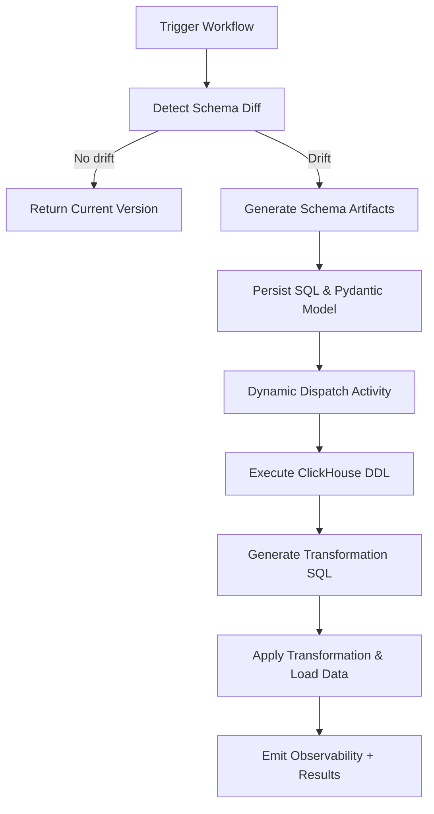
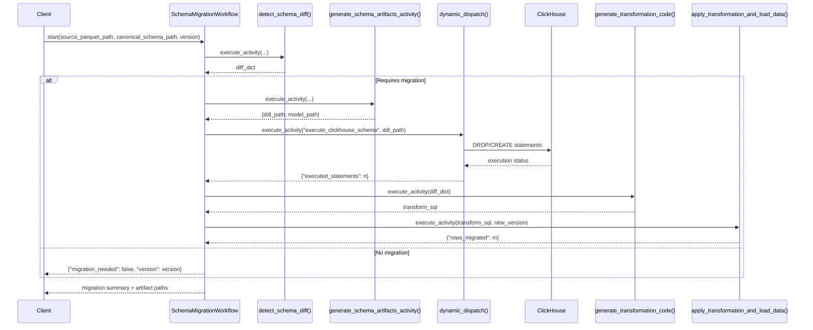
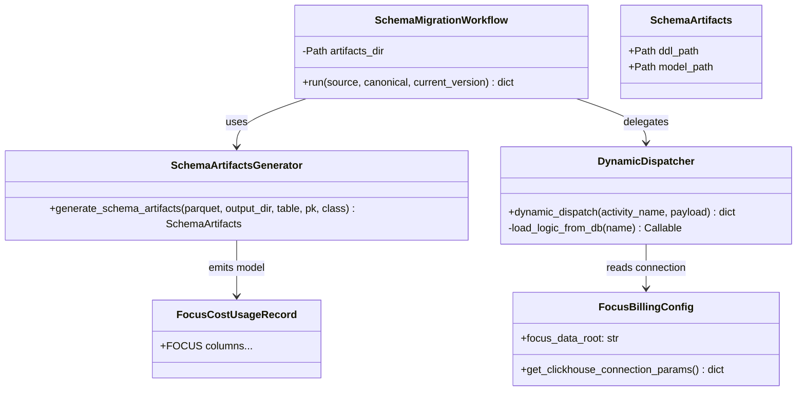

# Focus Data Ingestion Workflow Design

## Overview

The focus data ingestion workflow automates schema discovery, ClickHouse table management, and data migration for Azure billing exports that adhere to the FOCUS specification. The Temporal workflow coordinates a set of lightweight activities backed by the shared `parquet_to_clickhouse_schema_py` converter to keep SQL DDL and Pydantic models in sync. Dynamic dispatch keeps runtime behaviour extensible while allowing schema execution logic to live outside the worker.

## Flow Overview

## Temporal Sequence

## Class Structure

## Implementation Notes

- **Schema generation**: `generate_schema_artifacts_activity` wraps `generate_schema_artifacts` (which uses the shared converter) and persists artifacts to `bia_admin/bia_backend/workflows/focus_billing/schema_migration/generated/`.
- **Version control**: Generated SQL (`focus_cost_usage.sql`) and the matching Pydantic model (`FocusCostUsageRecord.py`) are checked into the repository to make schema deltas reviewable.
- **Dynamic dispatch**: The dispatcher activity keeps a registry (`execute_clickhouse_schema`) that can be extended to invoke different operations stored in a metadata store.
- **Config isolation**: ClickHouse credentials are resolved through `FocusBillingConfig` so no secrets are hardcoded into activities.
- **Testing**: `tests/test_dynamic_dispatch.py` stubs the ClickHouse client to verify that generated statements are executed without requiring a running cluster.
- **Extensibility**: The same pattern supports additional datasets by pointing the artifact generator at new Parquet samples and registering new activity handlers.
