# Docker Compose Generation Flow for ODW

This document explains how Docker Compose files and overrides are generated when running `bun run odw:dev`.

## Overview

The ODW system uses a dynamic Docker Compose configuration that adapts based on whether services are local or external (PaaS). The `render-config.sh` script analyzes environment variables and generates appropriate overrides.

## Configuration Flow

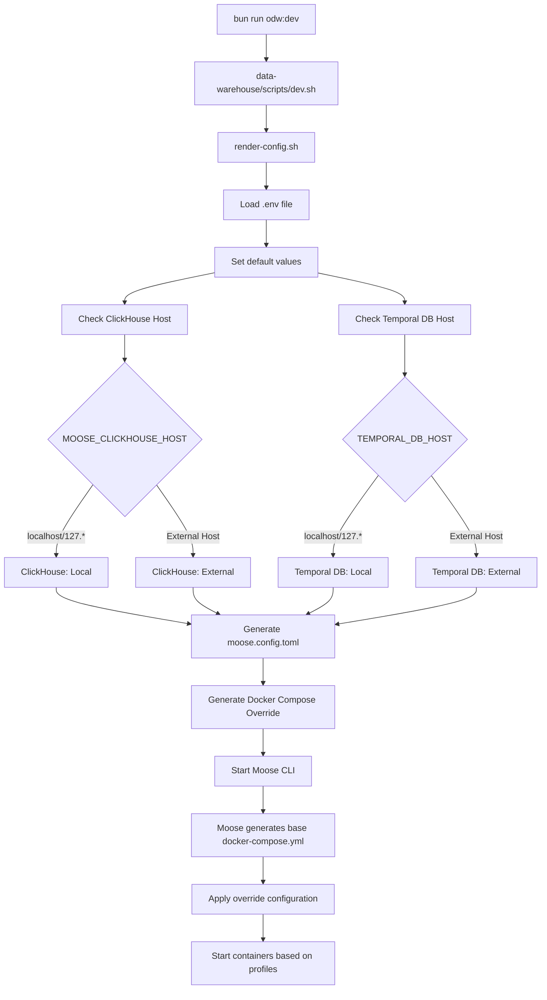

## Environment Variable Analysis

### ClickHouse Configuration
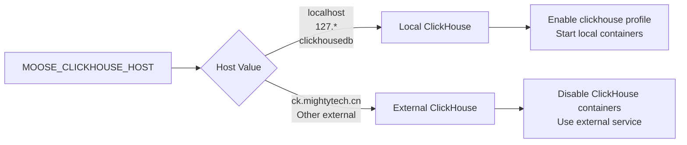

### Temporal Configuration
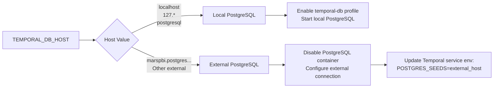

## Docker Compose Override Generation

### Current Configuration (.env)
```bash
# ClickHouse: External PaaS
MOOSE_CLICKHOUSE_HOST=ck.mightytech.cn
MOOSE_CLICKHOUSE_HOST_PORT=8443

# Temporal: Hybrid Configuration (Local server + External database)
TEMPORAL_DB_HOST=marspbi.postgres.database.chinacloudapi.cn
TEMPORAL_DB_PORT=5432

# Temporal Server: Local Temporal service
MOOSE_TEMPORAL_HOST=localhost  # ✅ Correct: Points to local Temporal server
```

### Generated Override Structure (Current Setup)

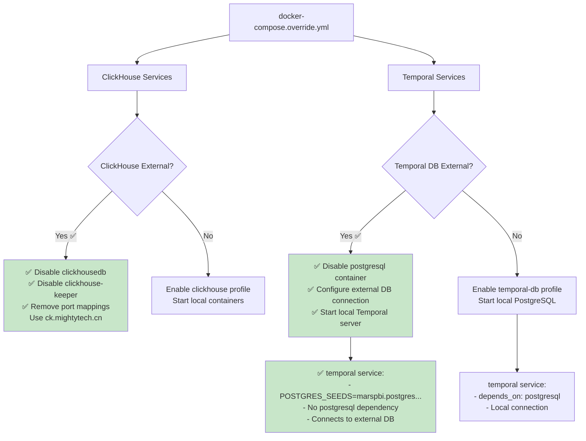

## Service Profiles and Dependencies

### Hybrid Architecture (Current Config)
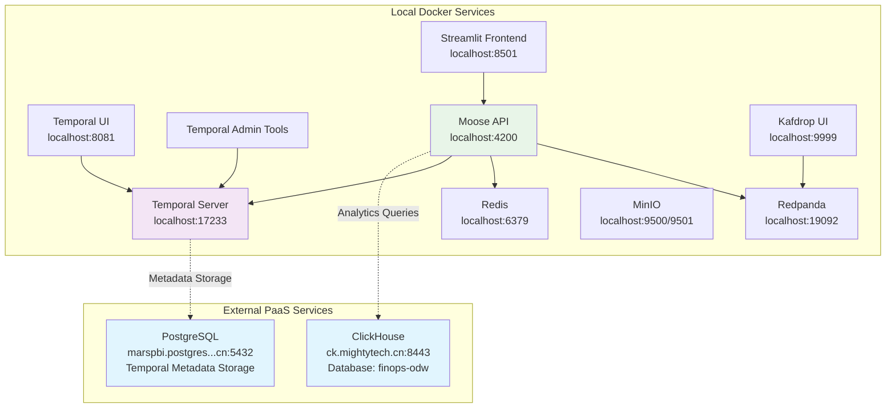

### Docker Compose Profiles Used
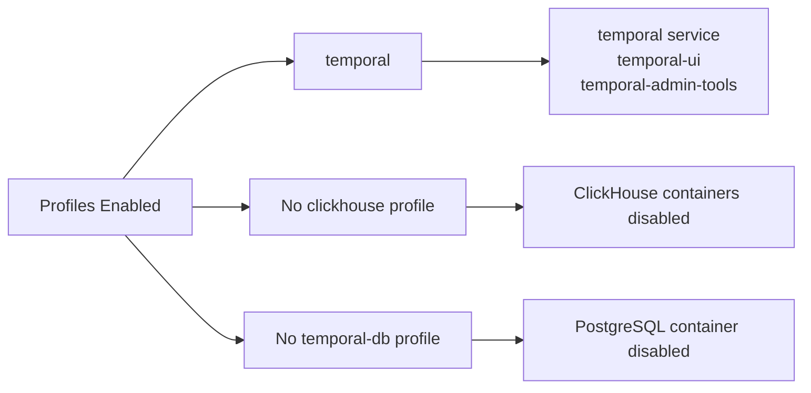

## Generated Files

### 1. moose.config.toml Generation Process

The `moose.config.toml` file is generated from `moose.config.template.toml` using environment variable substitution:

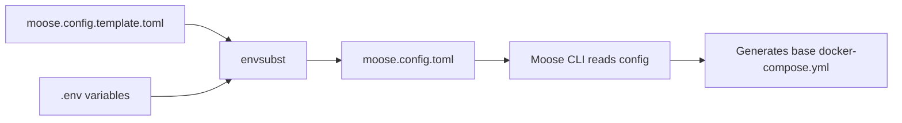

#### Template Variables Substitution:
```toml
# Template (moose.config.template.toml)
[clickhouse_config]
host = "${MOOSE_CLICKHOUSE_HOST}"
host_port = ${MOOSE_CLICKHOUSE_HOST_PORT}
use_ssl = ${MOOSE_CLICKHOUSE_USE_SSL}

[temporal_config]
temporal_host = "${MOOSE_TEMPORAL_HOST}"
db_user = "${MOOSE_TEMPORAL_DB_USER}"
db_password = "${MOOSE_TEMPORAL_DB_PASSWORD}"
```

#### Generated Result (moose.config.toml):
```toml
# Generated from .env variables
[clickhouse_config]
host = "ck.mightytech.cn"           # External ClickHouse PaaS
host_port = 8443
use_ssl = true

[temporal_config]
temporal_host = "localhost"         # Local Temporal server
db_user = "maradmin"               # External PostgreSQL credentials
db_password = "XQdaYh^4q&K9"
```

#### Key Configuration Sections:
- **`clickhouse_config`**: Tells Moose where to connect for analytics queries
- **`temporal_config`**: Configures Temporal workflow engine connection
- **`redpanda_config`**: Message broker for streaming (always local)
- **`redis_config`**: Caching layer (always local)
- **`s3_config`**: Object storage for unstructured data

### 2. How moose.config.toml Influences Docker Compose Generation

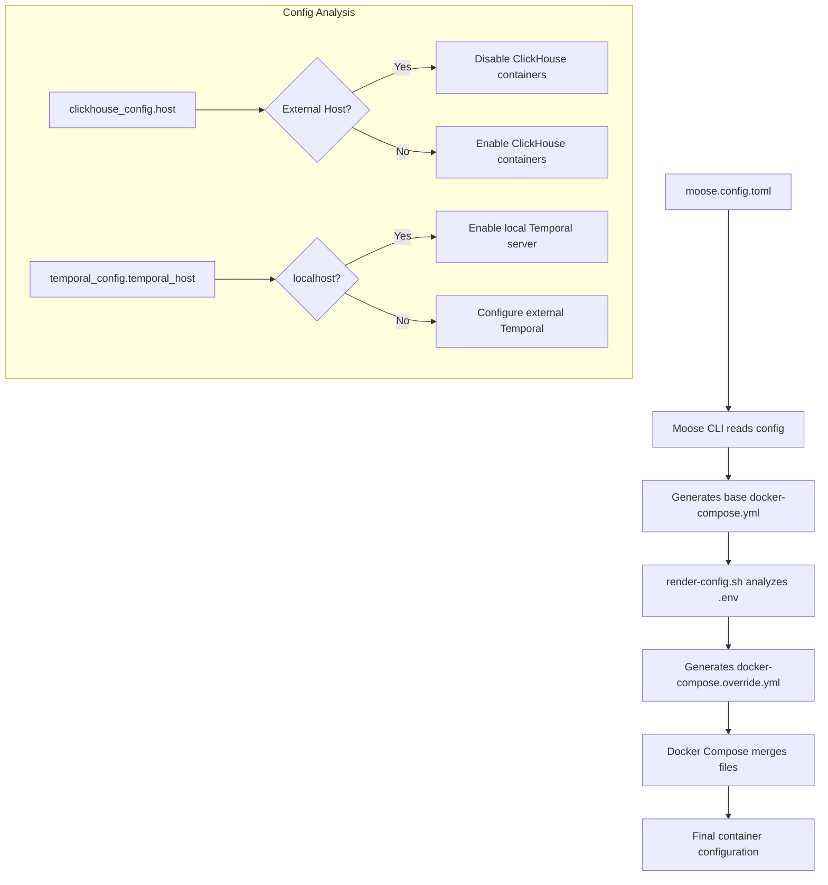

#### Base Docker Compose (Generated by Moose CLI):
Moose CLI reads `moose.config.toml` and generates a base `docker-compose.yml` with all possible services:

```yaml
# Generated by moose-cli based on moose.config.toml
services:
  clickhousedb:
    image: clickhouse/clickhouse-server:25.6
    ports:
      - "18123:8123"  # Uses MOOSE_CLICKHOUSE_HOST_PORT from config
  
  temporal:
    image: temporalio/auto-setup:1.22.3
    ports:
      - "17233:7233"  # Uses MOOSE_TEMPORAL_PORT from config
    environment:
      - POSTGRES_USER=${MOOSE_TEMPORAL_DB_USER}  # From config
```

### 3. docker-compose.override.yml (Generated by render-config.sh)

The override file modifies the base configuration based on external service detection:

```yaml
# Generated override based on .env analysis
services:
  # ClickHouse disabled - using external ck.mightytech.cn
  clickhousedb:
    deploy:
      replicas: 0
    profiles:
      - disabled-never-start
  
  # PostgreSQL disabled - using external marspbi.postgres...
  postgresql:
    profiles:
      - disabled
  
  # Temporal configured for external DB but local server
  temporal:
    profiles:
      - temporal
    depends_on: []  # No local PostgreSQL dependency
    environment:
      - POSTGRES_SEEDS=marspbi.postgres.database.chinacloudapi.cn
      - POSTGRES_USER=maradmin
      - POSTGRES_PWD=XQdaYh^4q&K9
```

## Configuration Validation

### Current Configuration Status
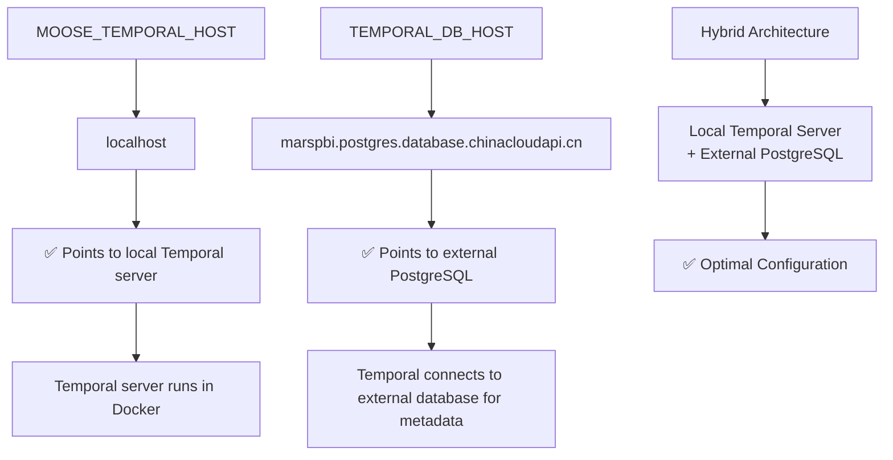

### Final Configuration
```bash
# In .env file - CURRENT CORRECT SETUP:
MOOSE_TEMPORAL_HOST=localhost                                    # ✅ Local Temporal server
TEMPORAL_DB_HOST=marspbi.postgres.database.chinacloudapi.cn     # ✅ External PostgreSQL for Temporal metadata
MOOSE_CLICKHOUSE_HOST=ck.mightytech.cn                          # ✅ External ClickHouse PaaS
```

## Complete Configuration Flow

### Configuration to Container Mapping

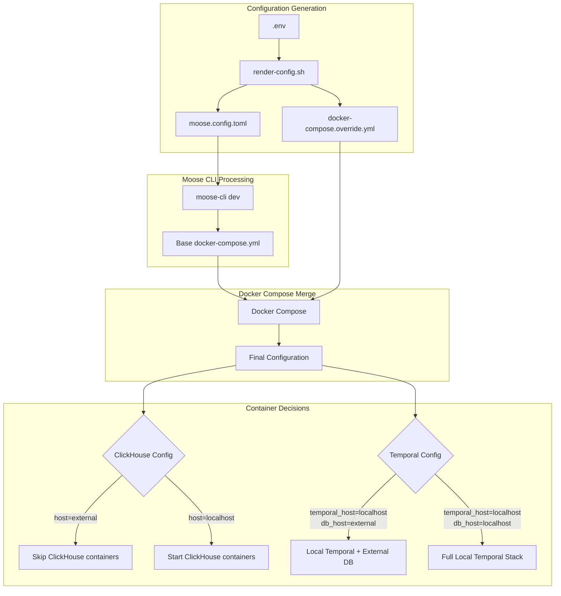

### Container Startup Sequence

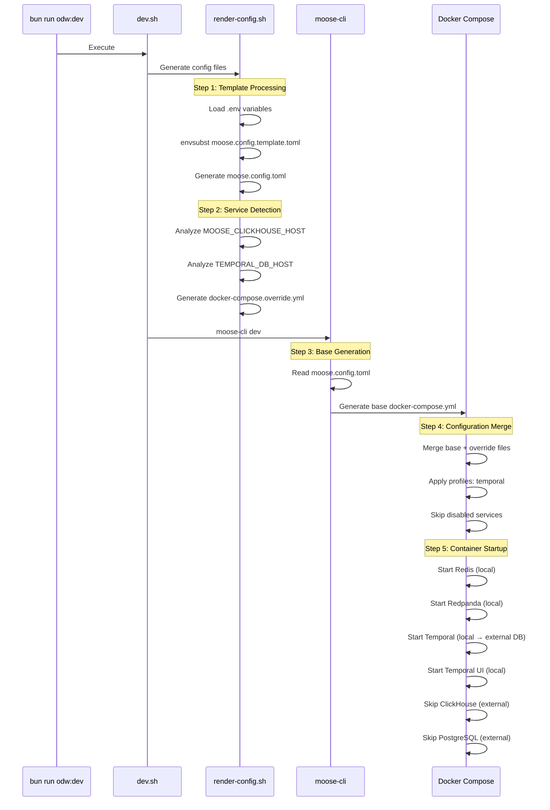

### Configuration Impact on Services

| Service | Config Source | Decision Logic | Result |
|---------|---------------|----------------|---------|
| **ClickHouse** | `MOOSE_CLICKHOUSE_HOST=ck.mightytech.cn` | External host detected | ❌ Container disabled |
| **PostgreSQL** | `TEMPORAL_DB_HOST=marspbi.postgres...` | External host detected | ❌ Container disabled |
| **Temporal Server** | `MOOSE_TEMPORAL_HOST=localhost` | Local host specified | ✅ Container enabled |
| **Redis** | Hard-coded `localhost:6379` | Always local | ✅ Container enabled |
| **Redpanda** | Hard-coded `localhost:19092` | Always local | ✅ Container enabled |
| **Temporal UI** | Depends on Temporal Server | Temporal enabled | ✅ Container enabled |

## Summary

The ODW system intelligently configures Docker Compose based on environment variables to create an optimal hybrid architecture:

### ✅ **Current Configuration Benefits:**
- **External ClickHouse PaaS**: Production-grade analytics database with existing data
- **External PostgreSQL PaaS**: Reliable metadata storage for Temporal workflows  
- **Local Temporal Server**: Fast, reliable workflow engine without external dependencies
- **Local Supporting Services**: Redis, Redpanda, MinIO for development flexibility

### **Service Profiles Enabled:**
- `temporal` - Enables Temporal server, UI, and admin tools
- No `clickhouse` profile - ClickHouse containers disabled
- No `temporal-db` profile - PostgreSQL container disabled

### **Key Architecture Decisions:**
1. **Hybrid Approach**: Combines PaaS reliability with local development speed
2. **Smart Profiles**: Docker Compose profiles automatically enable/disable services
3. **External Connections**: Temporal and Moose connect to external databases seamlessly
4. **Port Management**: All services use fixed ports to prevent conflicts

### **Configuration Variables:**
- `MOOSE_TEMPORAL_HOST=localhost` ✅ - Temporal server location (local Docker)
- `TEMPORAL_DB_HOST=external` ✅ - Database location (external PaaS)
- `MOOSE_CLICKHOUSE_HOST=external` ✅ - Analytics database (external PaaS)

This setup provides the best balance of performance, reliability, and development experience.