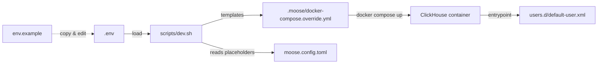

# Area Code - Operational Data Warehouse Starter Application

---

> ⚠️ **ALPHA RELEASE** - This is an early alpha version under active development. We are actively testing on different machines and adding production deployment capabilities. Use at your own risk and expect breaking changes.

Area Code ODW is a production-ready starter repository with all the necessary building blocks for building operational data warehouses with real-time data processing, analytics, and visualization capabilities.

## 🚀 Quick Start

Get up and running in minutes with our automated setup:

```bash
# 1. Ensure Docker Desktop is running

# 2. Install dependencies & start development environment
bun run odw:dev

# 3. Seed databases with sample data
bun run odw:dev:seed

# 4. Open the data warehouse frontend
http://localhost:8501/
```

This will:

- Install all Python dependencies and create virtual environment
- Start the data warehouse service (Moose app) on port 4200
- Start the Streamlit frontend on port 8501
- Launch Kafdrop UI for message queue monitoring on port 9999
- Open the dashboard in your browser automatically

## 🛠️ Available Scripts

```bash
# Development
bun run odw:dev              # Start all services
bun run odw:dev:clean        # Clean all services

# Individual services
bun run --cwd odw/apps/dw-frontend dev            # Frontend only
bun run --cwd odw/services/data-warehouse dev     # Data Warehouse only
bun run --cwd odw/services/kafdrop dev            # Kafdrop only
```

## 🏗️ Tech Stack

| Category             | Technologies                                        |
| -------------------- | --------------------------------------------------- |
| **Frontend**         | Streamlit, Python 3.12+                            |
| **Backend**          | Moose, Python, FastAPI                             |
| **Database**         | ClickHouse (analytical), PostgreSQL (temporal)     |
| **Message Queue**    | Redpanda (Kafka-compatible)                        |
| **Workflow Engine**  | Temporal                                           |
| **Caching**          | Redis                                              |
| **Data Processing**  | Kafka Python, ClickHouse Connect                   |
| **Infrastructure**   | Docker, Docker Compose                             |
| **Build Tool**       | Python setuptools, pip                             |

## 📁 Project Structure

```
area-code/
├── odw/                      # Operational Data Warehouse
│   ├── services/            # Backend services
│   │   ├── data-warehouse/  # Main Moose data warehouse service
│   │   │   ├── app/
│   │   │   │   ├── apis/    # REST API endpoints for data consumption
│   │   │   │   ├── blobs/   # Blob data extraction workflows
│   │   │   │   ├── events/  # Events data extraction workflows
│   │   │   │   ├── ingest/  # Data models and stream transformations
│   │   │   │   ├── logs/    # Log data extraction workflows
│   │   │   │   └── views/   # Materialized views for analytics
│   │   │   ├── docs/        # Documentation and walkthrough guides
│   │   │   ├── setup.sh     # Setup and management script
│   │   │   ├── moose.config.toml # Moose framework configuration
│   │   │   └── requirements.txt # Python dependencies
│   │   └── connectors/      # External data source connectors
│   │       └── src/
│   │           ├── blob_connector.py    # Blob storage data connector
│   │           ├── events_connector.py  # Events data connector
│   │           ├── logs_connector.py    # Logs data connector
│   │           └── connector_factory.py # Connector factory pattern
│   └── apps/
│       └── dw-frontend/     # Streamlit web application
│           ├── pages/       # Frontend page components
│           ├── utils/       # Frontend utility functions
│           └── main.py      # Streamlit application entry point
```

## 🔧 Services Overview

### Frontend (dw-frontend)

- Modern Streamlit web application with real-time data visualization
- Interactive dashboards for analytics and monitoring
- Real-time status monitoring and queue management
- Responsive design with custom styling and tooltips

### Data Warehouse Service

- [Moose analytical APIs + ClickHouse](https://docs.fiveonefour.com/moose/building/consumption-apis) with automatic OpenAPI/Swagger docs
- [Moose streaming Ingest Pipelines + Redpanda](https://docs.fiveonefour.com/moose/building/ingestion) for real-time data processing
- [Moose workflows + Temporal](https://docs.fiveonefour.com/moose/building/workflows) for durable long-running data synchronization
- REST API endpoints for data consumption and analytics
- Materialized views for optimized query performance

### Connectors Service

- Modular data connector system for external data sources
- Factory pattern for easy connector integration
- Support for blob storage, events, and logs data sources
- Extensible architecture for custom data connectors

### Infrastructure Services

- **Redpanda**: Kafka-compatible message queue for real-time data streaming
- **ClickHouse**: High-performance analytical database
- **Temporal**: Workflow engine for reliable data processing
- **Redis**: Caching and session management
- **Kafdrop**: Web UI for monitoring message queues

## 📊 Data Architecture

The application uses a modern data architecture:

1. **ClickHouse** (Analytical Database)
2. **Redpanda** (Message Queue)
3. **Temporal** (Workflow Engine)
4. **Redis** (Caching)

## ⚙️ Configuration Workflow

The operational data warehouse uses a layered configuration model so that secrets stay local while shared defaults live in version control.

**Key Files**

- `services/data-warehouse/.env`: Local developer secrets (ignored by git). Populate ClickHouse credentials and any machine-specific overrides here.
- `services/data-warehouse/env.example`: Safe template that documents required variables. Update placeholders when the default setup changes.
- `services/data-warehouse/moose.config.toml`: Moose service configuration checked into git. It references `${CLICKHOUSE_*}` placeholders so no credentials are committed.
- `services/data-warehouse/scripts/dev.sh`: Loads `.env`, regenerates `.moose/docker-compose.override.yml`, and starts the Moose service. The generated override injects credentials into Docker and rewrites the ClickHouse `default-user.xml` on each run.



**Updating ClickHouse credentials**

1. Edit `services/data-warehouse/.env` with the new values (and mirror the placeholder in `env.example` if the team needs to know about the change).
2. Rerun `services/data-warehouse/scripts/dev.sh` (or `bun run odw:dev`) so the Docker override and container user config are regenerated.
3. Restart the stack; no direct edits to `moose.config.toml` or Docker volumes are required.

This flow keeps credentials out of source control while ensuring the running containers always receive the latest configuration.

## 🚀 Production Deployment (Coming Soon)

> 🚧 **UNDER DEVELOPMENT** - Production deployment capabilities are actively being developed and tested. The current focus is on stability and compatibility across different machine configurations.

We're working on a production deployment strategy that will be available soon.

## 🐛 Troubleshooting

> 🔬 **TESTING STATUS** - We are actively testing on various machine configurations. Currently tested on Mac M3 Pro (18GB RAM), M4 Pro, and M4 Max. We're expanding testing to more configurations.

### Common Issues

1. **Python Version**: Ensure you're using Python 3.12+ (required for Moose)
2. **Docker**: Make sure Docker Desktop is running before setup
3. **Memory Issues**: ClickHouse and Redpanda require significant memory (4GB+ recommended)
4. **Port Conflicts**: Ensure ports 4200, 8501, 9999, 18123, 19092 are available

**Tested Configurations:**

- ✅ Mac M3 Pro (18GB RAM)
- ✅ Mac M4 Pro
- ✅ Mac M4 Max
- 🔄 More configurations being tested

### Reset Environment

```bash
# Navigate to data warehouse directory
cd odw/services/data-warehouse

# Clean and restart
./setup.sh reset

# Check status
./setup.sh status
```

## 📚 Resources

### 🦌 **Moose Resources**

- **[🚀 Moose Repository](https://github.com/514-labs/moose)** - The framework that powers this demo
- **[📚 Moose Documentation](https://docs.fiveonefour.com/moose)** - Complete guide to building with Moose
- **[💬 Moose Community Slack](https://join.slack.com/t/moose-community/shared_invite/zt-210000000000000000000000000000000000000000)** - Join the discussion

### 🛠️ **Other Technologies**

- [Streamlit](https://streamlit.io/)
- [ClickHouse](https://clickhouse.com/)
- [Redpanda](https://redpanda.com/)
- [Temporal](https://temporal.io/)
- [Kafdrop](https://github.com/obsidiandynamics/kafdrop)

## 🆘 Support

> 📋 **ALPHA FEEDBACK** - We welcome feedback and bug reports during this alpha phase. Please include your machine configuration when reporting issues.

### 🦌 **Moose Support**

- **[💬 Moose Discussions](https://github.com/514-labs/moose/discussions)** - Get help with Moose
- **[🐛 Moose Issues](https://github.com/514-labs/moose/issues)** - Report Moose-related bugs
- **[📚 Moose Documentation](https://docs.fiveonefour.com/moose)** - Comprehensive guides

### 🏗️ **Area Code Demo Support**

For issues and questions about this demo:

1. Check the troubleshooting section above
2. Open an issue on GitHub with your machine configuration
3. Join our development discussions for alpha testing feedback

## 🦌 **Built with Moose**

This repository demonstrates Moose's capabilities for building production-ready operational data warehouses with:

- **Real-time analytics** with ClickHouse
- **Event streaming** with Redpanda
- **Reliable workflows** with Temporal
- **Interactive dashboards** with Streamlit

**[🚀 Get Started with Moose](https://github.com/514-labs/moose)** | **[📚 Moose Documentation](https://docs.fiveonefour.com/moose)**
