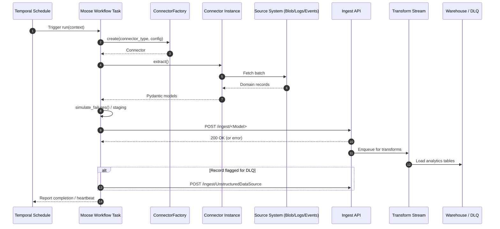
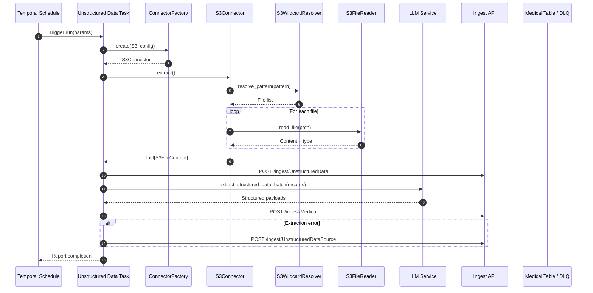

# ETL Architecture

## Overview
This document summarizes how the connectors defined in `odw/services/connectors/src` interact with the Moose (Temporal) workflow engine and downstream services to drive the ETL pipelines in `services/data-warehouse`. The connectors expose consistent extraction interfaces that are orchestrated by Temporal workflows to move data from source systems (or realistic simulations of them) into the ingestion layer and, ultimately, the analytical warehouse.

## Primary Components
- **Temporal workflows (`moose_lib.Task` / `moose_lib.Workflow`)** - Declarative workflow wrappers around Temporal that schedule and run extraction tasks such as `blobs/extract.py`, `logs/extract.py`, `events/extract.py`, and `unstructured_data/extract.py`.
- **Connector factory (`src/connector_factory.py`)** - Central place that maps a `ConnectorType` to a configured connector (`BlobConnector`, `LogsConnector`, `EventsConnector`, `S3Connector`). Workflows rely on this factory so the orchestration layer stays identical across data sources.
- **Structured connectors (`blob_connector.py`, `logs_connector.py`, `events_connector.py`)** - Simulate batches of Pydantic domain models (e.g., `BlobSource`) to mimic upstream systems.
- **S3 connector stack (`s3_connector.py`, `s3_wildcard_resolver.py`, `s3_file_reader.py`)** - Resolves S3-style wildcards, reads content via boto3, and normalizes file payloads (including binary-to-base64 conversions) for unstructured data handling.
- **Workflow utilities** - `simulate_failures` marks records with a `[DLQ]` prefix to exercise downstream dead-letter behavior; `get_llm_service()` powers the unstructured data transformation stage.
- **Ingest and transform services** - Each workflow posts JSON payloads to `http://localhost:4200/ingest/...`, which feeds a transform stream that loads curated warehouse tables.

## Structured Data Workflows (Blob, Logs, Events)
The extraction scripts under `services/data-warehouse/app/{blobs,logs,events}/extract.py` all follow the same pattern:
1. Temporal triggers the workflow (`WorkflowConfig(starting_task=...)`).
2. Inside `run_task`, the workflow pulls runtime parameters (`batch_size`, optional `fail_percentage`) from the Temporal `TaskContext`.
3. `ConnectorFactory.create()` returns the correct connector configured with those parameters.
4. The connector's `extract()` method generates a batch of Pydantic models representing source-system records.
5. The workflow optionally simulates failures, turning a percentage of records into DLQ candidates by prefixing key fields.
6. Records are serialized (`model_dump()`) and sent via HTTP POST to the ingest API.
7. The ingest service enqueues the data for transformation, where Moose streams apply business logic before persisting to warehouse tables.
8. Temporal monitors task heartbeats and marks the run successful (or retries on exceptions).

### Observability and Failure Handling
- `cli_log` consistently emits structured logs (action, message, level) so Temporal execution traces reveal each stage of ETL.
- Failure simulations propagate by design into downstream transforms; operators watch for `[DLQ]`-prefixed records to validate alerting.
- HTTP errors are caught, logged, and surfaced back to Temporal, where retries or manual intervention can occur.

## Unstructured Data Workflow (S3 -> LLM -> Medical)
`services/data-warehouse/app/unstructured_data/extract.py` expands on the base pattern with two internal stages:
1. **Stage 1 - S3 ingestion**
   - A `ConnectorFactory` call creates an `S3Connector` configured with an S3 wildcard pattern supplied in the workflow input.
   - `S3Connector.extract()` resolves the wildcard (`S3WildcardResolver`), reads each file (`S3FileReader`), and returns normalized `S3FileContent` objects that capture content, MIME type, size, and binary flags.
   - The workflow generates UUIDs, stages `UnstructuredData` models, and posts them to the ingest API. Failures create `UnstructuredDataSource` DLQ entries.
   - It returns the list of staged record IDs so Stage 2 knows exactly which payloads to process.
2. **Stage 2 - LLM processing and Medical load**
   - The workflow polls the consumption API for the staged IDs (with retry logic) to ensure writes are visible.
   - `get_llm_service()` returns an orchestrator that can process batches via `extract_structured_data_batch` (with fallback to per-record `extract_structured_data`).
   - The LLM output is normalized through helper functions so even inconsistent field names map into the expected `Medical` schema.
   - Successfully mapped records reuse the Stage 1 IDs and are inserted into the `Medical` table via the ingest API. Extraction errors fan out to the DLQ endpoint.

This two-phase approach keeps S3 connectivity, LLM costs, and warehouse writes isolated, giving Temporal clear retry boundaries between extraction and enrichment.

## Sequence Diagrams
### Structured connector workflow

### Unstructured S3 workflow

## Operational Notes
- **Configuration** - Connector configs encapsulate runtime parameters (batch size, S3 patterns). Temporal inputs map directly onto these configs, enabling per-run overrides without code changes.
- **Security** - `S3FileReader` supports `.env`-backed credentials and optional custom endpoints for MinIO deployments.
- **Extensibility** - Adding a new connector only requires implementing its `extract()` method and updating `ConnectorFactory`. Workflows can immediately compose it thanks to the shared interface.
- **Testing / simulation** - The random data generators in `src/random.py` keep workloads deterministic enough for demos, while DLQ simulation verifies downstream observability end-to-end.
