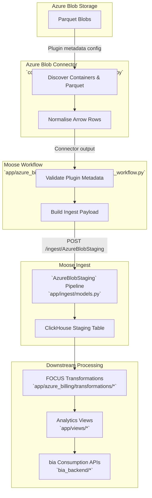
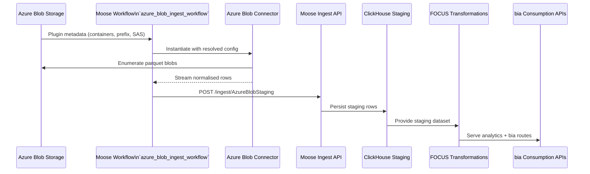

# Azure Blob Data Lineage

## Sequence Overview

## Stages

- **Azure Blob Storage** – Containers hold FOCUS-compliant parquet files published by cloud billing teams.
- **Azure Blob Connector** – Implemented in `odw/services/connectors/src/azure_blob_connector.py`; uses plugin metadata to resolve containers, enumerates parquet files, normalizes Arrow rows, and prepares JSON payloads.
- **Moose Workflow** – Defined in `odw/services/data-warehouse/app/azure_billing/workflows/azure_blob_ingest_workflow.py`; validates config, orchestrates the connector, and posts to Moose ingest.
- **Moose Ingest** – `AzureBlobStaging` pipeline in `odw/services/data-warehouse/app/ingest/models.py` that persists rows to a ClickHouse staging table exposed via Moose CLI.
- **Downstream Processing** – Transformation engines convert staging data into FOCUS models, expose analytical views, and serve bia APIs.
- **Trigger Surface** – Available via the bia admin UI (`Create New Workflow → Azure Blob Parquet Ingest`) and through the `/api/v1/workflows/trigger` endpoint using `workflow_type="azure_blob_ingest"`.

## Components & Paths

- Connector: `odw/services/connectors/src/azure_blob_connector.py`
- Workflow: `odw/services/data-warehouse/app/azure_billing/workflows/azure_blob_ingest_workflow.py`
- Ingest pipeline: `odw/services/data-warehouse/app/ingest/models.py`
- Plugin metadata: `odw/services/data-warehouse/app/azure_billing/plugins/marketplace_api.py`
- Sample parquet assets: `odw/services/data-warehouse/app/blobs/part_*.snappy.parquet`
- Downstream transforms: `odw/services/data-warehouse/app/azure_billing/transformations/`
