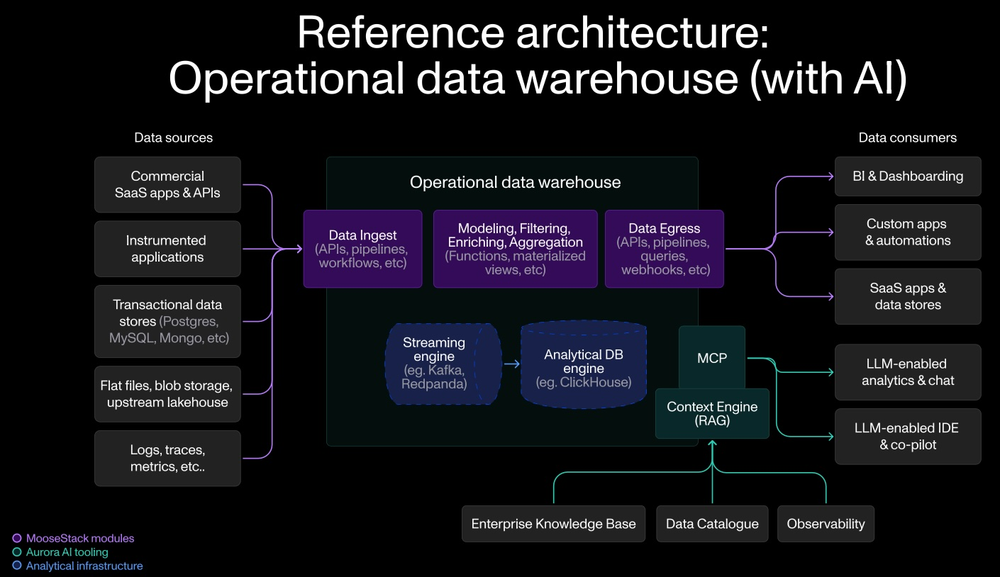

# Operational Data Warehouse (ODW) - Moose Framework Overview

## Summary

The Operational Data Warehouse (ODW) is a comprehensive demonstration application built using the Moose framework that showcases how to construct a modern analytical backend. This project serves as a practical template for developers looking to build their own data warehouse solutions using Moose's infrastructure-from-code approach.

## Core Architecture Components

### 1. **Data Ingestion Layer**
The system implements a sophisticated data ingestion strategy with four primary data types:

- **Blob Storage Data**: File metadata including bucket names, file paths, sizes, and permissions
- **Application Logs**: Structured log entries with timestamps, log levels, messages, and trace IDs  
- **User Events**: Analytics events with user identification, session tracking, and event properties
- **Unstructured Documents**: Text files, PDFs, and images processed via LLM extraction to generate structured medical records

Each data type follows a **two-stage ingestion pattern**:
- **Source Models**: Raw data received from external connectors
- **Processed Models**: Cleaned and enriched data ready for analytical queries

### 2. **Stream Processing Infrastructure**
The application leverages Moose's streaming capabilities to create a robust data processing pipeline:

- **Real-time Data Flow**: Raw data enters through ingestion APIs and flows through streaming topics
- **Data Transformation**: Stream processors apply business logic to clean, validate, and enrich incoming data
- **Error Handling**: Failed records are automatically routed to dead letter queues for analysis and recovery
- **Data Persistence**: Processed data is automatically synchronized to analytical database tables

### 3. **Analytical Storage Layer**
The system uses ClickHouse as its analytical database, optimized for:

- **High-performance queries** on large datasets
- **Columnar storage** for efficient analytical workloads
- **Real-time data ingestion** with automatic indexing
- **Materialized views** for pre-computed aggregations

### 4. **API Consumption Layer**
The application exposes type-safe APIs for data consumption:

- **Pagination Support**: Efficient handling of large result sets
- **Parameter Validation**: Automatic validation of query parameters
- **SQL Injection Protection**: Secure query execution using parameter binding
- **Response Formatting**: Structured responses with metadata

## Key Moose Framework Features Demonstrated

### **Infrastructure-from-Code**
The entire data infrastructure is defined through high-level declarations rather than manual configuration:
- Database tables are automatically created based on data model definitions
- S3 integration for unstructured data processing
- LLM services for intelligent document extraction
- Streaming topics are provisioned based on stream configurations
- API endpoints are generated from consumption API definitions
- Materialized views are created from SQL query specifications

### **End-to-End Type Safety**
The system maintains type consistency across all layers:
- Data models define the schema once and are used throughout the stack
- API request/response types are automatically validated
- Database queries are type-checked against the defined schemas
- Stream transformations maintain type safety during processing

### **Real-time Processing Capabilities**
The application demonstrates sophisticated real-time data processing:
- **Stream Transformations**: Data is processed and enriched as it flows through the system
- **Dead Letter Queues**: Failed records are captured for analysis and potential recovery
- **Automatic Recovery**: The system includes mechanisms to reprocess failed records after correction
- **Monitoring**: Built-in logging and status tracking for operational visibility

### **Workflow Orchestration**
The system includes automated data extraction workflows:
- **Scheduled Data Extraction**: Periodic extraction of data from external sources
- **Configurable Batch Processing**: Adjustable batch sizes and failure simulation for testing
- **Error Handling**: Robust error management with retry mechanisms
- **Operational Logging**: Comprehensive logging for monitoring and debugging

## Data Flow Architecture

### **Ingestion Flow**
1. **External Connectors** extract data from various sources (blob storage, logs, events)
2. **Workflow Tasks** orchestrate the extraction process and send data to ingestion APIs
3. **Ingestion APIs** validate incoming data against defined schemas
4. **Stream Processing** transforms and enriches the data in real-time
5. **Database Storage** persists processed data to analytical tables

### **Consumption Flow**
1. **API Requests** are validated against parameter schemas
2. **Database Queries** are executed with proper parameter binding for security
3. **Response Processing** formats results according to defined response models
4. **Frontend Integration** provides a user interface for data exploration

### **Analytical Processing**
1. **Materialized Views** pre-compute common aggregations (e.g., daily page views)
2. **Real-time Updates** ensure analytical views are current with incoming data
3. **Performance Optimization** leverages ClickHouse's columnar storage for fast queries

## Operational Benefits

### **Developer Experience**
- **Hot Reloading**: Changes to data models and configurations are immediately reflected
- **Type Safety**: Compile-time validation prevents runtime errors
- **Declarative Configuration**: Infrastructure is defined through code rather than manual setup
- **Comprehensive Documentation**: Built-in API documentation and schema validation

### **Operational Excellence**
- **Error Resilience**: Dead letter queues and recovery mechanisms ensure data integrity
- **Monitoring**: Built-in logging and status tracking for operational visibility
- **Scalability**: Stream processing and columnar storage support high-volume data
- **Security**: Parameter binding and input validation protect against common vulnerabilities

### **Business Value**
- **Real-time Analytics**: Immediate access to processed data for decision-making
- **Data Quality**: Automated validation and transformation ensure reliable data
- **Flexibility**: Easy addition of new data sources and analytical views
- **Cost Efficiency**: Optimized storage and processing reduce infrastructure costs

## Technology Stack Integration

The application demonstrates seamless integration of modern data technologies:
- **ClickHouse**: High-performance analytical database
- **Redpanda/Kafka**: Real-time streaming platform
- **Temporal**: Workflow orchestration and scheduling
- **Streamlit**: Interactive data visualization and exploration
- **Pydantic**: Data validation and serialization

This operational data warehouse serves as an excellent starting point for organizations looking to build modern, scalable analytical backends using the Moose framework. It demonstrates best practices for data ingestion, processing, storage, and consumption while maintaining the flexibility to adapt to specific business requirements.
