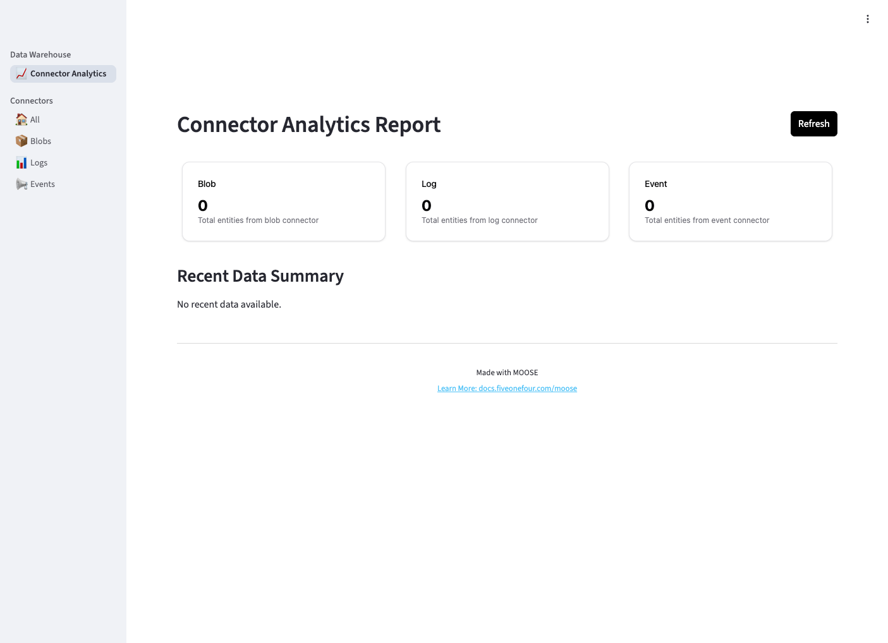
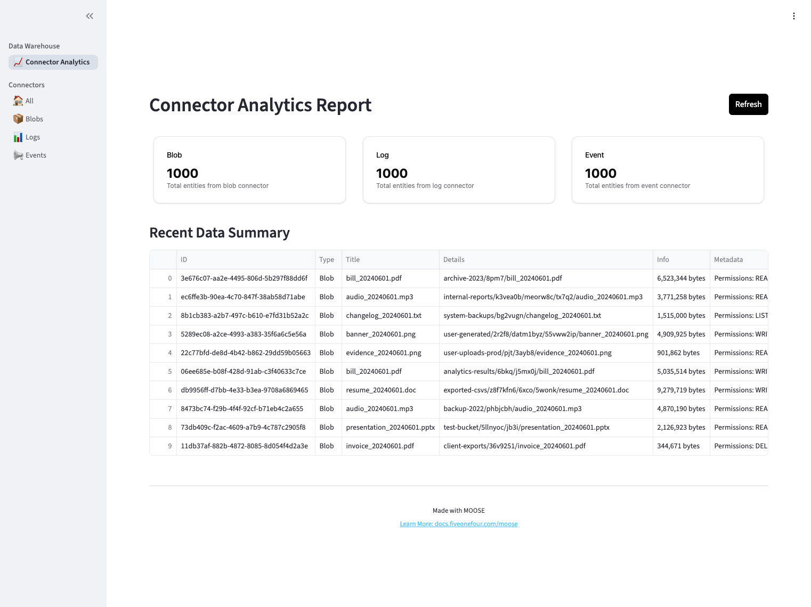
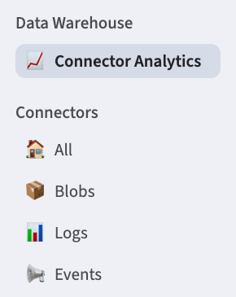
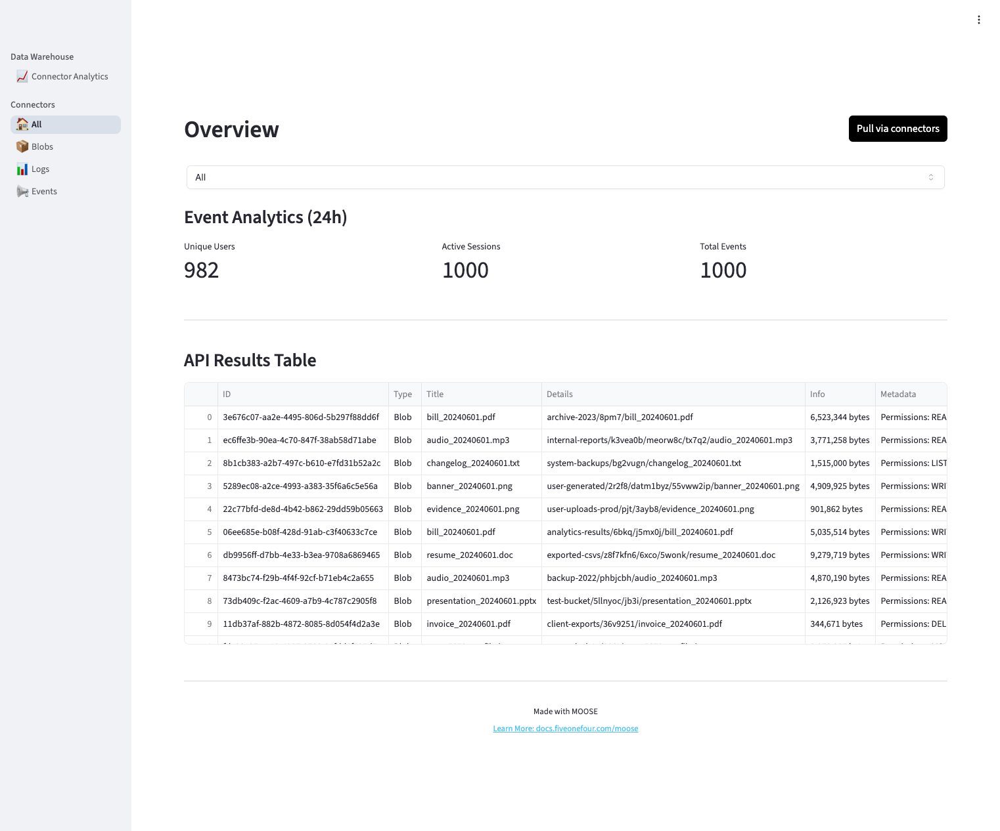
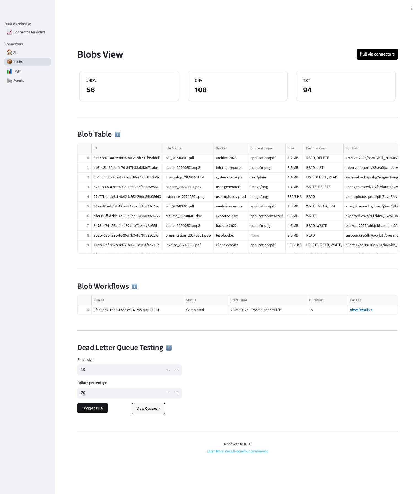
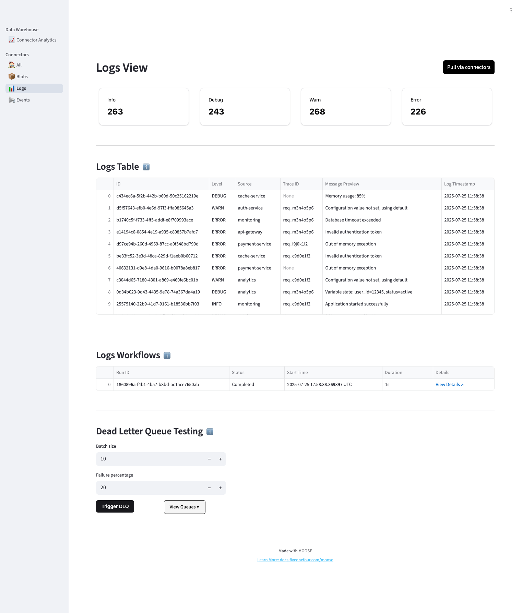
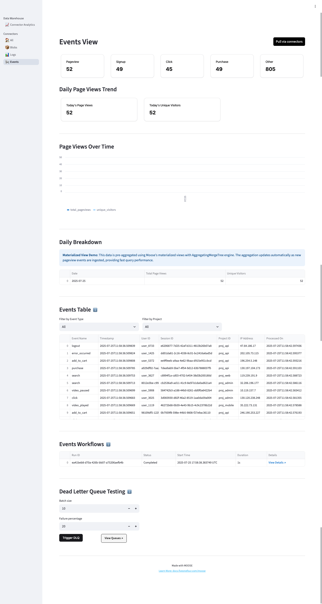
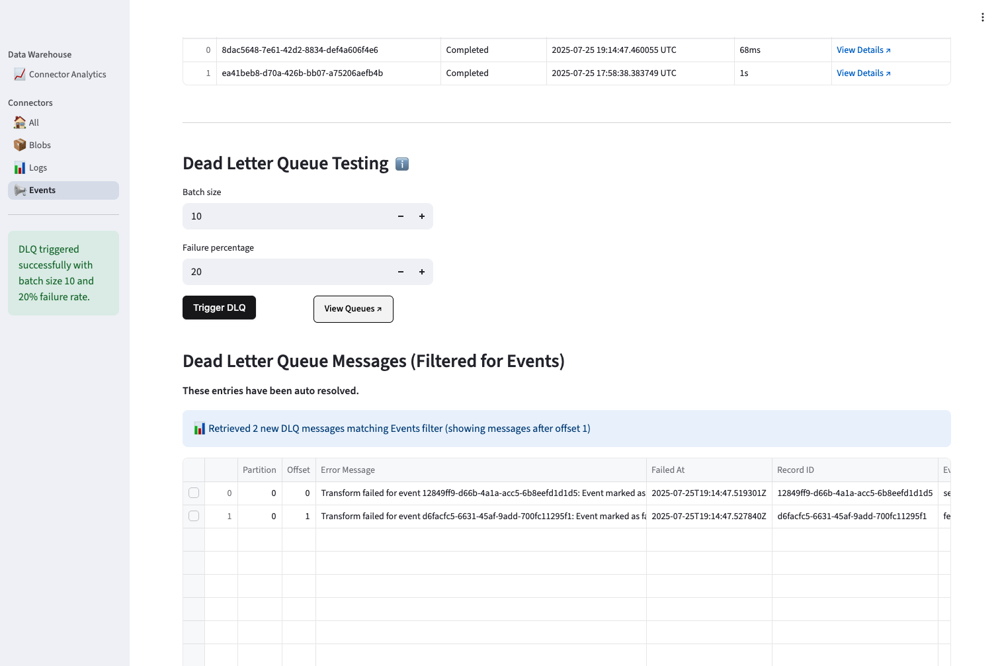

# Walk-Through Tour

## Overview

The Data Warehouse Frontend is a Streamlit-based web application that provides business users and data analysts with an intuitive interface to interact with the Moose-powered analytical backend. It transforms complex data warehouse operations into simple, visual interactions that require no technical expertise. 

**What Makes This Possible:** Underneath this simple interface lies a sophisticated data infrastructure that would traditionally require extensive DevOps setup, database administration, and streaming platform configuration. With Moose, this entire backend is defined in ~200 lines of declarative Python code that automatically provisions and manages:

- ClickHouse analytical database with optimized schemas
- Redpanda streaming platform for real-time data processing  
- HTTP APIs with built-in validation and error handling
- Temporal workflows for reliable data orchestration
- Dead Letter Queues for robust error recovery

The application enables self-service analytics, real-time data exploration, operational visibility into data pipeline health, and decision-making support through automated data extraction and visualization.

> For a detailed overview of the frontend application's architecture and business value, see: [Data Warehouse Frontend Application Overview](./web-front-end.md)

In this walkthrough document, we'll step through each frontend page and explore how Moose's "infrastructure-from-code" approach eliminates traditional data engineering complexity. All pages are powered by these core Moose framework features:

- **Data Models**: Pydantic `BaseModel` classes with `Key[str]` primary keys and proper type annotations
- **IngestPipeline**: Multiple pipelines (source + final) with ingest, stream, table, and DLQ configurations  
- **Stream Transformations**: Real-time data processing with `.add_transform()` and timestamp addition
- **ConsumptionApi**: Type-safe HTTP endpoints using ClickHouse native parameter binding
- **Workflow**: Temporal-powered workflows for pull-based data extraction with failure simulation
- **Dead Letter Queue**: Automatic error handling with DLQ recovery transforms

## Landing Page

When the Data Warehouse frontend launches, users see the Connector Analytics page displaying three data sources: Blob, Log, and Event. Initially empty, clicking "Refresh" triggers Moose workflows that extract data via connectors, process it through real-time streams with transformations, and store it in ClickHouse tables. The page then displays unified metrics and recent data from all three sources.





The Connector Analytics Report provides a unified dashboard view of all data sources. Three metric cards display real-time counts for Blob, Log, and Event connectors. The "Recent Data Summary" table shows the latest 10 records across all sources with key details like file names, sizes, and permissions for blobs. Users can trigger fresh data extraction by clicking the "Refresh" button, which populates the dashboard with current metrics and recent data from the warehouse.

**Backend Code Examples:**

*ConsumptionApi for querying data:*
```python
from moose_lib import ConsumptionApi, EgressConfig
from app.ingest.models import Blob

class GetBlobsQuery(BaseModel):
    limit: Optional[int] = None
    offset: int = 0

def get_blobs(client, params: GetBlobsQuery) -> GetBlobsResponse:
    query = """
        SELECT id, bucket_name, file_path, file_name, file_size, permissions
        FROM Blob ORDER BY transform_timestamp DESC
    """
    result = client.query.execute(query, query_params)
    return GetBlobsResponse(items=[Blob(**item) for item in result])

get_blobs_api = ConsumptionApi[GetBlobsQuery, GetBlobsResponse](
    "getBlobs", query_function=get_blobs
)
```

*IngestPipeline for automatic infrastructure:*
```python
from moose_lib import IngestPipeline, IngestPipelineConfig

# This single declaration automatically creates:
# - HTTP POST endpoint at /ingest/Blob 
# - Redpanda topic for streaming
# - ClickHouse table with optimized schema
# - Dead letter queue for error handling
blobModel = IngestPipeline[Blob]("Blob", IngestPipelineConfig(
    ingest=True,    # Creates HTTP ingest endpoint
    stream=True,    # Creates Redpanda topic
    table=True,     # Creates ClickHouse table
    dead_letter_queue=True  # Error handling
))
```

*Workflow for data extraction:*
```python
from moose_lib import Task, Workflow, WorkflowConfig

blob_task = Task[BlobExtractParams, None](
    name="blob-task",
    config=TaskConfig(run=run_task)
)

blob_workflow = Workflow(
    name="blob-workflow",
    config=WorkflowConfig(starting_task=blob_task)
)
```

*Stream transformations for real-time processing:*
```python
blobSourceModel.get_stream().add_transform(
    destination=blobModel.get_stream(),
    transformation=blob_source_to_blob,
    config=TransformConfig(
        dead_letter_queue=blobSourceModel.get_dead_letter_queue()
    )
)
```

## Navigation

Under the "Connectors" section we have links for All, Blobs, Logs and Events. All shows overview data for all connections and individual connector pages show specific information for each connector.



## Connector Pages

### What Are Connectors?

Connectors are mock data generators that simulate real-world data sources (blob storage, application logs, user events) for the data warehouse. They use a factory pattern to create domain-specific extractors that generate structured test data. In the data warehouse, Moose workflows use these connectors to extract data, which then flows through ingest pipelines for real-time processing and storage. Each connector produces Pydantic models that match the source data schemas, enabling type-safe data flow from extraction through transformation to final storage.

### All Page

The `All` connectors page displays a unified dashboard showing combined data from all three connectors. It features metric cards displaying real-time counts for Blob, Log, and Event data sources, plus a data table showing records across all sources. Users can trigger fresh data extraction for all connectors simultaneously using the "Pull via connectors" button, which populates the dashboard with current metrics and recent data from the warehouse.



The top filter dropdown allows users to filter the view by specific connector types: "All", "Blob", "Logs", or "Events". When "Events" is selected, additional event analytics metrics are displayed showing unique users, active sessions, and total events over the past 24 hours. The filter dynamically updates the data table to show only records from the selected connector type.

### Individual Connector Pages

Each connector page (Blobs, Logs, Events) follows a similar structure with four main sections:

1. **Summary Cards**: Metric cards displaying counts by relevant categories (file types for blobs, log levels for logs, event types for events). Each page has a "Pull via connectors" button that triggers the respective workflow.

2. **Data Table**: A comprehensive table showing individual records with formatted columns and relevant metadata for each data type.

3. **Workflows**: Shows recent workflow execution history with Run ID, Status, Start Time, Duration, and clickable "View Details" links that open the Temporal UI.

4. **Dead Letter Queue Testing**: Interactive controls for testing the DLQ system (covered in detail below).

**Backend Code Examples:**

The connector pages use the same Moose patterns shown in the Landing Page section - **ConsumptionApi** for data queries, **Workflows** for data extraction, and **Stream processing** for real-time transformations. However, the Events page adds unique **MaterializedView** functionality:

*MaterializedView for pre-aggregated analytics:*
```python
from moose_lib import MaterializedView, MaterializedViewOptions, AggregateFunction

class DailyPageViewsSchema(BaseModel):
    view_date: str
    total_pageviews: Annotated[int, AggregateFunction(agg_func="sum", param_types=[int])]
    unique_visitors: Annotated[int, AggregateFunction(agg_func="uniq", param_types=[str])]

query = """
  SELECT 
    toString(toDate(timestamp)) as view_date,
    sumState(toInt64(1)) as total_pageviews,
    uniqState(distinct_id) as unique_visitors
  FROM Event
  WHERE event_name = 'pageview'
  GROUP BY toString(toDate(timestamp))
"""

daily_pageviews_mv = MaterializedView[DailyPageViewsSchema](
    MaterializedViewOptions(
        select_statement=query,
        table_name="daily_pageviews_table",
        materialized_view_name="daily_pageviews_mv",
        select_tables=[eventModel.get_table()],
        engine="AggregatingMergeTree",
        order_by_fields=["view_date"]
    )
)
```


**Behind the Scenes**: All pages use the same Moose infrastructure patterns, with the Events page showcasing how MaterializedView enables real-time pre-aggregated analytics with automatic incremental updates.

#### Blobs Page



The Blobs page shows file type counts (JSON, CSV, TXT) and displays individual blob records with columns for ID, File Name, Bucket, Content Type, Size (formatted in human-readable bytes/KB/MB), Permissions, and Full Path. The table displays various file types including PDFs, MP3s, TXT files, PNGs, and DOCs with their associated metadata.

#### Logs Page



The Logs page shows log level counts (INFO, DEBUG, WARN, ERROR) and displays individual log records with columns for ID, Level, Source, Trace ID, Message Preview (truncated for readability), and Log Timestamp (formatted for better display).

#### Events Page



The Events page shows event type counts (Pageview, Signup, Click, Purchase, Other) and includes a unique **Daily Page Views Trend** section demonstrating Moose's materialized view capabilities. This section shows aggregated page view data with metric cards (Today's Page Views, Today's Unique Visitors, Change from Yesterday), a line chart displaying page views over time, and a daily breakdown table using AggregatingMergeTree engine.

The Events Table includes filtering controls for Event Type and Project, displaying columns for Event Name, Timestamp, User ID, Session ID, Project ID, IP Address, and Processed On timestamp.

## Dead Letter Queue Testing

All connector pages include a Dead Letter Queue Testing section that provides interactive controls for testing the DLQ system. This section includes:

- **Batch Size Input**: Configurable number of records to process (default: 10)
- **Failure Percentage Input**: Configurable failure rate (default: 20%)
- **Trigger DLQ Button**: Simulates failures during processing
- **View Queues Button**: Opens the Kafdrop UI for queue inspection (will be replaced with new Moose features under development)

When DLQ messages are retrieved, they display in a filtered table showing partition, offset, error details, and record information. Users can select individual messages to view their complete JSON payload for debugging and recovery analysis.



The screenshot shows the DLQ testing interface in action. A green notification confirms successful DLQ triggering with batch size 10 and 20% failure rate. The "Dead Letter Queue Messages" table displays two failed events that were automatically routed to the DLQ, showing their partition/offset locations, error messages indicating transformation failures, timestamps, and unique record IDs. The system automatically filters messages by connector type (Events in this case) and tracks offset positions to avoid duplicate processing.

**Backend Code Examples:**

*DLQ configuration in stream transforms:*

```python
blobSourceModel.get_stream().add_transform(
    destination=blobModel.get_stream(),
    transformation=blob_source_to_blob,
    config=TransformConfig(
        dead_letter_queue=blobSourceModel.get_dead_letter_queue()
    )
)
```

*DLQ recovery transforms for failed messages:*

```python
from moose_lib import DeadLetterModel

def invalid_blob_source_to_blob(dead_letter: DeadLetterModel[BlobSource]) -> Optional[Blob]:
    try:
        original_blob_source = dead_letter.as_typed()
        
        # Fix the failure condition - change [DLQ] to [RECOVERED]
        corrected_file_name = original_blob_source.file_name
        if corrected_file_name.startswith("[DLQ]"):
            corrected_file_name = corrected_file_name.replace("[DLQ]", "[RECOVERED]", 1)
        
        return Blob(
            id=original_blob_source.id,
            file_name=corrected_file_name,
            # ... other fields
            transform_timestamp=datetime.now().isoformat()
        )
    except Exception as error:
        return None

# Set up DLQ recovery transforms
blobSourceModel.get_dead_letter_queue().add_transform(
    destination=blobModel.get_stream(),
    transformation=invalid_blob_source_to_blob,
)
```

**Behind the Scenes**: The DLQ system leverages Moose's DLQ transforms and recovery mechanisms, using DeadLetterModel to handle failed records and enable message recovery. Failed messages are automatically routed to DLQs where they can be inspected, fixed, and reprocessed through recovery transforms.

## Unstructured Data Processing

The Data Warehouse includes powerful LLM-driven unstructured data processing capabilities that transform documents, images, and text files into structured medical records. This feature demonstrates how modern AI can be seamlessly integrated into data warehouse workflows.

### **Document-to-Medical Record Pipeline**

The unstructured data page enables users to process documents stored in S3-compatible storage:

- **S3 Pattern Input**: Users specify file patterns like `s3://medical-docs/*.pdf` or `minio://documents/patient-*.txt`
- **LLM Processing**: Documents are processed using Anthropic's Claude API with vision capabilities for images and OCR
- **Medical Record Generation**: Extracted data is structured into medical records with patient information, procedures, and appointments
- **Workflow Monitoring**: Real-time progress tracking through the two-stage processing pipeline

### **Key Features**

- **Multi-Format Support**: Processes text files, PDFs, images, and Word documents
- **Intelligent Extraction**: Uses natural language instructions to guide data extraction
- **Batch Processing**: Handles multiple files efficiently with configurable batch sizes
- **Error Handling**: Failed extractions are routed to dead letter queues for analysis
- **S3 Integration**: Direct integration with AWS S3 and MinIO storage systems

**Backend Code Examples:**

*Unstructured data extraction workflow:*
```python
class UnstructuredDataExtractParams(BaseModel):
    source_file_pattern: str  # S3 pattern like "s3://bucket/medical-docs/*"
    processing_instructions: Optional[str] = """Extract patient information..."""

def stage_1_s3_to_unstructured(input: UnstructuredDataExtractParams) -> List[str]:
    connector = ConnectorFactory[S3FileContent].create(
        ConnectorType.S3,
        S3ConnectorConfig(s3_pattern=input.source_file_pattern)
    )
    files = connector.extract()
    # Process each file and create UnstructuredData records
```

*LLM service integration:*
```python
llm_service = LLMService()
extracted_data = llm_service.extract_structured_data(
    file_content=file.content,
    file_type=file.content_type,
    instruction=processing_instructions
)
```

**Behind the Scenes**: The unstructured data pipeline leverages Moose's workflow system, S3 connectors, and LLM integration to create a two-stage processing flow: S3 files → UnstructuredData staging → Medical records. This demonstrates how complex AI-powered workflows can be declaratively defined and automatically orchestrated.

## Summary

This walkthrough has demonstrated how the Data Warehouse Frontend provides business users with an intuitive interface to interact with complex analytical infrastructure. Through the lens of this application, we've explored how Moose framework transforms traditional data engineering challenges into simple, declarative code.

**What We've Covered:**
- A unified dashboard showing real-time metrics across multiple data sources
- Individual connector pages for detailed data exploration (Blobs, Logs, Events)
- LLM-powered unstructured data processing from documents to medical records
- Interactive workflow monitoring with direct links to Temporal UI
- Advanced error handling through Dead Letter Queue testing and recovery
- Materialized views demonstrating pre-aggregated analytics capabilities

**Moose's Role:**
Moose has been the invisible foundation that makes this all possible. It automatically provisions ClickHouse databases, Redpanda streaming platforms, and API gateways from simple Python declarations. The framework ensures end-to-end type safety, provides built-in SQL injection protection, enables real-time stream processing, and offers robust error handling—all while maintaining the developer experience of writing simple, declarative code.

**The Traditional Alternative:** Without Moose, implementing this same functionality would require:
- Setting up and configuring ClickHouse clusters with proper schemas and indexing
- Deploying and managing Kafka/Redpanda brokers with topic configurations  
- Building custom APIs with validation, authentication, and error handling
- Implementing streaming processors with exactly-once semantics
- Integrating LLM services with S3 storage and workflow orchestration
- Creating monitoring dashboards for data pipeline health
- Writing extensive DevOps scripts for deployment and scaling
- Managing database migrations and schema evolution

This could easily require 10-20x more code, multiple infrastructure specialists, and weeks of setup time.

**The Moose Advantage:** This entire data warehouse runs from a few declarative Python files that define data models, transformations, and APIs. Moose handles all the infrastructure complexity automatically, allowing developers to focus on business logic rather than plumbing.

The result is a production-ready data warehouse that business users can interact with confidently, knowing that the underlying infrastructure is reliable, scalable, and maintainable. This demonstrates Moose's core value: transforming complex analytical backends into accessible, business-friendly applications with minimal code.