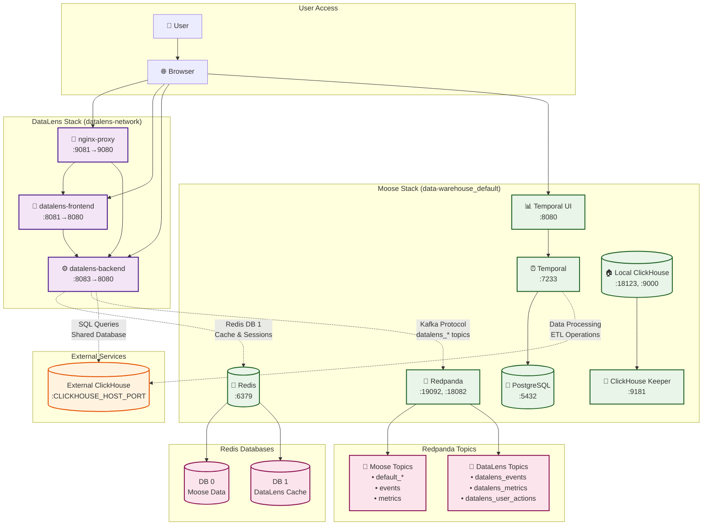
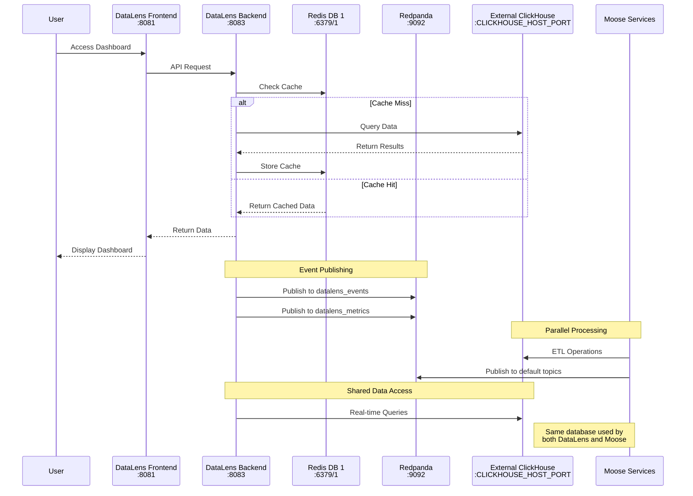
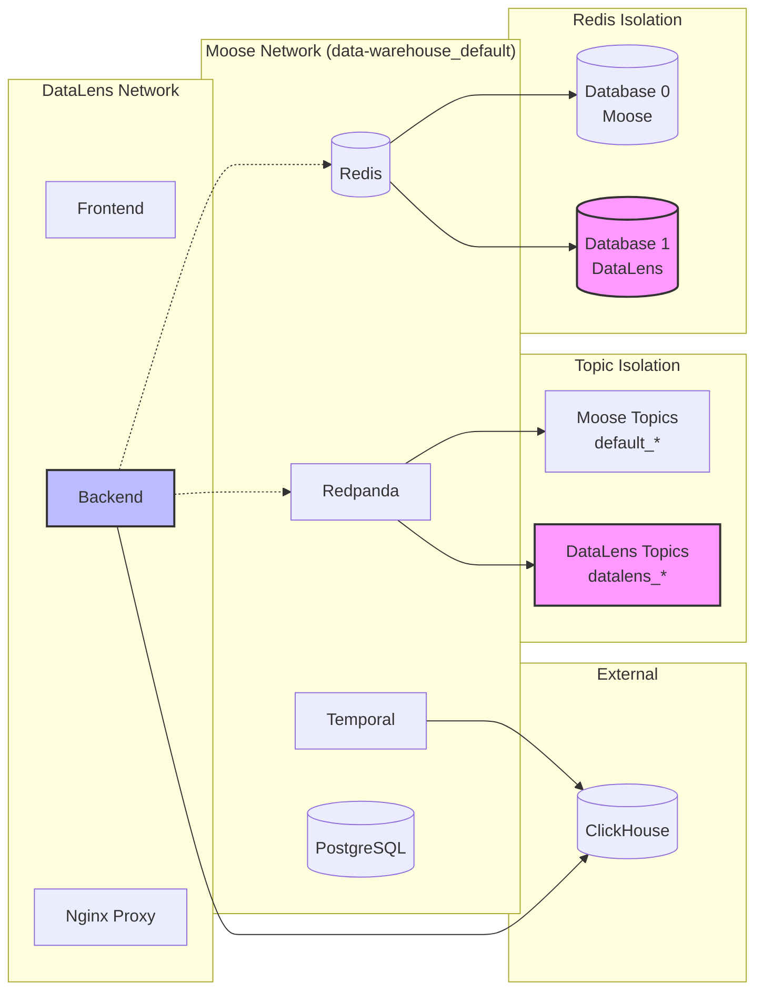

# DataLens Integration with Moose Data Warehouse

This document describes how DataLens is integrated with the Moose data warehouse backend containers.

## Architecture Diagram



### Port Mapping Summary

| Service               | Host Port               | Container Port | Purpose                             |
| --------------------- | ----------------------- | -------------- | ----------------------------------- |
| **DataLens Services** |
| nginx-proxy           | 9081                    | 9080           | Unified access point                |
| datalens-frontend     | 8081                    | 8080           | Web UI                              |
| datalens-backend      | 8083                    | 8080           | API server                          |
| **Moose Services**    |
| Redis                 | 6379                    | 6379           | Cache (DB 0: Moose, DB 1: DataLens) |
| Redpanda Kafka        | 19092                   | 19092          | Kafka protocol                      |
| Redpanda Proxy        | 18082                   | 18082          | HTTP API                            |
| Temporal              | 7233                    | 7233           | Workflow engine                     |
| Temporal UI           | 8080                    | 8080           | Temporal dashboard                  |
| Local ClickHouse      | 18123                   | 8123           | HTTP interface (unused)             |
| Local ClickHouse      | 9000                    | 9000           | Native protocol (unused)            |
| PostgreSQL            | 5432                    | 5432           | Temporal metadata                   |
| **External Services** |
| External ClickHouse   | CLICKHOUSE_HOST_PORT | -              | Shared data warehouse               |

## Integration Overview

DataLens has been configured to reuse the Moose infrastructure instead of running duplicate services:

### Shared Services

1. **External ClickHouse Database**: Both DataLens and Moose connect to the same external ClickHouse instance
   - Host: `${CLICKHOUSE_HOST}` (external instance)
   - Port: `${CLICKHOUSE_HOST_PORT}` (external port)
   - Database: Uses the same database as Moose (`${CLICKHOUSE_DB_NAME}`)
   - Credentials: Shared `${CLICKHOUSE_USER}` and `${CLICKHOUSE_PASSWORD}`

2. **Redis Cache**: DataLens uses the Moose Redis instance with a different database
   - Host: `redis` (Moose container)
   - Port: `6379`
   - Database: `1` (DataLens) vs `0` (Moose default)

3. **Redpanda/Kafka**: DataLens uses the Moose Redpanda instance with different topics
   - Host: `redpanda` (Moose container)
   - Port: `9092` (internal Kafka protocol)
   - Topic Prefix: `datalens_` (DataLens) vs default (Moose)
   - Consumer Group: `datalens-consumers`

### Port Configuration

To avoid conflicts with Moose services, DataLens ports have been adjusted:

| Service           | Original Port | New Port | Reason                                    |
| ----------------- | ------------- | -------- | ----------------------------------------- |
| DataLens Backend  | 8082          | 8083     | Avoid conflict with Redpanda proxy (8082) |
| DataLens Frontend | 8081          | 8081     | No conflict                               |
| Nginx Proxy       | 9080          | 9081     | Avoid potential conflicts                 |

### Network Configuration

DataLens containers connect to Moose networks:

- `data-warehouse_clickhouse-network`: For ClickHouse access
- `data-warehouse_default`: For Redis access

## Project Structure

The DataLens project is now properly structured with a clean, flat organization:

```
odw/services/datalens/
├── datalens-ui/                 # Main DataLens UI project
│   ├── abi-extensions/          # ABI extensions (integrated)
│   │   ├── src/                # Extension source code
│   │   ├── package.json        # Extension dependencies
│   │   └── INTEGRATION.md      # Extension documentation
│   ├── src/                    # Main UI source
│   ├── package.json            # Main project dependencies
│   └── ...                     # Other DataLens UI files
├── datalens-backend/           # Main DataLens backend project
│   ├── docker_build/           # Official Dockerfiles
│   ├── lib/                    # Backend libraries
│   ├── app/                    # Application code
│   ├── pyproject.toml          # Python dependencies
│   └── ...                     # Other backend files
├── placeholder/                # Placeholder UI for development
├── config/                     # Configuration files
├── scripts/                    # Development scripts
└── docker-compose*.yml        # Docker orchestration
```

## Usage

### Starting the Services

1. **Start Moose stack first**:

   ```bash
   cd odw/services/data-warehouse
   # Start Moose services (this should already be running)
   ```

2. **Start DataLens**:

   ```bash
   cd odw/services/datalens

   # For development with placeholders
   docker-compose -f docker-compose.simple.yml up

   # For full DataLens (when repositories are available)
   docker-compose up
   ```

   > 💡 For UI-only development you can also run `bun run dev` inside `services/datalens/datalens-ui`.  
   > The local app-builder server now listens on http://localhost:8081.

### Access Points

- **DataLens Frontend**: http://localhost:8081
- **DataLens Backend**: http://localhost:8083
- **DataLens Unified Access**: http://localhost:9081
- **Moose Temporal UI**: http://localhost:8080
- **Moose Redpanda Proxy**: http://localhost:18082
- **External ClickHouse**: `${CLICKHOUSE_HOST}:${CLICKHOUSE_HOST_PORT}`

### Environment Variables

DataLens uses the same environment variables as Moose:

- `CLICKHOUSE_HOST` - External ClickHouse host
- `CLICKHOUSE_HOST_PORT` - External ClickHouse port
- `CLICKHOUSE_USER` - ClickHouse username
- `CLICKHOUSE_PASSWORD` - ClickHouse password
- `CLICKHOUSE_DB_NAME` - Database name
- `CLICKHOUSE_USE_SSL` - SSL configuration

### Kafka/Redpanda Topics

DataLens uses prefixed topics to avoid conflicts:

- **DataLens Topics**: `datalens_*` (e.g., `datalens_events`, `datalens_metrics`)
- **Moose Topics**: Default naming (no prefix)
- **Consumer Groups**: `datalens-consumers` vs Moose default groups

## Data Flow Diagram



## Network Isolation Strategy



## Benefits

1. **Resource Efficiency**: No duplicate ClickHouse, Redis, or Kafka instances
2. **Data Consistency**: DataLens visualizes the same data that Moose processes
3. **Simplified Management**: Single external ClickHouse and shared Moose infrastructure
4. **Proper Isolation**: Separate Redis databases and Kafka topic prefixes
5. **Event Streaming**: DataLens can consume and produce events via shared Redpanda

## Troubleshooting

### Common Issues

1. **Connection Refused**: Ensure Moose stack is running before starting DataLens
2. **Port Conflicts**: Check that no other services are using the configured ports
3. **Network Issues**: Verify that external networks exist:
   ```bash
   docker network ls | grep data-warehouse
   ```

### Verification

Check that DataLens can connect to shared services:

```bash
# Check external ClickHouse connection
curl -s "${CLICKHOUSE_HOST}:${CLICKHOUSE_HOST_PORT}/ping"

# Check Redis connection (database 1)
docker exec -it datalens_datalens-backend_1 redis-cli -h redis -p 6379 -n 1 ping

# Check Redpanda connection
docker exec -it datalens_datalens-backend_1 curl -s http://redpanda:18082/topics

# List DataLens topics
docker exec -it data-warehouse_redpanda_1 rpk topic list | grep datalens_
```

### Topic Management

Create DataLens-specific topics:

```bash
# Create DataLens topics with prefix
docker exec -it data-warehouse_redpanda_1 rpk topic create datalens_events
docker exec -it data-warehouse_redpanda_1 rpk topic create datalens_metrics
docker exec -it data-warehouse_redpanda_1 rpk topic create datalens_user_actions
```
