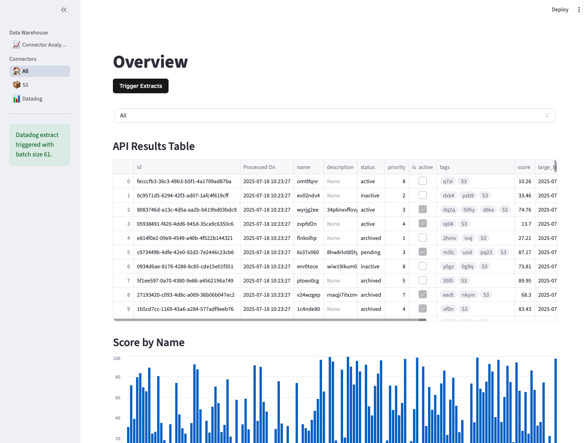
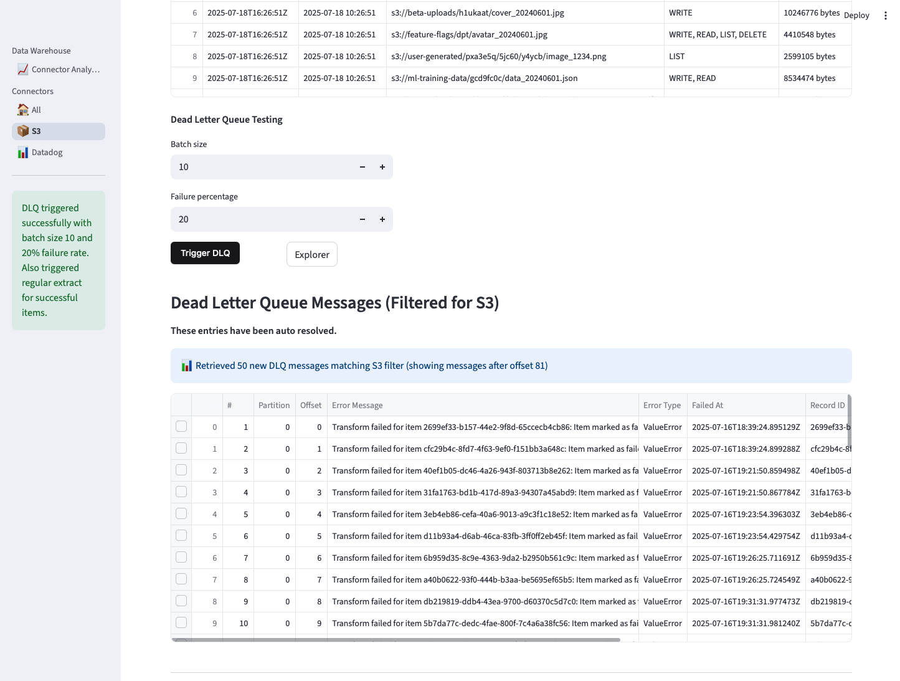

# Data Warehouse Demo - Walkthrough Guide

## Overview
This guide walks you through the Data Warehouse demo, which showcases a modern data ingestion and analytics platform built with Moose. The system demonstrates real-time data processing from multiple sources (S3 and Datadog) with error handling, visualization, and analytics capabilities.

## Prerequisites
- Python 3.12+ installed
- Access to the Area-code repository
- Terminal/command line access

## Quick Start

### 1. Launch the Demo
Open a terminal window in the root of the Area-code repository and navigate to the data-warehouse project:

```sh
cd services/data-warehouse/
```

### 2. Initial Setup
Run the one-time setup command to install required dependencies:

```sh
./setup.sh setup
```

### 3. Start the Demo
Launch the Moose data warehouse server and web-based frontend:

```sh
./setup.sh start
```

The dashboard will be available at `http://localhost:8501` (or the port shown in the terminal).

### 4. Stop the Demo
When finished, shutdown the demo:

```sh
./setup.sh stop
```

## Dashboard Overview

### Landing Page - Connector Analytics
The main dashboard features a left-side navigation panel and a primary content area. The landing page "Connector Analytics" displays key metrics and insights about S3 and Datadog entities ingested into the Data Warehouse.

**Key Features:**
- **Update Button**: Triggers fresh data extraction from both S3 and Datadog sources
- **Metric Cards**: Real-time counts of entities by connector type
- **Time Series Chart**: Shows items processed per minute by connector
- **Real-time Updates**: Data refreshes automatically after extraction


> **Note**: On first launch, no data will be displayed. Use the "Update" button to trigger initial data extraction.

### Overview Page - All Connectors Data
Navigate to the "All" section to view detailed entries from both S3 and Datadog connectors. This page provides comprehensive data exploration capabilities.

**Features:**
- **Trigger Extracts**: Manually initiate data extraction workflows
- **Filter Dropdown**: Filter by "All", "S3", or "Datadog" sources
- **Interactive Table**: Search, sort, export to CSV, and full-screen view
- **Data Visualization**: Bar chart showing entity relationships and scores




**Pro Tip**: Use the mouse wheel to zoom in and out of interactive charts for detailed analysis.

## Connector-Specific Views

### S3 Connector Data
The S3 connector page displays structured data with S3-specific fields including:
- **S3 Location**: File paths and bucket information
- **Permissions**: Access control details
- **Resource Size**: File sizes and storage metrics
- **Metadata**: Additional S3 object properties

**Key Features:**
- **Trigger S3 Extract**: Initiate S3-specific data extraction
- **Dead Letter Queue Testing**: Simulate error scenarios and test error handling
- **JSON Inspection**: Click checkboxes to view detailed JSON object data


#### Dead Letter Queue (DLQ) Testing
The DLQ testing interface allows you to:
- Generate controlled errors during data processing
- Test error handling and recovery mechanisms
- Inspect failed records and their error details
- Monitor the system's ability to process problematic data




> **Important**: The Data Warehouse automatically inspects and resolves DLQ errors. Subsequent DLQ triggers will only show the most recent entries.

### Datadog Connector Data
The Datadog connector provides similar functionality but focuses on log data processing:

- **Log Entries**: Structured log data from Datadog
- **Timestamp Analysis**: Time-based log processing
- **Error Handling**: Robust error management for log processing
- **Real-time Processing**: Live log ingestion capabilities


## Backend Monitoring

### Moose Output Monitoring
When DLQ entries are created via the "Trigger DLQ" button, you can monitor the backend processing in real-time:


This provides visibility into both the web interface and the underlying data processing pipeline, demonstrating the full-stack nature of the Data Warehouse system.

## Troubleshooting

### Common Issues
1. **No Data Displayed**: Use the "Update" or "Trigger Extracts" buttons to load initial data
2. **Connection Errors**: Ensure the setup script completed successfully
3. **Port Conflicts**: Check if port 8501 is available for the web interface

### Getting Help
- Check the terminal output for error messages
- Verify all dependencies are installed correctly
- Ensure proper file permissions on setup scripts

## Architecture Highlights

This demo showcases several modern data engineering concepts:
- **Multi-source Ingestion**: Simultaneous processing from S3 and Datadog
- **Error Handling**: Robust DLQ implementation for failed records
- **Real-time Processing**: Live data updates and visualization
- **Interactive Analytics**: User-friendly exploration of complex data
- **Scalable Architecture**: Built on Moose for enterprise-grade performance
