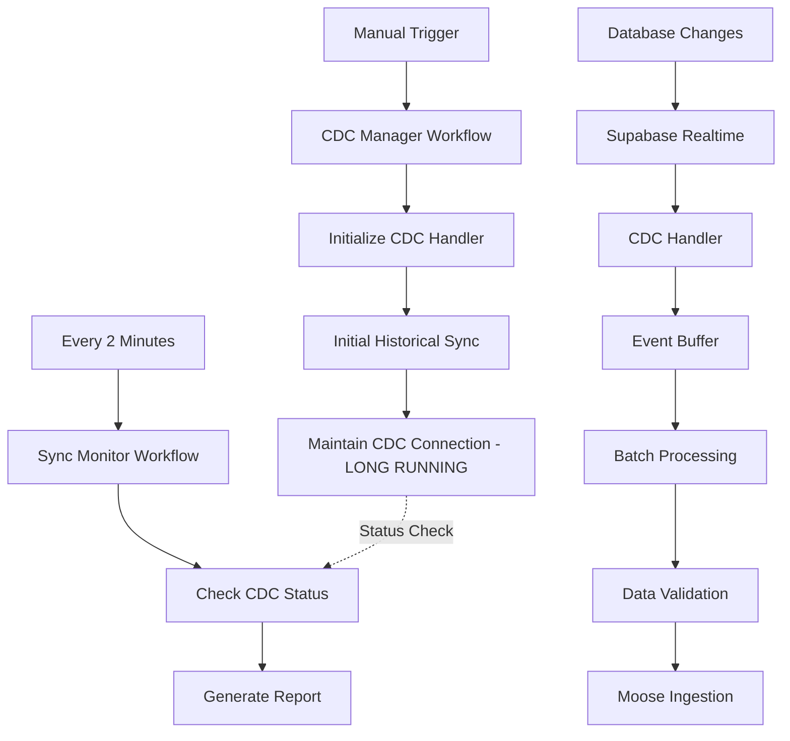

# This is a [MooseJs](https://www.moosejs.com/) project bootstrapped with the [`Moose CLI`](https://github.com/514-labs/moose/tree/main/apps/framework-cli).

<a href="https://www.getmoose.dev/"></a>

[](https://www.npmjs.com/package/@514labs/moose-cli?activeTab=readme)
[](https://join.slack.com/t/moose-community/shared_invite/zt-2fjh5n3wz-cnOmM9Xe9DYAgQrNu8xKxg)
[](https://docs.moosejs.com/)
[](LICENSE)

[Moose](https://www.getmoose.dev/) is an open-source data engineering framework designed to drastically accellerate AI-enabled software developers, as you prototype and scale data-intensive features and applications.

# Get started with Moose

Get up and running with your own Moose project in minutes by using our [Quick Start Tutorial](https://docs.getmoose.dev/quickstart). We also have our [Docs](https://docs.getmoose.dev/) where you can pick your path, learn more about Moose, and learn what types of applications can be built with Moose.

# Beta release

Moose is beta software and is in active development. Multiple public companies across the globe are using Moose in production. We'd love for you to [get your hands on it and try it out](https://docs.getmoose.dev/quickstart). If you're interested in using Moose in production, or if you just want to chat, you can reach us at [hello@moosejs.dev](mailto:hello@moosejs.dev) or in the Moose developer community below.

# Community

You can join the Moose community [on Slack](https://join.slack.com/t/moose-community/shared_invite/zt-2fjh5n3wz-cnOmM9Xe9DYAgQrNu8xKxg).

Here you can get together with other Moose developers, ask questions, give feedback, make feature requests, and interact directly with Moose maintainers.

# Contributing

We welcome contributions to Moose! Please check out the [contribution guidelines](https://github.com/514-labs/moose/blob/main/CONTRIBUTING.md).

# Made by 514

Our mission at [fiveonefour](https://www.fiveonefour.com/) is to bring incredible developer experiences to the data stack. If you're interested in enterprise solutions, commercial support, or design partnerships, then we'd love to chat with you: [hello@moosejs.dev](mailto:hello@moosejs.dev)

# 🔄 Sync-Base Service

A **Moose-powered data synchronization service** that provides real-time CDC (Change Data Capture) from transactional databases to analytical stores using **Supabase Postgres Changes** and **dual-workflow architecture**.

## 🏗️ **Architecture Overview**

This service uses a **two-workflow approach** for optimal separation of concerns:

### **1. 🔥 CDC Manager Workflow** (Long-Running)
- **Purpose**: Manages the CDC handler lifecycle
- **Execution**: Manually triggered, runs continuously (24-72 hours)
- **Responsibilities**:
  - Initialize and start CDC handler
  - Perform initial historical sync
  - Maintain persistent CDC connections
  - Handle CDC restarts and recovery

### **2. 🔍 Sync Monitor Workflow** (Scheduled)
- **Purpose**: Monitors CDC health and generates reports
- **Execution**: Automatically runs every 2 minutes
- **Responsibilities**:
  - Check CDC handler status
  - Generate monitoring reports
  - Alert if CDC is down
  - Provide observability data



## 🚀 **Getting Started**

### **Prerequisites**
- Node.js 18+
- PostgreSQL database (transactional-base)
- Supabase project configured
- Moose CLI installed

### **1. Install Dependencies**
```bash
cd services/sync-base
pnpm install
```

### **2. Configure Environment**
```bash
# Run the setup script to create .env file
node setup-env.js

# Or manually create .env with:
SUPABASE_URL=http://localhost:3001
SUPABASE_REST_URL=http://localhost:3001
REALTIME_URL=ws://localhost:4002
ELASTICSEARCH_URL=http://localhost:9200
# No authentication keys needed anymore!
```

### **3. Start the Service**
```bash
pnpm dev
```

### **4. Start CDC Data Sync**
```bash
# In another terminal, start the CDC manager (long-running)
moose workflow run cdcManagerWorkflow

# The monitor workflow runs automatically every 2 minutes
```

## 🎯 **Workflow Management**

### **Starting CDC**
```bash
# Start the CDC manager workflow (this runs continuously)
moose workflow run cdcManagerWorkflow
```

### **Checking Status**
```bash
# View CDC manager workflow status
moose workflow status cdcManagerWorkflow

# View scheduled monitor workflow status
moose workflow status syncMonitorWorkflow

# View all workflow runs
moose workflow list
```

### **Stopping CDC**
```bash
# Cancel the CDC manager workflow
moose workflow cancel cdcManagerWorkflow
```

### **Manual Status Check**
```bash
# Run monitor workflow manually
moose workflow run syncMonitorWorkflow
```

## 📊 **Data Flow**

### **Tables Synchronized**
- `foo` → `FooSync`
- `bar` → `BarSync` 
- `foo_bar` → `FooBarSync`

### **Event Processing**
1. **Real-time Events**: Database changes trigger Supabase realtime notifications
2. **Event Buffering**: Events are batched (default: 50 events)
3. **Dual Triggers**: Process when buffer is full OR every 30 seconds
4. **Data Validation**: Zod schema validation before ingestion
5. **Moose Ingestion**: Validated data sent to analytical store

### **CDC Operations Supported**
- ✅ **INSERT**: New records
- ✅ **UPDATE**: Modified records  
- ✅ **DELETE**: Removed records
- ✅ **Historical Sync**: Initial data catch-up

## 🔧 **Configuration**

### **Workflow Configuration**
```typescript
export const initialSyncConfig: SyncWorkflowConfig = {
  supabaseUrl: process.env.SUPABASE_URL || 'http://localhost:3001',
  // No authentication key needed anymore!
  batchSize: 50,              // Events per batch
  syncInterval: '@every 2m',  // Monitor frequency
  tables: ['foo', 'bar', 'foo_bar'],
};
```

### **CDC Handler Configuration**
```typescript
const cdcConfig: CDCConfig = {
  supabaseUrl: config.supabaseUrl,
  // No authentication key needed anymore!
  tables: config.tables,
  batchSize: config.batchSize,
  onBatch: processCDCEvents,    // Batch processor function
};
```

## 🔍 **Monitoring & Observability**

### **Temporal Dashboard**
- View both workflows in Temporal UI
- Monitor workflow execution history
- Track failures and retries
- Analyze performance metrics

### **Logs & Metrics**
```bash
# View real-time logs
moose logs

# Check workflow-specific logs
moose workflow logs cdcManagerWorkflow
moose workflow logs syncMonitorWorkflow
```

### **Status Indicators**
- **🔥 CDC Manager**: Long-running workflow status
- **🔍 Monitor**: Scheduled health checks
- **💓 Heartbeat**: CDC connection health (every minute)
- **📊 Metrics**: Events processed, buffer status, uptime

## 🛠️ **Development & Testing**

### **Test CDC Connection**
```bash
node test-cdc.js
```

### **Manual Status Check**
```javascript
// In Node.js REPL or script
const { getCDCStatus } = require('./app/index.ts');
console.log(getCDCStatus());
```

### **Debug Mode**
```bash
# Enable verbose logging
DEBUG=moose:* pnpm dev
```

## 🏥 **Error Handling & Recovery**

### **Automatic Recovery**
- **Connection Drops**: Auto-reconnect with exponential backoff
- **Batch Failures**: Individual event retry with dead letter queue
- **Workflow Failures**: Temporal retry policies with proper timeouts
- **CDC Handler Restart**: Monitor workflow detects and alerts

### **Manual Recovery**
```bash
# Restart CDC if stuck
moose workflow cancel cdcManagerWorkflow
moose workflow run cdcManagerWorkflow

# Check what went wrong
moose workflow logs cdcManagerWorkflow --tail 100
```

## 🚀 **Production Deployment**

### **Scaling Considerations**
- **CDC Manager**: One instance per database
- **Monitor Workflow**: Can run multiple instances safely
- **Event Volume**: Adjust `batchSize` based on throughput
- **Resources**: Long-running workflows need persistent containers

### **High Availability**
```bash
# Deploy with process manager
pm2 start pnpm --name "sync-base" -- dev

# Or with Docker
docker-compose up -d
```

### **Monitoring Setup**
- Configure Temporal alerts
- Set up log aggregation
- Monitor CDC lag metrics
- Track sync completion rates

## 🤔 **Why Two Workflows?**

### **Traditional Single Workflow Issues**
- ❌ Bootstrap dependency (need scheduled workflow to start CDC)
- ❌ Poor observability for long-running operations  
- ❌ Mixed concerns (CDC management + monitoring)
- ❌ Difficult to control independently

### **Dual Workflow Benefits**
- ✅ **Clear Separation**: CDC management vs. monitoring
- ✅ **Independent Control**: Start/stop CDC without affecting monitoring
- ✅ **Better Observability**: Each workflow visible in Temporal
- ✅ **Fault Isolation**: CDC failure doesn't break monitoring
- ✅ **Scalability**: Each workflow can scale independently

## 📚 **API Reference**

### **Exported Functions**
```typescript
// Get current CDC status
getCDCStatus(): CDCStatus

// Graceful shutdown
shutdownCDC(): Promise<void>
```

### **Workflow Names**
- `cdcManagerWorkflow` - Long-running CDC manager
- `syncMonitorWorkflow` - Scheduled monitoring

### **Data Schemas**
- `FooSync` - Zod schema for foo table sync
- `BarSync` - Zod schema for bar table sync  
- `FooBarSync` - Zod schema for foo_bar table sync

## 🔗 **Related Services**

- **[transactional-base](../transactional-base)**: Source database service
- **[analytical-base](../analytical-base)**: Target analytical store
- **[Supabase Realtime](https://supabase.com/docs/guides/realtime)**: CDC source

## 🆘 **Troubleshooting**

### **Common Issues**

**CDC Not Starting**
```bash
# Check environment variables
echo $SUPABASE_URL
echo $REALTIME_URL
echo $ELASTICSEARCH_URL

# Verify services are running
curl http://localhost:3001  # PostgREST
curl http://localhost:9200  # Elasticsearch
```

**No Events Being Processed**
```bash
# Check Supabase realtime configuration
# Verify table has realtime enabled
# Check CDC handler status
```

**Workflow Stuck**
```bash
# Cancel and restart
moose workflow cancel cdcManagerWorkflow
moose workflow run cdcManagerWorkflow
```

**High Memory Usage**
```bash
# Reduce batch size
# Check for event processing bottlenecks
# Monitor buffer sizes
```

### **Getting Help**
- Check Moose documentation: https://moosejs.dev
- Review Temporal workflow patterns
- Analyze workflow execution history
- Enable debug logging for detailed traces

---

🎉 **Ready to sync data in real-time with robust, observable, and scalable CDC workflows!**

# @workspace/sync-base

Real-time data synchronization service that keeps the transactional-base (PostgreSQL) and retrieval-base (Elasticsearch) services in sync.

## Overview

This service listens to database changes in the transactional-base service via Supabase real-time subscriptions and automatically synchronizes those changes to the retrieval-base Elasticsearch indices.

### What it does:

- 🔄 **Real-time sync**: Monitors `foo` and `bar` tables for INSERT, UPDATE, DELETE operations
- 🔍 **Search optimization**: Keeps Elasticsearch indices up-to-date for fast search and retrieval
- ⚡ **Event-driven**: Uses Supabase real-time subscriptions for immediate data propagation
- 🔧 **Error handling**: Graceful error handling with detailed logging

## Prerequisites

Before starting, ensure you have:
- Node.js 20+ (required for Moose)
- Docker and Docker Compose
- PostgreSQL configured for logical replication
- All required services running (transactional-base, retrieval-base)

## Setup

### 1. Database Configuration

First, ensure the database is properly configured for Supabase Realtime according to the [official documentation](https://github.com/supabase/realtime#server-setup):

```bash
# Start the database
cd services/transactional-base
docker-compose up -d db

# Run the realtime setup
pnpm setup:realtime
```

This configures:
- ✅ WAL level set to 'logical'
- ✅ Replication slots and WAL senders
- ✅ Supabase publication with tracked tables
- ✅ Tenant configuration for JWT authentication
- ✅ Replica identity for real-time updates

### 2. Verify Configuration

```bash
# Verify database is configured correctly
cd services/sync-base
pnpm verify:realtime
```

This verification script checks all required settings:
- PostgreSQL replication settings
- Publication and table configuration
- Tenant and JWT setup
- Replica identity settings

### 3. Start Realtime Server

The Realtime server must be running for WebSocket connections:

```bash
cd services/transactional-base
docker-compose --profile manual up realtime
```

Wait for: `Realtime is listening on port 4000`

### 4. Environment Setup

Run the setup script to create a `.env` file:

```bash
cd services/sync-base
node setup-env.js
```

This creates a `.env` file with:

```bash
# Transactional-base connection (simplified - no auth)
SUPABASE_URL=http://localhost:3001
SUPABASE_REST_URL=http://localhost:3001

# Real-time WebSocket URL
REALTIME_URL=ws://localhost:4002

# Elasticsearch connection (from retrieval-base)  
ELASTICSEARCH_URL=http://localhost:9200
```

### 5. Install Dependencies

```bash
pnpm install
```

## Usage

### Start the sync service

```bash
# Development mode with hot reload
pnpm run sync

# Or directly with moose CLI
pnpm run dev
```

### Expected output:

```
🔄 Starting transactional-base → retrieval-base sync...
📍 Supabase: http://localhost:3001
🔍 Elasticsearch: http://localhost:9200
📋 Syncing tables: foo, bar
✅ Elasticsearch connection successful
🔌 [foo] Subscription status: SUBSCRIBED
✅ [foo] Successfully subscribed to changes
🔌 [bar] Subscription status: SUBSCRIBED
✅ [bar] Successfully subscribed to changes
🎧 Real-time sync active! Monitoring for changes...
   • Changes in transactional-base will be synced to retrieval-base
   • Press Ctrl+C to stop
```

## Architecture

```
┌─────────────────┐    Real-time     ┌──────────────┐    Elasticsearch    ┌─────────────────┐
│ transactional-  │    subscriptions │  sync-base   │    indexing         │ retrieval-base  │
│ base            │ ───────────────► │              │ ──────────────────► │                 │
│ (PostgreSQL)    │                  │ (This        │                     │ (Elasticsearch) │
│                 │                  │  service)    │                     │                 │
└─────────────────┘                  └──────────────┘                     └─────────────────┘
```

## Synchronized Data

### Tables monitored:
- **`foo`** → Elasticsearch index `foos`
- **`bar`** → Elasticsearch index `bars`

### Operations handled:
- **INSERT**: Creates new documents in Elasticsearch
- **UPDATE**: Updates existing documents in Elasticsearch  
- **DELETE**: Removes documents from Elasticsearch

### Field mapping:

**Foo table** (PostgreSQL → Elasticsearch):
```typescript
{
  id: record.id,
  name: record.name,
  description: record.description,
  status: record.status,
  priority: record.priority,
  isActive: record.is_active,      // Snake case → camelCase
  createdAt: record.created_at,    // Snake case → camelCase  
  updatedAt: record.updated_at,    // Snake case → camelCase
}
```

**Bar table** (PostgreSQL → Elasticsearch):
```typescript
{
  id: record.id,
  fooId: record.foo_id,           // Snake case → camelCase
  value: record.value,
  label: record.label,
  notes: record.notes,
  isEnabled: record.is_enabled,   // Snake case → camelCase
  createdAt: record.created_at,   // Snake case → camelCase
  updatedAt: record.updated_at,   // Snake case → camelCase
}
```

## Troubleshooting

### Connection Issues

**Supabase connection failed:**
- Verify `SUPABASE_URL` is correct (default: http://localhost:3001)
- Ensure transactional-base service is running
- Check if real-time server is running on port 4002
- No authentication is required anymore (simplified setup)

**Elasticsearch connection failed:**
- Verify `ELASTICSEARCH_URL` is correct
- Ensure retrieval-base service is running
- Check Elasticsearch health: `curl http://localhost:9200/_health`

### Sync Issues

**Changes not syncing:**
- Check console for error messages
- Verify table names match exactly (`foo`, `bar`)
- Ensure indices exist in Elasticsearch

**Performance issues:**
- Monitor Elasticsearch performance
- Consider batching for high-volume changes
- Check network latency between services

## Development

### Adding new tables:

1. Add table name to the `tables` array in the config
2. Create a new sync function (following `syncFooToElasticsearch` pattern)
3. Add the new table case to the switch statement
4. Ensure corresponding Elasticsearch index exists in retrieval-base

### Testing:

```bash
# Test the listener functionality
pnpm run test:listener
```

## Related Services

- **[@workspace/transactional-base](../transactional-base)**: Source of truth for transactional data
- **[@workspace/retrieval-base](../retrieval-base)**: Search and retrieval service with Elasticsearch
- **[@workspace/models](../../packages/models)**: Shared data models and types

## Comprehensive Troubleshooting Guide

### Common Issues and Solutions

#### 1. **Realtime server not responding**

**Symptoms:**
- Test fails with "Realtime server is not responding"
- WebSocket connection timeouts

**Solutions:**
```bash
# Check if realtime container is running
docker ps | grep realtime

# If not running, start it
cd services/transactional-base
docker-compose --profile manual up realtime

# Check realtime logs for errors
docker logs transactional-base-realtime

# Test WebSocket connectivity
curl -i -N -H "Connection: Upgrade" -H "Upgrade: websocket" http://localhost:4002
```

#### 2. **Database configuration errors**

**Symptoms:**
- Verification script shows errors
- No real-time events received

**Solutions:**
```bash
# Run verification
cd services/sync-base
pnpm verify:realtime

# Common fixes based on verification results:

# Fix WAL level
docker exec -it transactional-base-db psql -U postgres -c "ALTER SYSTEM SET wal_level = 'logical';"
docker-compose restart db

# Fix replication slots
docker exec -it transactional-base-db psql -U postgres -c "ALTER SYSTEM SET max_replication_slots = 5;"
docker exec -it transactional-base-db psql -U postgres -c "ALTER SYSTEM SET max_wal_senders = 5;"
docker-compose restart db

# Recreate publication
cd services/transactional-base
pnpm setup:realtime
```

#### 3. **No real-time events received**

Based on [Supabase Realtime error codes](https://github.com/supabase/realtime#server-setup):

**Error: UnableToSubscribeToPostgresChanges**
```bash
# Check if publication exists
docker exec -it transactional-base-db psql -U postgres -c "SELECT * FROM pg_publication WHERE pubname = 'supabase_realtime';"

# Check tables in publication
docker exec -it transactional-base-db psql -U postgres -c "SELECT * FROM pg_publication_tables WHERE pubname = 'supabase_realtime';"
```

**Error: ReplicationSlotBeingUsed**
```bash
# Check active replication slots
docker exec -it transactional-base-db psql -U postgres -c "SELECT * FROM pg_replication_slots;"

# Drop stuck slot if needed
docker exec -it transactional-base-db psql -U postgres -c "SELECT pg_drop_replication_slot('supabase_realtime_replication_slot');"
```

**Error: IncreaseConnectionPool**
```bash
# Increase max_connections
docker exec -it transactional-base-db psql -U postgres -c "ALTER SYSTEM SET max_connections = 300;"
docker-compose restart db
```

#### 4. **JWT Authentication errors**

**Symptoms:**
- "Unauthorized" errors
- "JwtSignatureError" in logs

**Solutions:**
```bash
# Verify JWT secret matches (minimum 32 characters)
# Check docker-compose.yml:
JWT_SECRET: your-super-secret-jwt-token-with-at-least-32-characters-long

# Verify tenant configuration
docker exec -it transactional-base-db psql -U postgres -c "SELECT external_id, jwt_secret FROM tenants WHERE external_id = 'localhost';"
```

#### 5. **Connection timeout issues**

**Symptoms:**
- "Subscription timeout after 30 seconds"
- Intermittent connection drops

**Solutions:**
```javascript
// Adjust timeout settings in test-simplified-sync.js
realtime: {
  heartbeatIntervalMs: 30000,  // Increase if network is slow
  timeout: 10000,               // Increase connection timeout
  reconnectAfterMs: function(tries) {
    return Math.min(tries * 100, 30000);
  }
}
```

### Required PostgreSQL Settings

Ensure these are set in `docker-compose.yml`:

```yaml
command: >
  postgres
  -c wal_level=logical                    # Required for CDC
  -c max_replication_slots=5              # Minimum 5
  -c max_wal_senders=5                   # Minimum 5
  -c max_connections=200                  # Increase if needed
  -c shared_preload_libraries=pg_stat_statements
```

### Database Objects Checklist

Run `pnpm verify:realtime` to check:

✅ **WAL level** = logical  
✅ **max_replication_slots** >= 5  
✅ **max_wal_senders** >= 5  
✅ **tenants** table exists with localhost entry  
✅ **supabase_realtime** publication exists  
✅ Tables have **REPLICA IDENTITY FULL**  
✅ JWT secret >= 32 characters  

### Debug Commands

```bash
# Full system check
cd services/sync-base
pnpm verify:realtime

# Check all containers
docker ps --format "table {{.Names}}\t{{.Status}}\t{{.Ports}}"

# View realtime server logs
docker logs -f transactional-base-realtime --tail 100

# Check database logs for replication issues
docker logs transactional-base-db 2>&1 | grep -E "(replication|real|slot|wal)"

# Test REST API
curl http://localhost:3001/foo

# Test WebSocket endpoint
wscat -c ws://localhost:4002/socket/websocket

# Check PostgreSQL replication status
docker exec -it transactional-base-db psql -U postgres -c "SELECT * FROM pg_stat_replication;"
```

### Performance Tuning

```bash
# Monitor replication lag
docker exec -it transactional-base-db psql -U postgres -c "SELECT slot_name, active, restart_lsn, confirmed_flush_lsn FROM pg_replication_slots;"

# Check table sizes for performance impact
docker exec -it transactional-base-db psql -U postgres -c "SELECT relname, pg_size_pretty(pg_total_relation_size(relid)) FROM pg_stat_user_tables ORDER BY pg_total_relation_size(relid) DESC;"
```

### Getting Help

1. **Check the logs first** - Most issues are clearly indicated in logs
2. **Run verification** - `pnpm verify:realtime` catches most config issues
3. **Review Supabase docs** - https://github.com/supabase/realtime#server-setup
4. **Check container health** - Ensure all services are running properly
